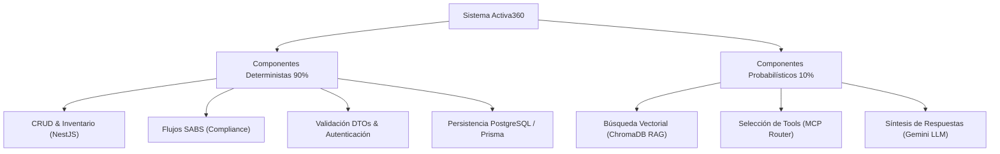

# Estrategia y Clasificación de Pruebas: Deterministas vs. Probabilísticas - Sistema Activa360

---

## 1. Información General del Documento y del Equipo

| Campo | Detalle |
| :--- | :--- |
| **Sistema** | Activa360 - Sistema de Gestión de Activos Fijos con IA (UMSS) |
| **Universidad / Programa** | Universidad Mayor de San Simón (UMSS) · Maestría en Desarrollo de Productos de Software con IA |
| **Módulo** | M6 — Integración de IA en Productos de Software |
| **Docente** | M.Sc. Luis Marcelo Garay Choqueribe |
| **Equipo** | Grupo Activos Fijos UMSS / Equipo Activa360 |
| **Integrantes** | • **Josefina Rojas**<br>• **Rita Nina**<br>• **Guillermo Daza Alcalá** |
| **Fecha de Emisión** | 3 de Septiembre, 2026 |

---

## 2. Marco Conceptual: La Falsa Premisa del "Todo es Probabilístico"

> [!CAUTION]
> **La Trampa Más Común en Proyectos con IA:**
> Clasificar todo el sistema como probabilístico simplemente porque incluye componentes de Inteligencia Artificial (ej. RAG, Agente MCP, LLMs).

En **Activa360**, aplicamos un modelo de **Arquitectura de Pruebas Híbrida**:
* **Componentes Deterministas (~90% de la Base de Código):** Reglas de negocio rígidas, CRUD de activos, validación de schemas DTO, cálculos de amortización/depreciación, autenticación JWT, flujos normativos SABS y persistencia SQL en PostgreSQL mediante Prisma.
* **Componentes Probabilísticos (~10% de la Base de Código):** Generación de respuestas naturales con Gemini, recuperación contextual por similitud coseno en base vectorial (ChromaDB RAG) y enrutamiento/razonamiento autónomo del Agente MCP.



---

## 3. Matriz General de Clasificación de Pruebas

| Componente / Funcionalidad | Clasificación | Capa de la Pirámide de Pruebas | Herramienta Utilizada | Criterio de Evaluación / Assertion |
| :--- | :---: | :---: | :--- | :--- |
| **Escaneo de Código QR** (`ScanQrService`) | **Determinista** | **Unitaria (Unit)** | **Jest** | Assertion exacta (`toEqual`, `toBeInstanceOf(NotFoundException)`, `ConflictException`). |
| **Sincronización Offline** (`SyncOfflineService`) | **Determinista** | **Unitaria (Unit)** | **Jest** | Comparación exacta de marcas de tiempo (*timestamps*) y comprobación de atomicidad del lote. |
| **Proceso de Baja SABS** (`InitiateBajaService`) | **Determinista** | **Unitaria / Dominio** | **Jest** | Verificación de reglas de negocio (`Dañado`/`Obsoleto`) y transición estricta del estado del activo. |
| **Endpoints REST Activos / Bajas** (`Controllers`) | **Determinista** | **Integración / API** | **Jest + Supertest** | Códigos de estado HTTP (`200 OK`, `201 Created`, `400 Bad Request`, `404 Not Found`). |
| **Persistencia y Modelos** (`Prisma / PostgreSQL`) | **Determinista** | **Integración / BD** | **Jest + Testcontainers / SQLite InMemory** | Integridad referencial, restricciones de claves foráneas y ejecución de migraciones. |
| **Búsqueda Vectorial y Retrieval** (`ChromaDB RAG`) | **Probabilístico** | **Integración de IA (RAG Retrieval)** | **Jest + Cosine Similarity Checks / Ragas** | **Context Precision $\ge 0.85$**, **Context Recall $\ge 0.80$** (recuperación de top-$k$ documentos relevantes). |
| **Selección de Herramientas** (`Agente MCP Router`) | **Determinista / Probabilístico (Híbrido)** | **Integración / Contrato de IA** | **Promptfoo / Jest (Tool Call Asserts)** | **Tool Selection Accuracy $\ge 98\%$** (verificación de que el LLM elija la herramienta correcta según la intención). |
| **Generación de Respuestas RAG** (`Gemini 1.5/2.0`) | **Probabilístico** | **Evaluación de IA (AI Evals / Guardrails)** | **DeepEval / Ragas / Promptfoo** | **Faithfulness $\ge 0.90$** (sin alucinaciones), **Answer Relevance $\ge 0.85$**, **Toxicity $= 0$**. |
| **Interfaz Web de Usuario** (`React / Vite Frontend`) | **Determinista** | **E2E / Sistema** | **Cypress / Playwright** | Renderizado de componentes DOM, manejo de estado local, navegación y eventos del usuario. |

---

## 4. Adaptación de la Pirámide de Pruebas para Activa360

```text
               / \
              /   \     E2E / UI (Cypress / Playwright)
             / E2E \    [Determinista: Renderizado, clicks, rutas]
            /-------\
           / AI EVALS\  AI Evals & Guardrails (Ragas / DeepEval / Promptfoo)
          /           \ [Probabilístico: Faithfulness, Relevance, Hallucination]
         /-------------\
        / INTEGRACIÓN   \ Pruebas de Integración, API REST y Contratos (Supertest + Jest)
       /                 \ [Determinista: HTTP 200, 404, Schema DTO]
      /-------------------\
     /  PRUEBAS UNITARIAS  \ Pruebas Unitarias de Dominio y Servicios Hexagonales (Jest)
    /                       \ [Determinista: Assertions exactos, Stubs, Mocks]
   /-------------------------\
```

---

## 5. Criterios Técnicos de Evaluación por Naturaleza

### A. Para Componentes Deterministas (Ej. `ScanQrService`, `InitiateBajaService`)
* **Técnica:** Pruebas tradicionales basadas en código de aserción directo.
* **Criterios Exigidos:**
  1. `expect(asset.location).toBe('Lat: -17.3935, Long: -66.157')`
  2. `expect(promise).rejects.toThrow(ConflictException)`
  3. Cobertura de código (Code Coverage) $\ge 80\%$ en ramas lógicas del dominio.

### B. Para Componentes Probabilísticos (Ej. Agente MCP + ChromaDB RAG)
* **Técnica:** Pruebas de evaluación continua (*Eval Suites*) utilizando la **Tríada de RAG**:

$$\text{Faithfulness} = \frac{\text{Afirmaciones sustentadas en la fuente}}{\text{Total de afirmaciones generadas por el LLM}} \ge 0.90$$

$$\text{Context Relevance} = \frac{\text{Fragmentos útiles recuperados de ChromaDB}}{\text{Total de fragmentos en el contexto Top-K}} \ge 0.85$$

* **Criterios Exigidos:**
  1. **Tasa de Alucinación (Hallucination Rate):** $\le 5\%$ en una suite estandarizada de 50 preguntas de prueba.
  2. **Acción Segura de Herramientas (Guardrails):** $0\%$ de ejecuciones no autorizadas (ej. intentar ejecutar escrituras en base de datos sin confirmación del usuario).
  3. **Fidelidad al Especificado (Spec Fidelity):** $\ge 95\%$ en el formateo de las respuestas normativas SABS.

---

## 6. Cuadro Resumen de Defensa Académica / Técnica

| Pregunta Clave | Respuesta Técnica para Defensa |
| :--- | :--- |
| **¿Es determinista o probabilística?** | El sistema es **híbrido**. El 90% del sistema (lógica de negocio, CRUD, autenticación y servicios de dominio) es **Determinista**. El 10% (RAG, Agente MCP y síntesis LLM) es **Probabilístico**. |
| **¿Con qué capa de la pirámide se prueba?** | • Deterministas $\rightarrow$ Pruebas Unitarias e Integración (Base y Centro de la pirámide).<br>• Probabilísticas $\rightarrow$ Pruebas de Evaluación de IA (AI Evals & Guardrails, capa especializada superior). |
| **¿Qué herramientas van a utilizar?** | • Deterministas: **Jest** (Unit/Integration) y **Supertest** (API REST).<br>• Probabilísticas: **DeepEval**, **Ragas** y **Promptfoo** (AI Benchmarking & Guardrails). |
| **Criterio de Evaluación** | • Deterministas: Assertions exactos binarios (`expect().toBe()`, HTTP 200/404).<br>• Probabilísticas: Métricas cuantitativas continuas (Faithfulness $\ge 0.90$, Answer Relevance $\ge 0.85$, Hallucinations $\le 5\%$). |
