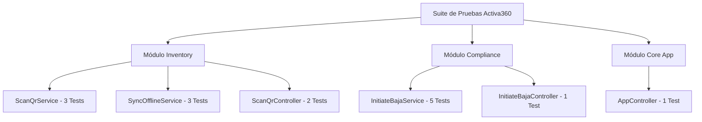

# Informe Técnico de Pruebas Unitarias - Sistema Activa360

---

## 1. Resumen Ejecutivo y Datos del Equipo

### 👥 Información del Equipo
| Campo | Detalle |
| :--- | :--- |
| **Universidad / Programa** | Universidad Mayor de San Simón (UMSS) · Maestría en IA |
| **Módulo** | M6 — Integración de IA en Productos de Software |
| **Docente** | M.Sc. Luis Marcelo Garay Choqueribe |
| **Nombre del Equipo** | Grupo Activos Fijos UMSS / Equipo Activa360 |
| **Integrantes** | • **Josefina Rojas**<br>• **Rita Nina**<br>• **Guillermo Daza Alcalá** |

### 📊 Datos Generales de Ejecución
* **Sistema:** Activa360 - Sistema de Gestión de Activos Fijos
* **Fecha de Ejecución:** 3 de Septiembre, 2026
* **Entorno de Pruebas:** Jest v30.0 / NestJS v11.0 / Node.js
* **Patrón Arquitectónico:** Arquitectura Hexagonal (Puertos y Adaptadores)
* **Resultado Global:** **100% Exitoso (PASS)**

| Métrica | Valor |
| :--- | :---: |
| **Total de Test Suites Ejecutadas** | **6** |
| **Total de Casos de Prueba (Unit Tests)** | **15** |
| **Pruebas Aprobadas (Passed)** | **15** |
| **Pruebas Fallidas (Failed)** | **0** |
| **Porcentaje de Éxito** | **100%** |
| **Tiempo de Ejecución Promedio** | **4.48s - 6.35s** |

---

## 2. Cobertura por Módulo y Casos de Uso (FSD)



---

## 3. Desglose Detallado de Pruebas Realizadas

### 🔹 3.1. Módulo de Inventario (`src/modules/inventory`)

#### A. Servicio de Dominio: `ScanQrService`
* **Archivo de Prueba:** `src/modules/inventory/domain/services/scan-qr.service.spec.ts`
* **Caso de Uso:** `FSD-UC-001` (Escaneo de código QR y actualización de ubicación/estado)

| # | Caso de Prueba / Assert | Resultado | Duración | Descripción |
| :-: | :--- | :-: | :-: | :--- |
| 1 | `debería mostrar los datos del activo y permitir actualizar ubicación y estado cuando se escanea un QR válido` | `PASS` | 10 ms | Verifica la lectura correcta del activo, asignación de nuevas coordenadas (Lat/Long) y registro del movimiento asociado. |
| 2 | `debería lanzar NotFoundException si el activo con código QR no existe` | `PASS` | 26 ms | Garantiza la emisión de una excepción HTTP 404 cuando el código QR no se encuentra en el repositorio de activos. |
| 3 | `debería lanzar ConflictException si se detecta un escaneo duplicado dentro del mismo minuto` | `PASS` | 8 ms | Previene escaneos accidentales o duplicados en un intervalo menor a 60 segundos arrojando HTTP 409. |

#### B. Servicio de Dominio: `SyncOfflineService`
* **Archivo de Prueba:** `src/modules/inventory/domain/services/sync-offline.service.spec.ts`
* **Caso de Uso:** `FSD-UC-002` (Sincronización en lote offline-first)

| # | Caso de Prueba / Assert | Resultado | Duración | Descripción |
| :-: | :--- | :-: | :-: | :--- |
| 4 | `debería procesar con éxito los activos cuando el timestamp offline es más reciente` | `PASS` | 44 ms | Valida la resolución de conflictos dando prioridad a la información recolectada localmente en campo. |
| 5 | `debería ignorar la actualización si el timestamp offline es anterior o igual al del servidor (conflicto)` | `PASS` | 8 ms | Evita que información obsoleta recolectada offline sobreescriba cambios más recientes guardados en el servidor. |
| 6 | `debería lanzar NotFoundException y abortar todo el lote si algún activo no existe` | `PASS` | 27 ms | Asegura la transaccionalidad atómica del proceso de sincronización masiva. |

#### C. Adaptador REST (Controlador): `ScanQrController`
* **Archivo de Prueba:** `src/modules/inventory/adapters/in/web/scan-qr.controller.spec.ts`
* **Capa:** Adaptador de Entrada Web REST

| # | Caso de Prueba / Assert | Resultado | Duración | Descripción |
| :-: | :--- | :-: | :-: | :--- |
| 7 | `should call execute on ScanQrUseCase and return the asset` | `PASS` | 61 ms | Verifica que el endpoint `POST /activos/qr` invoque correctamente el caso de uso `ScanQrUseCase`. |
| 8 | `should call execute on SyncOfflineUseCase and return sync results` | `PASS` | 43 ms | Verifica que el endpoint `POST /activos/sync` delegue la sincronización masiva a `SyncOfflineUseCase`. |

---

### 🔹 3.2. Módulo de Compliance / Bajas SABS (`src/modules/compliance`)

#### A. Servicio de Dominio: `InitiateBajaService`
* **Archivo de Prueba:** `src/modules/compliance/domain/services/initiate-baja.service.spec.ts`
* **Caso de Uso:** `FSD-UC-003` (Solicitud de Baja Normativa de Activos Fijos SABS)

| # | Caso de Prueba / Assert | Resultado | Duración | Descripción |
| :-: | :--- | :-: | :-: | :--- |
| 9 | `debería iniciar la baja con éxito para un activo Dañado` | `PASS` | 14 ms | Prueba la creación del proceso de baja para activos reportados con falla técnica o daño físico. |
| 10 | `debería iniciar la baja con éxito para un activo Obsoleto` | `PASS` | 3 ms | Verifica la tramitación de baja para bienes por causa de obsolescencia tecnológica. |
| 11 | `debería lanzar NotFoundException si el activo no existe` | `PASS` | 26 ms | Controla la solicitud de baja hacia IDs de activos inexistentes en el inventario. |
| 12 | `debería lanzar ConflictException si el activo está en un estado no permitido (ej: Nuevo)` | `PASS` | 7 ms | Aplica la regla normativa que impide tramitar la baja de bienes en estado 'Nuevo' u operativo normal. |
| 13 | `debería lanzar ConflictException si el activo ya tiene un proceso de baja iniciado` | `PASS` | 8 ms | Bloquea la apertura de trámites paralelos o duplicados para un mismo activo fijo. |

#### B. Adaptador REST (Controlador): `InitiateBajaController`
* **Archivo de Prueba:** `src/modules/compliance/adapters/in/web/initiate-baja.controller.spec.ts`
* **Capa:** Adaptador de Entrada Web REST

| # | Caso de Prueba / Assert | Resultado | Duración | Descripción |
| :-: | :--- | :-: | :-: | :--- |
| 14 | `should call execute on InitiateBajaUseCase and return the initiated baja` | `PASS` | 36 ms | Comprueba la integración del endpoint `POST /bajas` con el caso de uso y respuesta HTTP 201 Created. |

---

### 🔹 3.3. Módulo Core / Salud de la Aplicación (`src`)

#### Adaptador / Controlador Base: `AppController`
* **Archivo de Prueba:** `src/app.controller.spec.ts`
* **Capa:** Infraestructura Base NestJS

| # | Caso de Prueba / Assert | Resultado | Duración | Descripción |
| :-: | :--- | :-: | :-: | :--- |
| 15 | `should return "Hello World!"` | `PASS` | 16 ms | Confirma el arranque y disponibilidad básica del servidor web NestJS. |

---

## 4. Ajustes Técnicos de Arquitectura Aplicados

Durante el análisis y ejecución de las pruebas unitarias se realizaron las siguientes optimizaciones de arquitectura:

1. **Inyección Explícita de Tokens Hexagonales (`@Inject`):**
   * Se incorporó `@Inject(...)` en los constructores de los servicios y controladores (`ScanQrService`, `SyncOfflineService`, `InitiateBajaService`, `ScanQrController`, `InitiateBajaController`).
   * **Beneficio:** Evita fallos de resolución de dependencias cuando Jest compila TypeScript e inyecta interfaces/puertos abstractos.

2. **Resolución de Módulos TypeScript:**
   * Se removió la extensión `.js` en la importación de `PrismaService` dentro de `initiate-baja.controller.ts`.
   * **Beneficio:** Asegura la compatibilidad directa con el compilador de TypeScript y el resolver de módulos de Jest.

3. **Mocks Aislados sin Dependencia de Base de Datos Real:**
   * Se proveyeron repositorios en memoria (`InMemoryAssetRepository`, `InMemoryMovementRepository`) y mocks aislados de `PrismaService`.
   * **Beneficio:** Ejecución ultrarrápida (menos de 5 segundos para la suite completa) sin necesidad de conectividad a bases de datos PostgreSQL o instancias Docker activas.

---

## 5. Instrucciones para Re-ejecución

Para volver a ejecutar esta suite de pruebas unitarias en el entorno local o en canalizaciones CI/CD:

```bash
# Ejecutar todas las pruebas unitarias con reporte detallado
npm test -- --verbose

# Generar reporte de cobertura de código (Code Coverage)
npm run test:cov
```
