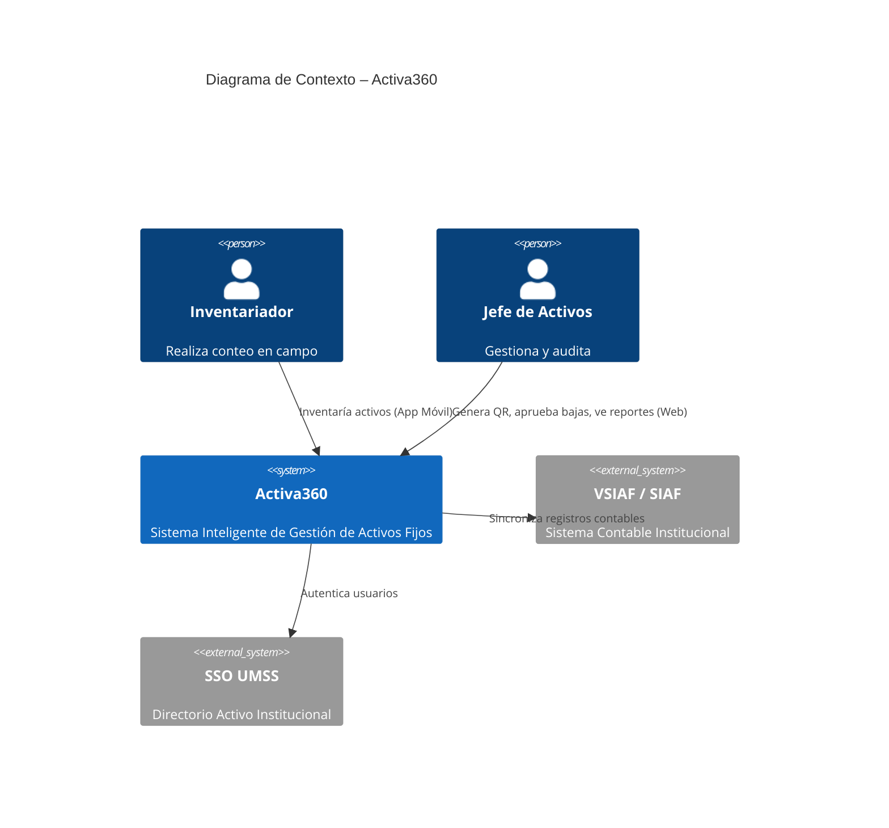
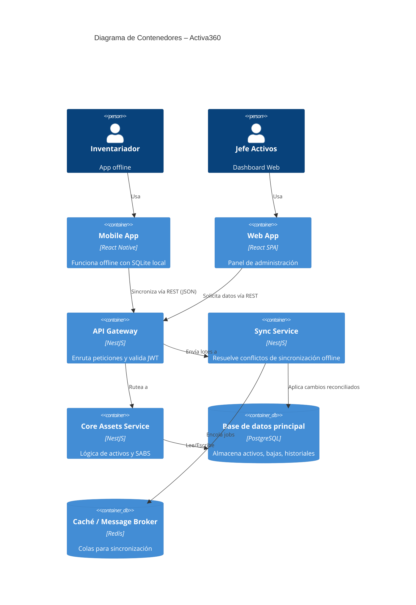
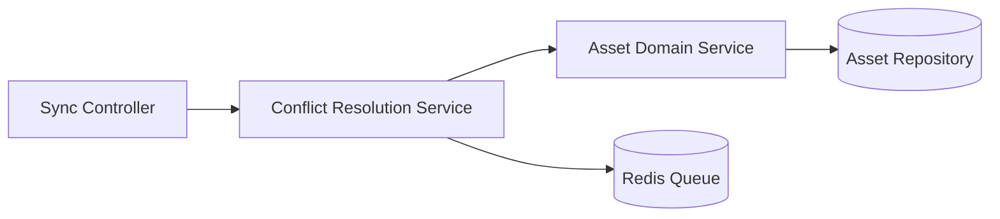
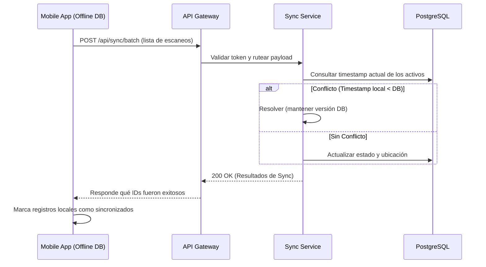

# Documento Técnico Inicial del Producto (DTI) – Activa360

## 0. Metadatos `[máquina]`

| Campo | Valor |
| :---- | :---- |
| Producto | Activa360 – Sistema Inteligente de Gestión de Activos Fijos |
| Grupo | Grupo 3 (Activos Fijos) |
| Versión | `v1.0.0` |
| Fecha | `27/05/2026` |
| Arquitecto responsable | Equipo de Arquitectura Activa360 |
| Stakeholders | Jefe de Activos Fijos, Inventariadores, MAE (UMSS) |
| Estado | Final |
| Repositorio | [Activa360 Repo](https://github.com/ActFijos/Activa360) |
| Enlace al BRD | [BRD Activos Fijos](file:///home/personal/docs/BRD_Activos_Fijos.md) |
| Enlace al MRD | [MRD Activos Fijos](file:///home/personal/docs/MRD_Activos_Fijos.md) |
| Enlace al PRD | [PRD Activos Fijos](file:///home/personal/docs/PRD_Activos_Fijos.md) |
| Enlace al FSD | [FSD Activos Fijos](file:///home/personal/docs/FSD_Activos_Fijos.md) |
| Enlace a `AGENTS.md` | [AGENTS.md](file:///home/personal/AGENTS.md) |
| Enlace a `PROMPT_MAPPING.md` | [PROMPT_MAPPING.md](file:///home/personal/docs/PROMPT_MAPPING.md) |

### 0.1 Rol de agentes IA en el SDLC `[máquina]`

| Agente | Fase SDLC | Output | Supervisor humano | Skill propio que orquesta | Qué se actualiza si el agente falla |
| :---- | :---- | :---- | :---- | :---- | :---- |
| `c4-architect` | Diseño | Diagramas C4 niveles 1–3 en Mermaid | Arquitecto del grupo | `docs/skills/c4.md` | ADR-0001 + DTI §3 |
| `dti-author` | Diseño / Docs | Secciones del DTI con frontmatter + tags | Arquitecto del grupo | `docs/skills/dti-author.md` | DTI + `AGENTS.md` |

## 1. Visión del Producto `[humano]`

- **Problema**: Desconexión entre inventario físico y registros digitales, procesos manuales propensos a errores y falta de trazabilidad en tiempo real.
- **Usuarios objetivo**: Jefe de Activos Fijos, Inventariadores en campo, Custodios (funcionarios/docentes) y Autoridades (MAE).
- **Propuesta de valor**: Trazabilidad en tiempo real, eliminación de activos fantasmas y cumplimiento normativo SABS automático mediante app móvil con capacidad offline y códigos QR.
- **Métricas de éxito del producto**: 
  - *North Star*: % de coincidencia entre inventario físico y sistema (Meta: ≥ 95%)
  - *Secundarias*: Reducción de tiempo en inventarios (-50%), Adopción del sistema (≥ 80%).
- **Restricciones de negocio**: Cumplimiento estricto de normativa SABS (Decreto Supremo N° 0181) y despliegue en infraestructura de la UMSS.

## 2. Contexto del Sistema `[humano+máquina]`

### 2.1 Diagrama C4 – Nivel 1 (Contexto)

### 2.2 Actores externos y dependencias

| Actor / Sistema | Tipo | Dirección | Criticidad |
| :---- | :---- | :---- | :---- |
| `VSIAF/SIAF` | sistema | bidireccional | alta |
| `SSO UMSS` | sistema | entrada | alta |

## 3. Arquitectura de Alto Nivel `[humano+máquina]`

### 3.1 Estilo arquitectónico adoptado

- [ ] Monolito modular  
- [x] Hexagonal / Clean  
- [x] Microservicios (híbrido inicial)
- [ ] Serverless  
- [x] Event‑driven (para sincronización offline)

**Justificación**: Se opta por una arquitectura basada en microservicios y *Hexagonal* para el backend (Node.js/NestJS) para desacoplar las integraciones con los sistemas institucionales legacy (VSIAF) de la lógica core de activos. Además, se incorpora un patrón de eventos asíncronos para gestionar las sincronizaciones masivas desde la app móvil offline sin bloquear la API principal.

### 3.2 Diagrama C4 – Nivel 2 (Contenedores)

### 3.3 Diagrama C4 – Nivel 3 (Componentes) del módulo crítico (Sync Service)

### 3.4 Data Flow Diagram del caso de uso más crítico (Sincronización Offline)

### 3.5 Contenedores agénticos del producto `[humano+máquina]`

**N/A**. Activa360 v1.0 no expone agentes de IA en *runtime*. La inteligencia del sistema recae en los algoritmos heurísticos de reconciliación de conflictos offline y paneles analíticos estructurados, no en LLMs. 

## 4. Modelo de Dominio `[humano+máquina]`

### 4.1 Bounded Contexts

| Contexto | Responsabilidad | Entidades principales | Tipo de integración |
| :---- | :---- | :---- | :---- |
| `Inventory` | Conteo físico y estado de activos | `Activo`, `Movimiento` | Síncrona REST / Async Sync |
| `Compliance` | Flujos normativos (Bajas, Asignaciones) | `Baja`, `Custodio` | Síncrona |

### 4.2 Entidades, Value Objects y Aggregates

| Tipo | Nombre | Invariantes | Ciclo de vida |
| :---- | :---- | :---- | :---- |
| Aggregate Root | `Activo` | Código QR único | Alta -> Asignado -> Dañado -> Baja |
| Entity | `Movimiento` | Fecha no futura | Inmutable tras creación |
| Value Object | `CoordenadasGPS` | Lat/Long válidas | - |

## 5. Arquitectura Hexagonal del *core* `[humano+máquina]`

### 5.1 Puertos (Ports)

| Puerto | Tipo (*input*/*output*) | Definido en | Propósito |
| :---- | :---- | :---- | :---- |
| `SyncInventoryUseCase` | input | `domain/ports/in` | Procesa lotes de inventariación offline |
| `AssetRepositoryPort` | output | `domain/ports/out` | Abstracción de base de datos |

### 5.2 Adaptadores (Adapters)

| Adaptador | Implementa | Tecnología | Ubicación |
| :---- | :---- | :---- | :---- |
| `SyncRestController` | `SyncInventoryUseCase` | NestJS HTTP | `adapters/in/web` |
| `PostgresAssetRepository`| `AssetRepositoryPort` | TypeORM / Postgres | `adapters/out/persistence` |

## 6. Arquitectura Distribuida `[humano+máquina]`

### 6.1 Microservicios y responsabilidades

| Servicio | Responsabilidad | Datos propios | API expuesta |
| :---- | :---- | :---- | :---- |
| `core-service` | Gestión CRUD y reglas de negocio | `activos`, `usuarios` | REST `/api/activos` |
| `sync-service` | Resolución de conflictos offline | - | REST `/api/sync` |

## 7. Arquitectura Asíncrona / Event‑Driven `[humano+máquina]`

### 7.1 Catálogo de eventos

| Evento | Productor | Consumidor(es) | Payload (schema) | Garantía |
| :---- | :---- | :---- | :---- | :---- |
| `AssetScanned` | `mobile-app` | `sync-service` | `activo_id, gps, timestamp` | at-least-once |
| `AssetWrittenOff` | `core-service` | Notificaciones, SIAF | `activo_id, motivo, acta_url` | at-least-once |

## 8. Despliegue – Cloud Native (AWS / On-Premise) `[humano+máquina]`

Para alinear las restricciones institucionales de la UMSS (que exigen un despliegue On-Premise) con la escalabilidad GovTech comercial de Activa360 en la nube (SaaS), adoptamos una **estrategia de Arquitectura Híbrida y Cloud-Native**. El sistema está 100% contenerizado bajo estándares Docker, lo que garantiza una paridad absoluta de infraestructura entre los servidores locales y los servicios gestionados de nube en **Amazon Web Services (AWS)**.

### 8.1 Mapeo de Componentes por Capas (AWS / On-Premise)

| Capa del Sistema | Componente On-Premise (Local) | Equivalente Cloud Target (AWS) | Justificación e Invariantes Técnicas |
| :--- | :--- | :--- | :--- |
| **Presentación (Frontend)** | Servidor Nginx (React SPA estático) | **Amazon S3 + Amazon CloudFront** | Distribución estática de baja latencia con seguridad integrada y sin consumo de recursos del clúster de backend. |
| **API Gateway / Ruteo** | Nginx Reverse Proxy / Gateway | **Amazon API Gateway** | Punto único de entrada para enrutamiento, validación JWT institucional y limitación de peticiones (rate limiting). |
| **Autenticación (IDP)** | Active Directory / LDAP UMSS | **AWS Cognito / SSO** | Gestión federada de identidades y roles institucionales integrados mediante SAML/LDAP. |
| **Lógica de Microservicios**| Docker Containers locales (k8s/Compose)| **Amazon ECS + AWS Fargate** | Ejecución serverless de los microservicios en NestJS (Core y Sync Engine). Garantiza cero overhead operativo de VMs. |
| **Base de Datos Core** | PostgreSQL Server Local (Clúster) | **Amazon RDS para PostgreSQL** | Base de datos relacional compatible con TypeORM, con respaldos y replicación automática administrada. |
| **Colas de Sincronización**| Clúster de Redis Server local | **Amazon ElastiCache para Redis** | Almacenamiento rápido en memoria y encolamiento asíncrono para el Sync Engine de inventario offline. |
| **Almacenamiento (Actas)** | MinIO local (API compatible S3) | **Amazon S3 (Simple Storage Service)** | Almacenamiento de objetos duradero e inmutable para copias físicas firmadas digitalmente y actas SABS en PDF. |
| **Observabilidad** | Winston Logs + Grafana | **Amazon CloudWatch + X-Ray** | Trazabilidad estructurada de peticiones y métricas en caliente para la reconciliación asíncrona de base de datos. |

## 9. Capa de IA / Agentes `[humano+máquina]`

**N/A**. Como se documenta en la visión del producto y PRD, el MVP de Activa360 no incluye componentes de Inteligencia Artificial Generativa o Agentes en producción.

## 10. Estrategia de *Prompt Mapping* `[máquina]`

Vive en [PROMPT_MAPPING.md](file:///home/personal/docs/PROMPT_MAPPING.md). (Refiere a los prompts utilizados durante el desarrollo por los agentes IA en SDLC).

## 11. NFRs Consolidados (espejo de FSD §10) `[máquina]`

| ID | Categoría | Umbral | Mecanismo de verificación |
| :---- | :---- | :---- | :---- |
| NFR-001 | Rendimiento | p95 < 500 ms | k6 load testing |
| NFR-002 | Disponibilidad | Operación en campo (Offline) ≥ 60 seg | Pruebas manuales modo avión |
| NFR-003 | Seguridad | Cifrado base de datos local app AES-256 | SQLCipher / Auditoría |
| NFR-004 | Usabilidad | Pasos para escanear activo ≤ 3 clics | Auditoría UX |

## 12. POCs Críticas `[humano+máquina]`

### 12.1 POC-01: Sincronización Offline WatermelonDB a Postgres

- **Riesgo que mitiga**: Pérdida de datos o cuellos de botella al sincronizar cientos de registros desde áreas sin red.
- **Hipótesis**: WatermelonDB en React Native puede sincronizarse asíncronamente con un endpoint NestJS manejando conflictos eficientemente.
- **Criterio de éxito medible**: Sincronización de 1000 registros en < 5 segundos sin bloqueos UI.

### 12.2 POC-02: Generación automática de Actas SABS en PDF

- **Riesgo que mitiga**: Incompatibilidad del formato de generación con los requisitos estrictos de la normativa boliviana.
- **Hipótesis**: Utilizar Puppeteer/PDFKit en el backend permite replicar exactamente el acta física actual.
- **Criterio de éxito medible**: Aprobación visual del PDF por parte de la Jefatura de Activos Fijos.

## 13. Seguridad `[humano+máquina]`

- **AuthN / AuthZ**: JWT + Integración OAuth2 con el SSO de la UMSS. Control de acceso basado en roles (RBAC).
- **Protección de datos**: Cifrado AES-256 para la base de datos local en SQLite en los dispositivos móviles en caso de pérdida o robo.

## 14. Observabilidad `[humano+máquina]`

- **Logs estructurados**: Winston (Node.js) en formato JSON.
- **Métricas**: Tiempos de resolución de conflictos de sincronización y métricas de CPU/Memoria del servidor.

## 15. DevOps y ciclo de vida `[humano+máquina]`

### 15.1 Ciclo de vida clásico

- **Branching**: Git Flow simplificado (`main`, `develop`, `feature/*`).
- **CI/CD**: GitHub Actions / GitLab CI para validación de lints, tests unitarios (Jest) y build de la app móvil.

### 15.2 Integraciones agénticas de desarrollo

| Integración | Propósito | Entorno | Propietario |
| :---- | :---- | :---- | :---- |
| `c4-architect` agent | Validar que el código respeta los diagramas C4 | CI | Equipo |

### 15.3 Estrategia de release de agentes IA

**N/A**.

## 16. Antipatrones auditados `[humano]`

| Antipatrón | ¿Se detectó? | Mitigación |
| :---- | :---- | :---- |
| Distributed Monolith | riesgo bajo | Separación estricta entre lógica Core y de Sincronización |
| God Service | no | Lógica segmentada por Bounded Contexts |

## 17. Trade‑offs arquitectónicos `[humano]`

| Decisión | Opción elegida | Alternativas descartadas | Razones | Consecuencias |
| :---- | :---- | :---- | :---- | :---- |
| Persistencia Móvil | SQLite / WatermelonDB | Async Storage | Capacidad de ejecutar queries relacionales offline | Aumenta el peso de la app |

## 18. Riesgos técnicos `[humano]`

| Riesgo | Prob. | Impacto | Mitigación | Plan de contingencia |
| :---- | :---- | :---- | :---- | :---- |
| Fallas de cámara/lector QR en dispositivos de gama baja | Media | Alto | Uso de librerías nativas optimizadas para React Native (VisionCamera) | Ingreso manual de código |

## 19. *Roadmap* técnico `[humano]`

- **Módulo 4**: DTI + POC de Sincronización Offline.
- **Siguiente módulo**: Desarrollo MVP Core Backend y App Móvil.
- **Posterior**: Integración con VSIAF y Despliegue en servidores institucionales.

## 20. Glosario y referencias `[humano+máquina]`

- **VSIAF**: Sistema Integrado de Administración Financiera.
- **WatermelonDB**: Base de datos reactiva para React Native enfocada en sincronización offline.

## 21. Registro de decisiones arquitectónicas (ADR) `[máquina]`

| ADR | Título | Estado | Fecha |
| :---- | :---- | :---- | :---- |
| 0001 | Adopción de React Native con enfoque Offline-First | Aceptada | 14/05/2026 |
| 0002 | Uso de NestJS y Arquitectura Hexagonal en el Backend | Aceptada | 14/05/2026 |
| 0005 | Adopción de una Arquitectura Híbrida y Cloud-Native | Aceptada | 27/05/2026 |

## 22. Auditoría de decisiones IA `[humano+máquina]`

**N/A** para el tiempo de ejecución del producto. 

## 23. Eval de agentes y prompts `[humano+máquina]`

**N/A** (El producto final no implementa agentes conversacionales o LLMs en runtime, por lo que no aplican inyecciones de prompt o jailbreaks en la API de producción).
