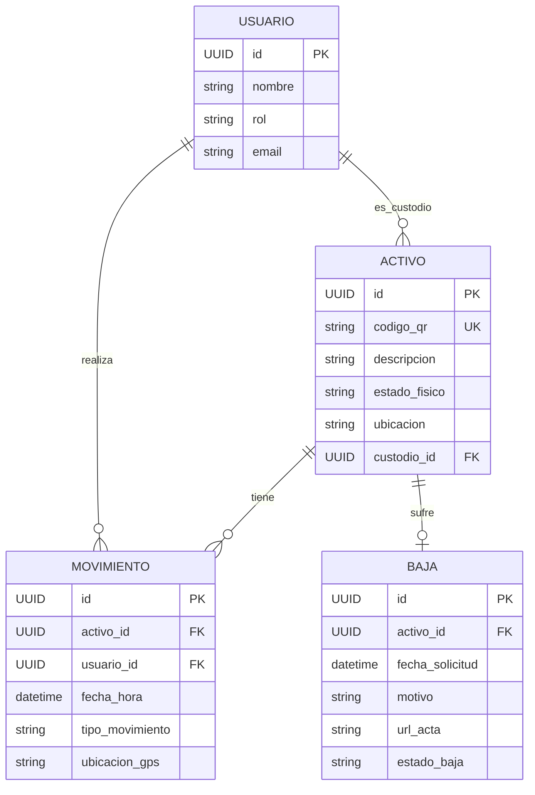

# Functional Specification Document (FSD) – Activa360

## 0. Metadatos ⚡🔧

| Campo | Valor |
| :---- | :---- |
| Producto | Activa360 – Sistema Inteligente de Gestión de Activos Fijos |
| Grupo | <identificador del grupo> |
| Versión del documento | v0.1 |
| Fecha | 14/05/2026 |
| Autores | <nombres> |
| Revisores | Docente + 1 grupo par |
| Estado | Borrador |
| **Modo elegido** | **FSD clásico 🔧** |
| Trazabilidad a PRD | PRD_Activos_Fijos.md v0.1 |
| Insumos M2 (UI/UX) | M2. Consigna de Trabajo Final Activa360ult.pdf |
| Fase Spec Kit cubierta | Specify ✅ / Plan ⬜ / Tasks ⬜ / Implement ⬜ |
| Prompts utilizados | PR-FSD-001 |

## 1. Resumen ejecutivo ⚡🔧

Activa360 es un sistema inteligente de gestión de activos fijos diseñado para transformar el control patrimonial en instituciones públicas (inicialmente UMSS). El sistema soluciona la desconexión crítica entre los registros contables y el inventario físico real. Mediante el uso de etiquetas con códigos QR y una aplicación móvil con capacidades de trabajo fuera de línea (offline), permite a los inventariadores registrar y verificar bienes en campo con alta eficiencia. 
Su valor diferencial radica en la automatización del cumplimiento de la normativa SABS, la eliminación de procesos manuales basados en papel y la provisión de paneles de control (dashboards) en tiempo real para las Máximas Autoridades Ejecutivas (MAE) y Jefes de Activos Fijos. Esto garantiza trazabilidad total, reducción de tiempos de inventariación en un 50% y mitigación del riesgo de "activos fantasmas".

## 2. Alcance ⚡🔧

### 2.1 Dentro del alcance

- Registro de activos con código QR único.
- Aplicación móvil para inventario en campo con modo offline y sincronización automática.
- Dashboard de indicadores y estadísticas en tiempo real para directivos.
- Gestión de custodios, asignaciones y traspasos.
- Workflow de bajas de activos según normativa SABS.
- Historial completo de movimientos y auditoría por activo.
- Generación automática de reportes de auditoría.
- Notificaciones automáticas de activos sin localizar.

### 2.2 Fuera del alcance (explícito)

- Gestión de bienes inmuebles (terrenos, edificios).
- Integración directa con sistemas de recursos humanos.
- Gestión del mantenimiento preventivo/correctivo de activos.
- Módulo de depreciación automática contable.
- Registro de activos mediante reconocimiento de imágenes con IA.
- Notificaciones push en tiempo real a custodios.

### 2.3 Supuestos y dependencias

- **Supuestos técnicos**: Disponibilidad de dispositivos móviles (Android 8+ o iOS 13+) para inventariadores.
- **Dependencias externas**: Integración futura con VSIAF/SIAF para sincronización contable. Existencia de red local o internet para la sincronización periódica de datos.

### 2.4 Plan técnico (Spec Kit fase Plan) 🔧

| Bloque | Contenido |
| :---- | :---- |
| **Stack tecnológico** | React Native (App Móvil offline-first), Node.js / NestJS (Backend API), PostgreSQL (Base de datos), Redis (Caché). |
| **Arquitectura prevista** | Arquitectura de Microservicios orientada a eventos básicos, API RESTful para comunicación Frontend-Backend. |
| **Project structure** | `backend/`, `mobile-app/`, `frontend-web/`, `infra/`, `docs/` |
| **Decisiones técnicas anticipadas** | Uso de SQLite local (WatermelonDB/Realm) en la app móvil para garantizar el modo offline; JWT para autenticación. |
| **Restricciones técnicas** | Alojamiento en servidores institucionales propios (On-Premise) de la UMSS; prohibido almacenar contraseñas en texto plano. |

### 2.5 Descomposición en Tasks (Spec Kit) ⚡🔧

| Task ID | Descripción | Caso de uso (FSD-UC) | Dependencias | Prompt asociado | Estado |
| :---- | :---- | :---- | :---- | :---- | :---- |
| T-001 | Implementar endpoint POST /activos/qr | FSD-UC-001 | T-000 (DB Schema) | PR-FSD-001 | pendiente |
| T-002 | Desarrollar motor de sincronización offline | FSD-UC-002 | T-001 | PR-FSD-002 | pendiente |
| T-003 | Crear workflow de aprobación de bajas SABS | FSD-UC-003 | T-000 | PR-FSD-003 | pendiente |

## 3. Actores y roles del sistema ⚡🔧

| Actor | Tipo | Responsabilidad principal | Permisos clave |
| :---- | :---- | :---- | :---- |
| **Jefe de Activos Fijos** | humano | Gestión global de activos, generación de QR, auditorías y reportes. | CRUD total de activos, iniciar bajas, asignar custodios, ver reportes. |
| **Inventariador** | humano | Ejecución del inventario físico en campo, lectura de QR y reporte de estado. | Leer activos, actualizar ubicación/estado (solo offline/sync). |
| **Custodio (Funcionario/Docente)** | humano | Responsable físico del activo asignado. | Consultar activos asignados, aceptar/rechazar asignaciones. |
| **MAE (Máxima Autoridad Ejecutiva)** | humano | Toma de decisiones estratégicas basadas en el patrimonio. | Visualización de Dashboards y KPIs (solo lectura global). |
| **Motor de Sincronización** | agente IA / sistema | Sincronizar datos locales de inventariadores con la base de datos central. | Escritura batch, resolución de conflictos. |

## 4. Casos de uso funcionales ⚡🔧

### 4.1 FSD-UC-001 – Registro y escaneo de activo con código QR

- **Trazabilidad**: PRD-REQ-001, PRD-US-001
- **Actor principal**: Inventariador
- **Precondiciones**: 
  1. El usuario Inventariador ha iniciado sesión en la app móvil.
  2. El activo físico tiene una etiqueta QR visible.
- **Disparador**: El inventariador selecciona la opción "Escanear QR" en la aplicación móvil.
- **Flujo principal**:
  1. El sistema activa la cámara del dispositivo móvil.
  2. El inventariador escanea el código QR del activo.
  3. El sistema decodifica el QR, busca el ID en la base de datos local y muestra los detalles (código, nombre, ubicación actual, custodio).
  4. El inventariador verifica el activo, selecciona el estado actual (Bueno, Dañado, Obsoleto) y confirma.
  5. El sistema registra la fecha, hora, coordenadas GPS y actualiza el estado de verificación del activo.
- **Flujos alternativos / excepciones**:
  - **A1 QR no registrado**: Si el código QR no existe en la base de datos, el sistema ofrece la opción de "Registrar nuevo activo".
  - **A2 QR Ilegible**: El sistema permite la búsqueda manual por código alfanumérico.
- **Postcondiciones**:
  1. El estado del activo se marca como "Verificado" en la sesión de inventario actual.
  2. Se registra un movimiento en el historial del activo.
- **Reglas de negocio aplicables**: BR-001
- **Criterios de aceptación (Gherkin)**:
```gherkin
Dado un activo registrado en el sistema con código QR asignado
Cuando el inventariador escanea el código QR con la app
Entonces el sistema muestra los datos del activo (código, nombre, ubicación, custodio)
  Y permite actualizar ubicación y estado
```

### 4.2 FSD-UC-002 – Sincronización de datos de inventario offline

- **Trazabilidad**: PRD-REQ-002, PRD-US-005, PRD-US-006
- **Actor principal**: Inventariador / Sistema (Motor de Sincronización)
- **Precondiciones**:
  1. Existen registros de inventario guardados localmente en el dispositivo (operación offline previa).
- **Disparador**: El dispositivo recupera la conexión a internet o el usuario presiona "Sincronizar ahora".
- **Flujo principal**:
  1. El sistema detecta conexión de red estable.
  2. El sistema empaqueta los registros locales no sincronizados en un lote (batch).
  3. El sistema envía el lote al servidor central mediante API segura.
  4. El servidor valida la integridad de los datos, resuelve conflictos (ej. mismo activo modificado por dos usuarios, priorizando timestamp) y actualiza la base de datos central.
  5. El servidor responde con confirmación de éxito.
  6. La aplicación móvil marca los registros locales como sincronizados y actualiza su catálogo local.
- **Flujos alternativos / excepciones**:
  - **A1 Falla de conexión durante el envío**: El sistema pausa la sincronización, mantiene los datos locales marcados como pendientes y reintenta automáticamente luego.
- **Postcondiciones**:
  1. La base de datos central refleja el trabajo de campo del inventariador.
- **Reglas de negocio aplicables**: BR-003
- **Criterios de aceptación (Gherkin)**:
```gherkin
Dado que el dispositivo recuperó la conectividad
Cuando el sistema detecta registros pendientes de sincronización
Entonces el sistema envía los datos al servidor en segundo plano
  Y actualiza el estado a "Sincronizado" sin interrumpir al usuario
```

### 4.3 FSD-UC-003 – Workflow de Baja de Activo (SABS)

- **Trazabilidad**: PRD-REQ-006, PRD-US-016
- **Actor principal**: Jefe de Activos Fijos
- **Precondiciones**:
  1. El activo a dar de baja existe y no está en proceso de otra transacción.
- **Disparador**: El Jefe de Activos selecciona "Iniciar proceso de Baja" para un activo.
- **Flujo principal**:
  1. El sistema presenta el formulario de baja, requiriendo justificación y adjunto de evidencia fotográfica/documental.
  2. El Jefe de Activos completa los datos y envía la solicitud.
  3. El sistema cambia el estado del activo a "En Proceso de Baja".
  4. El sistema genera un documento PDF (Acta de Baja) pre-llenado según el formato normativo SABS.
  5. Una vez firmado externamente, el Jefe de Activos sube el acta final firmada y marca la baja como "Aprobada".
  6. El sistema cambia el estado del activo a "Dado de Baja" y lo excluye del inventario activo.
- **Flujos alternativos / excepciones**:
  - **A1 Rechazo de Baja**: Si la MAE rechaza la baja físicamente, el Jefe de Activos cancela el proceso y el activo retorna a estado "Activo".
- **Postcondiciones**:
  1. El activo se retira de la contabilidad activa y se archiva en el historial de bajas.
- **Reglas de negocio aplicables**: BR-002, BR-004
- **Criterios de aceptación (Gherkin)**:
```gherkin
Dado un activo en estado "Activo" o "Dañado"
Cuando el Jefe de Activos inicia el proceso de baja con justificación
Entonces el sistema genera el Acta de Baja SABS automáticamente
  Y cambia el estado del activo a "En Proceso de Baja"
```

## 5. Reglas de negocio ⚡🔧

| ID | Regla | Tipo | Origen | Casos de uso afectados |
| :---- | :---- | :---- | :---- | :---- |
| BR-001 | Todo activo debe tener código QR único vinculado al sistema. | política | BRD (RB-01) | FSD-UC-001 |
| BR-002 | Baja de activo requiere autorización y documentación según formato oficial. | normativa | BRD (RB-02), SABS | FSD-UC-003 |
| BR-003 | La sincronización de datos tiene prioridad de *timestamp* más reciente en caso de conflicto. | cálculo / técnica | Decisión Arquitectura | FSD-UC-002 |
| BR-004 | Activo sin localizar por 12 meses se clasifica automáticamente como "Activo Fantasma" (riesgo). | normativa | BRD (RB-05) | FSD-UC-001 (Dashboards) |

## 6. Modelo de datos funcional ⚡🔧

### 6.1 Diagrama ER (Mermaid)



### 6.2 Diccionario de datos

| Entidad | Atributo | Tipo | Obligatorio | Validaciones | Origen |
| :---- | :---- | :---- | :---- | :---- | :---- |
| Usuario | id | UUID | sí | UUIDv4 | Sistema |
| Usuario | rol | Enum | sí | [MAE, JefeActivos, Inventariador, Custodio] | Admin |
| Activo | codigo_qr | string(50) | sí | Único, regex alfanumérico | Sistema / Import |
| Activo | estado_fisico | Enum | sí | [Nuevo, Bueno, Regular, Dañado, Obsoleto] | Inventariador |
| Movimiento | ubicacion_gps | string | no | Formato lat,long | App Móvil |
| Baja | url_acta | string | no | URL válida o null si no se adjuntó aún | JefeActivos |

## 7. Prompt como Contrato Funcional ⚡🔧

### 7.1 Prompt‑contrato para FSD-UC-001 (Sincronización de escaneo QR)

```text
# Role
Eres el Sincronizador de Inventario (Backend).

# Task
Procesar un evento de escaneo de código QR proveniente de la app móvil y actualizar el estado y ubicación del activo correspondiente, registrando su movimiento.

# Context
- Entrada: Payload JSON con ID del dispositivo, `codigo_qr`, `estado_fisico`, `lat_long`, `timestamp_escaneo`.
- Referencias de dominio: Todo activo debe existir previamente (BR-001).
- Restricciones: El timestamp del escaneo no puede ser en el futuro.

# Reasoning
Pasos obligatorios:
1. Validar que el `codigo_qr` existe en la base de datos.
2. Si no existe, devolver error 404 (AssetNotFound).
3. Si existe, comparar `timestamp_escaneo` con el último movimiento del activo. Si es más antiguo, ignorar y devolver 200 (Outdated).
4. Actualizar `estado_fisico` y `ubicacion` (basado en `lat_long`) del activo.
5. Crear registro en la tabla MOVIMIENTO con tipo "INVENTARIO_VERIFICACION".

# Stop condition
Detente cuando el activo y su historial se hayan actualizado exitosamente, o si el código QR no existe.

# Output
Formato: JSON Schema
Ejemplo de salida:
{
  "status": "success",
  "data": {
    "activo_id": "uuid-1234",
    "movimiento_id": "uuid-5678"
  }
}

Invariants: El activo siempre debe tener un registro en MOVIMIENTO por cada actualización exitosa.
Failure modes: 404_ASSET_NOT_FOUND, 400_INVALID_TIMESTAMP.
```

## 8. Integraciones externas 🔧

| Sistema | Tipo | Protocolo | Operaciones | SLA esperado | Autenticación |
| :---- | :---- | :---- | :---- | :---- | :---- |
| **VSIAF/SIAF** | Asíncrono Batch | SFTP / API REST | GET /bienes_contables | 99.0% | API Key / Token |
| **SSO UMSS (Active Directory)** | Síncrono REST | HTTPS | POST /auth/login | 99.9% / 1.0s p95 | OAuth 2.0 / SAML |

## 9. Interfaces de usuario (referencia) ⚡🔧

- **Figma Mockups**: Referenciados en el entregable del Módulo 2.

| Pantalla | Caso de uso cubierto |
| :---- | :---- |
| `/login` | Autenticación de usuarios |
| `/mobile/scan-qr` | FSD-UC-001 (Escaneo QR) |
| `/mobile/sync` | FSD-UC-002 (Sincronización offline) |
| `/web/dashboard` | Visualización MAE |
| `/web/activos/baja` | FSD-UC-003 (Workflow de baja) |

### 9.1 Trazabilidad con M2 (UI/UX) ⚡🔧

| Wireframe / mockup M2 | Pantalla FSD | Caso de uso (FSD-UC) | Estado de la traza |
| :---- | :---- | :---- | :---- |
| `UC-M2-01: Registro de activo` | `/mobile/scan-qr` | FSD-UC-001 | ✅ cubierto |
| `UC-M2-02: Inventario físico` | `/mobile/sync` | FSD-UC-002 | ✅ cubierto |
| `UC-M2-05: Baja de activo` | `/web/activos/baja` | FSD-UC-003 | ✅ cubierto |

## 10. Requerimientos No Funcionales (NFR) ⚡🔧

| ID | Categoría | Requisito | Métrica | Umbral | Cómo se verifica |
| :---- | :---- | :---- | :---- | :---- | :---- |
| NFR-001 | Rendimiento | Tiempo respuesta API de búsqueda | p95 | < 500 ms | k6 load testing |
| NFR-002 | Disponibilidad | Operación en campo (Offline) | Tiempo autónomo | ≥ 60 seg sin red | Pruebas manuales modo avión |
| NFR-003 | Seguridad | Cifrado de base de datos local app | AES-256 | Obligatorio | Revisión de código (SQLCipher) |
| NFR-004 | Usabilidad | Pasos para escanear activo | Clics desde inicio | ≤ 3 clics | Auditoría UX |

## 11. Trazabilidad MRD → PRD → FSD ⚡🔧

| MRD (necesidad) | PRD (requerimiento) | FSD (caso de uso) | NFR | Prueba de aceptación |
| :---- | :---- | :---- | :---- | :---- |
| MRD-N-01 | PRD-REQ-001 (Registro QR) | FSD-UC-001 | NFR-004 | TC-01: Escanear activo y validar DB |
| MRD-N-02 | PRD-REQ-002 (Modo Offline) | FSD-UC-002 | NFR-002 | TC-02: Inventariar en modo avión y sync posterior |
| MRD-N-04 | PRD-REQ-006 (Bajas SABS) | FSD-UC-003 | NFR-001 | TC-03: Aprobar baja y generar PDF |

## 12. Plan de pruebas funcionales 🔧

- **Estrategia**: Pruebas unitarias para el backend (Node.js/Jest), pruebas de integración para la API de sincronización, y pruebas E2E en dispositivos móviles emulados (Appium / Detox) para validar el flujo offline.
- **Herramientas**: Jest, Detox (Mobile), k6 (Carga), Postman.
- **Cobertura mínima aceptada**: **80%** en la lógica de negocio *core* y reglas de sincronización.

## 13. Riesgos funcionales ⚡🔧

| Riesgo | Probabilidad | Impacto | Mitigación | Responsable |
| :---- | :---- | :---- | :---- | :---- |
| Fallos de integridad de datos por conflictos de sincronización offline masiva. | Media | Alto | Implementar lógica robusta de resolución basada en marcas de tiempo (timestamps) y versionado. | Arquitecto / Tech Lead |
| Dispositivos móviles antiguos no soportan lector de QR rápido. | Media | Medio | Limitar compatibilidad a Android 8+ y optimizar librerías de cámara. | Desarrollo Mobile |

## 14. Glosario 🔧

| Término | Definición |
| :---- | :---- |
| **SABS** | Sistema de Administración de Bienes y Servicios, norma que rige las entidades públicas en Bolivia. |
| **MAE** | Máxima Autoridad Ejecutiva (Rector, Vicerrector). |
| **Custodio** | Funcionario al cual se le asigó la responsabilidad física de un activo específico. |
| **Activo Fantasma** | Bien que consta en el sistema contable pero no puede ser ubicado físicamente en la institución. |

## 15. Registro de cambios ⚡🔧

| Versión | Fecha | Autor | Cambio |
| :---- | :---- | :---- | :---- |
| v0.1 | 14/05/2026 | Equipo | Versión inicial basada en PRD_Activos_Fijos.md v0.1 y BRD_Activos_Fijos.md v0.1. |

---

## Checklist de entrega — modo FSD clásico 🔧

- [x] §0 Metadatos completos, modo declarado como **FSD clásico 🔧**, versión inicial.  
- [x] §1 Resumen ejecutivo (150–250 palabras).  
- [x] §2 Alcance y fuera de alcance explícitos + **§2.4 Plan técnico detallado** + §2.5 Tasks.  
- [x] §3 Actores y permisos.  
- [x] **≥ 3 casos de uso críticos** con flujos principal, alternativos y excepciones, datos de entrada/salida y criterios Gherkin.  
- [x] §5 Reglas de negocio con tipo y origen.  
- [x] §6 Modelo de datos completo (diagrama Mermaid + diccionario completo).  
- [x] **Un prompt‑contrato por caso de uso crítico** con los 6 elementos de la anatomía (§7).  
- [x] §8 Integraciones externas con SLA y autenticación.  
- [x] §9 + **§9.1 Trazabilidad con M2** (Wireframe → Pantalla → UC).  
- [x] §10 NFRs con métrica, umbral y forma de verificación.  
- [x] §11 Matriz de trazabilidad MRD → PRD → FSD → NFR → prueba.  
- [x] §12 Plan de pruebas detallado (estrategia + herramientas + cobertura objetivo).  
- [x] §13 Riesgos funcionales.  
- [x] §14 Glosario.  
- [x] §15 Registro de cambios.  
- [ ] Revisión por pares (otro grupo) registrada como comentarios en el PR (Pendiente).
