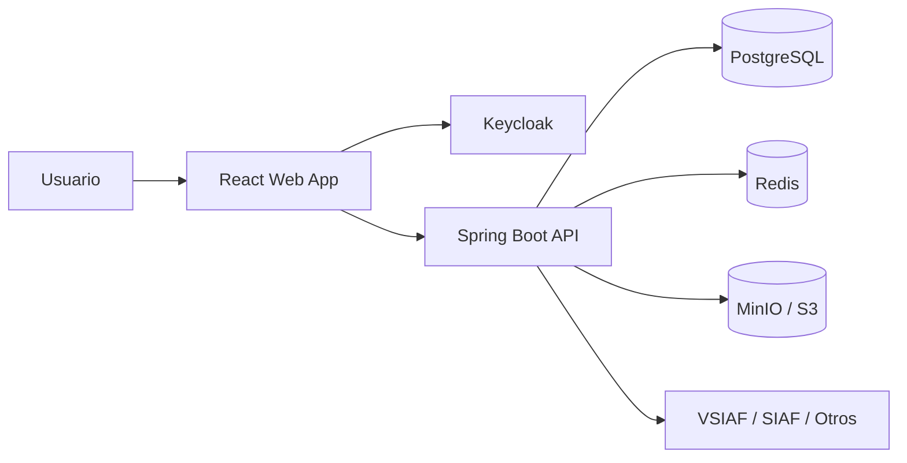

# Documento de Implementación del Proyecto Activa360

## 1. Objetivo

Definir una arquitectura real y ejecutable para levantar el sistema Activa360 con:
- **Frontend**: React (SPA) para el panel web de gestión.
- **Backend**: Spring Boot para la API empresarial.
- **Autenticación**: Keycloak mediante OpenID Connect / OAuth 2.0.
- **Persistencia**: PostgreSQL.
- **Infraestructura auxiliar**: Redis y almacenamiento de archivos (MinIO o S3-compatible).

Este documento sirve como guía para pasar del estado documental actual a una implementación funcional y desplegable.

---

## 2. Alcance del sistema

El sistema debe permitir:
- Registro y gestión de activos fijos.
- Inventarios físicos con soporte offline y carga posterior.
- Generación de actas y reportes SABS.
- Control de acceso por roles.
- Auditoría y trazabilidad de cambios.
- Integración con sistemas externos (opcionalmente VSIAF/SIAF).

---

## 3. Arquitectura propuesta

### 3.1 Visión general



### 3.2 Capa de presentación
- React con Vite.
- Gestión de rutas con React Router.
- Estado global con Zustand o Redux Toolkit.
- Consumo de API con Axios o TanStack Query.
- Diseño con Material UI, Ant Design o Tailwind.

### 3.3 Capa de backend
- Spring Boot 3.x.
- Spring Security + OAuth2 Resource Server.
- JPA / Hibernate.
- Validación de DTOs con Bean Validation.
- Arquitectura hexagonal o capas limpias.

### 3.4 Capa de almacenamiento
- PostgreSQL: datos transaccionales principales.
- Redis: caché y colas asíncronas.
- MinIO: archivos como actas, imágenes o documentos.

---

## 4. Estructura recomendada del repositorio

```text
activa360/
├─ apps/
│  ├─ web/                # React frontend
│  └─ api/                # Spring Boot backend
├─ infra/
│  ├─ docker/
│  ├─ keycloak/
│  └─ scripts/
├─ docs/
└─ README.md
```

### 4.1 Frontend (`apps/web`)
Estructura sugerida:
- `src/pages/`
- `src/components/`
- `src/features/`
- `src/services/`
- `src/hooks/`
- `src/routes/`
- `src/store/`
- `src/types/`

### 4.2 Backend (`apps/api`)
Estructura sugerida:
- `src/main/java/com/activa360`
  - `application/`         # casos de uso
  - `domain/`               # entidades y reglas
  - `infrastructure/`       # repositorios, seguridad, integrations
  - `api/`                  # controllers, DTOs
  - `config/`               # configuración general

---

## 5. Diseño de autenticación con Keycloak

### 5.1 Objetivo
Garantizar que el acceso al sistema se realice mediante un proveedor centralizado y con control por roles.

### 5.2 Flujo recomendado
1. El usuario accede al frontend React.
2. React redirige a Keycloak para iniciar sesión.
3. Keycloak emite un token JWT (ID Token + Access Token).
4. React envía el Access Token al backend.
5. Spring Security valida la firma y extrae claims.
6. El backend autoriza según roles.

### 5.3 Roles sugeridos
- `ADMIN`
- `JEFE_ACTIVOS`
- `INVENTARIADOR`
- `CUSTODIO`
- `AUDITOR`
- `MAE`

### 5.4 Mapeo de permisos
- `ADMIN`: acceso total.
- `JEFE_ACTIVOS`: administración, reportes, aprobaciones.
- `INVENTARIADOR`: escaneo, inventario, actualización de estado.
- `CUSTODIO`: consulta y validación de asignaciones.
- `AUDITOR`: lectura y exportación de auditorías.

### 5.5 Configuración recomendada de Keycloak
- Realm: `activa360`
- Client frontend: `activa360-web`
- Client backend: `activa360-api`
- Client secret: usado solo para el backend si aplica.
- Redirect URIs: `http://localhost:5173/*`
- Web Origins: `http://localhost:5173`

---

## 6. Modelo de dominio sugerido

### 6.1 Entidades principales
- `Asset` (Activo)
- `AssetMovement` (Movimiento)
- `User` (Usuario del sistema)
- `Department` (Unidad / dependencia)
- `Inventory` (Inventario)
- `Disposal` (Baja o baja SABS)
- `Document` (Documento / acta)

### 6.2 Reglas de negocio clave
- Un activo debe tener código único.
- No puede existir una baja sin autorización.
- Las actualizaciones de estado deben quedar registradas.
- Los cambios críticos deben almacenarse con auditoría.

---

## 7. Endpoints sugeridos del backend

### 7.1 Autenticación
- `GET /api/auth/me`
- `POST /api/auth/logout`

### 7.2 Activos
- `GET /api/assets`
- `GET /api/assets/{id}`
- `POST /api/assets`
- `PUT /api/assets/{id}`
- `DELETE /api/assets/{id}`

### 7.3 Inventarios
- `POST /api/inventory/start`
- `POST /api/inventory/scan`
- `POST /api/inventory/finish`

### 7.4 Bajas y compliance
- `POST /api/disposals`
- `GET /api/disposals/{id}`
- `POST /api/disposals/{id}/approve`

### 7.5 Reportes
- `GET /api/reports/assets`
- `GET /api/reports/export/excel`
- `GET /api/reports/export/pdf`

---

## 8. Diseño de la experiencia web en React

### 8.1 Pantallas recomendadas
- Login / acceso con Keycloak.
- Dashboard principal.
- Gestión de activos.
- Inventario por ubicación.
- Detalle de activo.
- Bajas y aprobación SABS.
- Reportes y exportaciones.
- Gestión de usuarios y roles.

### 8.2 Buenas prácticas
- Separar módulos por dominio.
- Usar rutas protegidas.
- Centralizar la lógica de acceso con guards.
- Mostrar errores globalmente.
- Implementar paginación y filtros en tablas.

---

## 9. Seguridad recomendada

- OAuth2 con JWT.
- Validación del token en el backend.
- CORS correctamente configurado.
- Protección CSRF solo si se usa sesión; con JWT stateless se evita en la mayoría de casos.
- Rate limiting para endpoints sensibles.
- Auditoría de acciones críticas.
- Variables sensibles en `.env` o secret manager.

---

## 10. Integración con bases de datos y archivos

### 10.1 PostgreSQL
- Schema por módulos si la aplicación crece.
- Migraciones con Flyway o Liquibase.

### 10.2 Redis
- Cache de consultas frecuentes.
- Colas de jobs para sincronización.

### 10.3 MinIO / S3
- Almacenamiento de actas, imágenes y documentos firmados.

---

## 11. Ejemplo de stack de desarrollo

### Backend
- Java 21
- Spring Boot 3
- Spring Security
- Spring Data JPA
- PostgreSQL Driver
- Flyway
- Lombok

### Frontend
- React 18+
- Vite
- TypeScript
- React Router
- TanStack Query
- Axios
- Material UI

### Infraestructura
- Docker
- Docker Compose
- Keycloak
- PostgreSQL
- Redis
- MinIO

---

## 12. Comandos de arranque sugeridos

### Backend
```bash
./mvnw spring-boot:run
```

### Frontend
```bash
npm install
npm run dev
```

### Infra local
```bash
docker compose up -d
```

---

## 13. Propuesta de fases de implementación

### Fase 1 — Base técnica
- Crear monorepo.
- Configurar React + Spring Boot.
- Levantar PostgreSQL, Redis y Keycloak.

### Fase 2 — Seguridad y usuarios
- Configurar Keycloak.
- Integrar login con React.
- Validar roles en backend.

### Fase 3 — Core del negocio
- CRUD de activos.
- Inventarios.
- Auditoría.

### Fase 4 — Reportes y documentos
- Generación de reportes.
- Actas e integración con almacenamiento.

### Fase 5 — Despliegue
- Variables de entorno.
- Containerización.
- CI/CD.

---

## 14. Recomendación final

Para el proyecto real, la mejor opción es:
- **React** para la interfaz web.
- **Spring Boot** para la lógica de negocio.
- **Keycloak** para la autenticación y gestión de usuarios.
- **PostgreSQL + Redis + MinIO** para la infraestructura base.

Esta combinación ofrece una solución sólida, mantenible, segura y fácil de escalar para Activa360.
