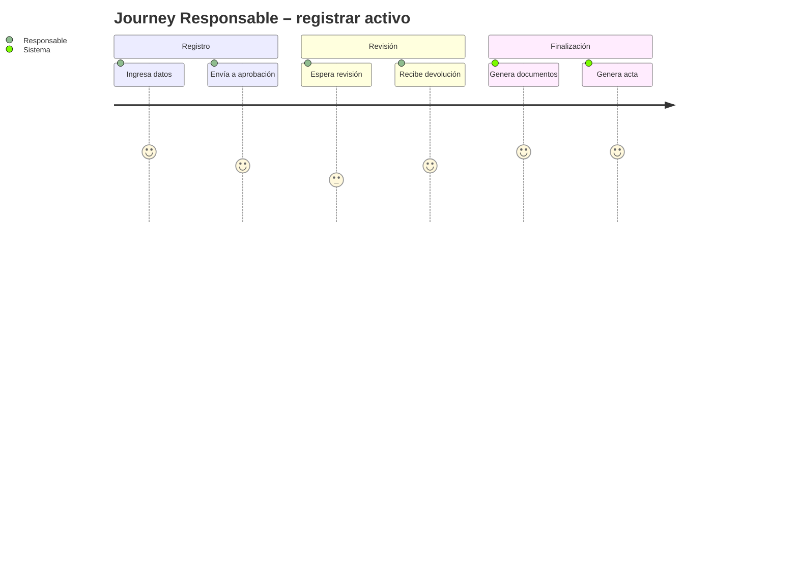
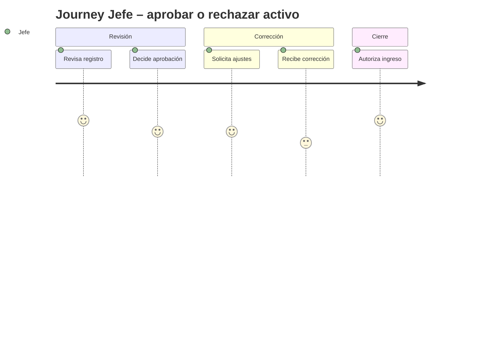

# Product Requirements Document (PRD) – Motor de Workflow para Registro de Activos Fijos

> **Propósito del PRD**: describir qué debe hacer el producto para soportar el proceso institucional de registro de activos fijos, desde el ingreso del bien hasta la elaboración del acta de ingreso, con suficiente detalle para que diseño, ingeniería y QA puedan avanzar.
>
> Audiencia: Product, Diseño, Ingeniería, QA.

---

## 0. Metadatos

| Campo | Valor |
|-------|-------|
| Producto | Motor de workflow para registro de activos fijos |
| Grupo | G1 |
| Versión | v0.1 |
| Fecha | 04/07/2026 |
| Product Manager / Autor | Equipo de desarrollo |
| Revisores | Docente + Tech Lead + QA |
| Estado | Borrador |
| BRD de referencia | Documento de diseño BPMN del curso |
| MRD de referencia | Requerimientos funcionales del proceso institucional |
| Insumos M2 (UI/UX) | N/A |
| Fase Spec Kit cubierta | Specify ✅ / Plan ⬜ / Tasks ⬜ / Implement ✅ |
| Prompts utilizados | N/A |

## 0.1 Constitution (opcional — Spec Kit)

- **Principio 1**: todo trámite de activo fijo debe poder completarse sin ambigüedad y con trazabilidad completa.
- **Principio 2**: ningún dato de registro debe perderse durante la aprobación o corrección.
- **Principio 3**: el flujo debe ser ejecutable de forma reproducible para simulaciones y auditoría.

## 1. Resumen del producto

La institución necesita un proceso formal y trazable para registrar activos fijos adquiridos, como muebles, computadoras, portátiles, sillas, mesas, impresoras y otros bienes inventariables. El proceso actual debe quedar representado como un workflow que permita registrar el activo con todos sus datos, enviarlo a aprobación del jefe, validar la aprobación o rechazo, generar los artefactos asociados al ingreso del bien y dejar registro histórico de cada transición. La solución propuesta consiste en un motor BPMN-like en Python que modela este proceso como un flujo de tareas con estados, reglas de negocio, trazabilidad y generación de documentos.

## 2. Objetivos del producto

| ID | Objetivo del producto | BRD vinculado | Métrica | Meta |
|----|------------------------|----------------|---------|------|
| OP-01 | Permitir registrar activos fijos con datos completos y obligatorios | BO-01 | tiempo medio de registro | ≤ 10 min |
| OP-02 | Asegurar aprobación formal del jefe antes de generar documentos finales | BO-02 | tasa de aprobación válida | 100 % |
| OP-03 | Generar automáticamente código jerárquico, QR y acta de ingreso | BO-03 | documentos generados por trámite | 100 % |
| OP-04 | Mantener trazabilidad completa del flujo ante rechazos o correcciones | BO-04 | trazas registradas por instancia | 100 % |

## 3. Alcance (*Scope*)

### 3.1 Dentro del alcance (release v1.0)

- Registro de un activo fijo con datos básicos y opcionales.
- Envío del registro a aprobación del jefe.
- Aprobación o rechazo del registro.
- Reenvío a corrección en caso de rechazo.
- Generación de código jerárquico institucional.
- Generación de código QR con datos esenciales del activo.
- Generación de impresión para etiquetado manual.
- Generación de acta de ingreso.
- Trazabilidad de estados y eventos del proceso.

### 3.2 Fuera del alcance (backlog)

- Integración real con sistemas de inventario institucional externo.
- Importación/exportación de flujos BPMN XML.
- Interfaz web completa.
- Persistencia relacional o documental en producción.

### 3.3 Roadmap de versiones (Delivery track)

| Versión | Contenido | Fecha objetivo |
|---------|-----------|----------------|
| v1.0 | MVP del motor BPMN para registro de activos fijos | 04/07/2026 |
| v1.1 | Persistencia durable y mejora de trazabilidad | pendiente |
| v2.0 | UI y conectores institucionales | pendiente |

### 3.4 Roadmap de validación (Discovery track)

| Sprint / Semana | Hipótesis a validar | Método | Criterio de éxito | Estado |
|-----------------|---------------------|--------|-------------------|--------|
| S1 | El flujo de aprobación/rechazo es comprensible para usuarios institucionales | revisión de requisitos y validación del docente | ≥ 80 % de comprensión | cerrada |
| S2 | La generación de QR y acta aporta valor operativo | demo del flujo | aceptación del flujo por parte del equipo | abierta |

## 4. Personas y *user journeys*

### 4.1 Personas

- **Responsable de registro**: ingresa datos del activo y envía el trámite.
- **Jefe**: revisa y aprueba o rechaza el registro.
- **Administrador / operador de inventario**: valida la generación final de documentos y acta.

### 4.2 *User journeys* principales





## 5. *User stories* y criterios de aceptación

### 5.1 Épica E1 – Registro y envío de trámite

| ID | Historia | Prioridad | Valor | Esfuerzo | Criterios Gherkin |
|----|----------|-----------|-------|----------|-------------------|
| PRD-US-001 | Como responsable, quiero registrar un activo con datos obligatorios y opcionales para completar el trámite correctamente | Must | 9 | 5 | ver §5.1.1 |
| PRD-US-002 | Como responsable, quiero enviar el registro al jefe para revisión y aprobación | Must | 8 | 4 | ver §5.1.2 |
| PRD-US-003 | Como responsable, quiero ver el estado del trámite para conocer si está pendiente, aprobado o en corrección | Should | 6 | 3 | ver §5.1.3 |

#### 5.1.1 Criterios PRD-US-001

```gherkin
Escenario: Registro de activo con datos completos
  Dado un responsable autenticado
  Cuando registra un activo con nombre, categoría, marca, modelo, número de serie y responsable
  Entonces el sistema crea el registro del activo
   Y lo deja en estado PENDIENTE_DE_APROBACION
```

#### 5.1.2 Criterios PRD-US-002

```gherkin
Escenario: Envío a aprobación
  Dado un activo registrado correctamente
  Cuando el responsable envía el trámite al jefe
  Entonces el sistema marca el trámite como EN_APROBACION
```

#### 5.1.3 Criterios PRD-US-003

```gherkin
Escenario: Consulta del estado del trámite
  Dado un activo en cualquier etapa del flujo
  Cuando el responsable consulta su estado
  Entonces el sistema muestra el estado actual y la última acción registrada
```

### 5.2 Épica E2 – Aprobación y devolución por corrección

| ID | Historia | Prioridad | Valor | Esfuerzo | Criterios Gherkin |
|----|----------|-----------|-------|----------|-------------------|
| PRD-US-004 | Como jefe, quiero aprobar o rechazar un registro para avanzar o corregir el trámite | Must | 9 | 4 | ver §5.2.1 |
| PRD-US-005 | Como jefe, quiero rechazar un registro con observaciones para devolverlo a corrección | Must | 8 | 3 | ver §5.2.2 |
| PRD-US-006 | Como sistema, quiero registrar el motivo del rechazo para mantener trazabilidad | Must | 7 | 2 | ver §5.2.3 |

#### 5.2.1 Criterios PRD-US-004

```gherkin
Escenario: Aprobación del registro
  Dado un activo pendiente de aprobación
  Cuando el jefe aprueba el registro
  Entonces el sistema cambia el estado a APROBADO
```

#### 5.2.2 Criterios PRD-US-005

```gherkin
Escenario: Rechazo con observaciones
  Dado un activo pendiente de aprobación
  Cuando el jefe rechaza el registro con observaciones
  Entonces el sistema devuelve el trámite a corrección
```

#### 5.2.3 Criterios PRD-US-006

```gherkin
Escenario: Registro de incidente
  Dado un rechazo del jefe
  Cuando el sistema procesa la devolución
  Entonces registra el incidente y la razón asociada en la trazabilidad
```

### 5.3 Épica E3 – Generación de documentos y acta

| ID | Historia | Prioridad | Valor | Esfuerzo | Criterios Gherkin |
|----|----------|-----------|-------|----------|-------------------|
| PRD-US-007 | Como sistema, quiero generar un código jerárquico cuando el activo sea aprobado para identificarlo institucionalmente | Must | 8 | 4 | ver §5.3.1 |
| PRD-US-008 | Como sistema, quiero generar un código QR con datos clave del activo para facilitar su identificación | Must | 8 | 3 | ver §5.3.2 |
| PRD-US-009 | Como sistema, quiero generar la impresión para etiquetado manual del activo | Should | 6 | 3 | ver §5.3.3 |
| PRD-US-010 | Como sistema, quiero generar un acta de ingreso solo si el activo está aprobado y tiene los documentos asociados | Must | 8 | 4 | ver §5.3.4 |

#### 5.3.1 Criterios PRD-US-007

```gherkin
Escenario: Generación de código jerárquico
  Dado un activo aprobado
  Cuando el workflow llega a la tarea de generación de código
  Entonces se asigna un código jerárquico institucional
```

#### 5.3.2 Criterios PRD-US-008

```gherkin
Escenario: Generación de QR
  Dado un activo aprobado
  Cuando se genera el QR
  Entonces contiene al menos el identificador, nombre y responsable del activo
```

#### 5.3.3 Criterios PRD-US-009

```gherkin
Escenario: Impresión de etiqueta
  Dado un activo aprobado
  Cuando la tarea de etiquetado se ejecuta
  Entonces se produce una referencia de impresión para etiquetado manual
```

#### 5.3.4 Criterios PRD-US-010

```gherkin
Escenario: Acta de ingreso
  Dado un activo aprobado con código y QR
  Cuando se completa el workflow
  Entonces se genera un número de acta y la fecha de ingreso
```

### 5.4 Épica E4 – Auditoría y simulación

| ID | Historia | Prioridad | Valor | Esfuerzo | Criterios Gherkin |
|----|----------|-----------|-------|----------|-------------------|
| PRD-US-011 | Como administrador, quiero consultar la trazabilidad del proceso para auditar cambios y decisiones | Should | 7 | 3 | ver §5.4.1 |
| PRD-US-012 | Como equipo, quiero simular múltiples activos en paralelo para validar el comportamiento del motor | Could | 5 | 3 | ver §5.4.2 |
| PRD-US-013 | Como responsable, quiero que el sistema soporte varios activos simultáneamente para no bloquear el proceso | Should | 6 | 4 | ver §5.4.3 |
| PRD-US-014 | Como sistema, quiero mantener el estado del activo en cada transición para evitar pérdida de información | Must | 8 | 3 | ver §5.4.4 |
| PRD-US-015 | Como administrador, quiero que el motor evite avanzar a documentos finales si el activo no fue aprobado | Must | 8 | 2 | ver §5.4.5 |

#### 5.4.1 Criterios PRD-US-011

```gherkin
Escenario: Auditoría de trazabilidad
  Dado una instancia de proceso
  Cuando se consultan los eventos del workflow
  Entonces el sistema devuelve la secuencia completa de pasos y estados
```

## 6. Priorización

| Método | Ranking |
|--------|---------|
| MoSCoW | Must > Should > Could > Won't |
| RICE | Reach × Impact × Confidence ÷ Effort |

Tabla RICE (top 10 historias):

| ID | Reach | Impact (0.25–3) | Confidence (%) | Effort | RICE |
|----|-------|-----------------|----------------|--------|------|
| PRD-US-001 | 10000 | 3 | 90 | 5 | 5400 |
| PRD-US-004 | 9000 | 3 | 85 | 4 | 5737 |
| PRD-US-007 | 8000 | 3 | 85 | 4 | 5100 |
| PRD-US-010 | 8000 | 3 | 85 | 4 | 5100 |

## 7. Requerimientos funcionales (alto nivel)

| ID | Requisito | Historia(s) | Prioridad |
|----|-----------|-------------|-----------|
| PRD-REQ-001 | El sistema debe permitir registrar activos fijos con datos obligatorios y opcionales | PRD-US-001 | Must |
| PRD-REQ-002 | El sistema debe enviar el registro al jefe para aprobación | PRD-US-002 | Must |
| PRD-REQ-003 | El sistema debe soportar aprobación y rechazo con observaciones | PRD-US-004, PRD-US-005 | Must |
| PRD-REQ-004 | El sistema debe generar código jerárquico y QR solo si el activo fue aprobado | PRD-US-007, PRD-US-008 | Must |
| PRD-REQ-005 | El sistema debe generar acta de ingreso solo cuando existan código jerárquico, QR y aprobación | PRD-US-010 | Must |
| PRD-REQ-006 | El sistema debe mantener trazabilidad y auditoría del proceso | PRD-US-006, PRD-US-011 | Must |

## 8. Requerimientos no funcionales (alto nivel)

| ID | Categoría | Requisito | Métrica | Umbral |
|----|-----------|---------------|---------|--------|
| PRD-NFR-001 | Rendimiento | ejecución del workflow de un activo | tiempo | < 5 s |
| PRD-NFR-002 | Trazabilidad | registro de eventos del flujo | cobertura | 100 % |
| PRD-NFR-003 | Seguridad | datos del activo | confidencialidad | uso local / sin exposición innecesaria |
| PRD-NFR-004 | Mantenibilidad | código modular y documentado | claridad de estructura | separación por capas |

## 9. Dependencias e integraciones

| Sistema | Tipo | Propósito | Riesgo |
|---------|------|-----------|--------|
| Motor BPMN interno | interno | orquestar el flujo del proceso | bajo |
| Generador de QR | interno | crear identificadores visuales | medio |
| Generador de acta | interno | producir documento final | medio |
| Inventario institucional | futuro | sincronización con registro oficial | medio |

## 10. Supuestos y restricciones

- **Supuestos**: el flujo se ejecuta en modo de simulación o ejecución local; no se requiere integración real con sistemas externos en la versión inicial.
- **Restricciones**: stack obligatorio Python 3.12, uso de dataclasses, Enum y type hints, documentación en Markdown y cumplimiento del diseño del documento base.

## 11. Experiencia de usuario

- La experiencia inicial debe ser simple y guiada para el responsable de registro.
- La revisión de aprobación debe ser clara y permitir decidir de forma explícita entre aprobación o rechazo.
- Los estados del trámite deben ser visibles para reducir incertidumbre.

### 11.1 Trazabilidad con M2 (UI/UX)

| Use Case M2 | User Story PRD | Estado de la traza |
|-------------|----------------|---------------------|
| UC-M2-01: registrar activo | PRD-US-001 | ✅ cubierto |
| UC-M2-02: revisar aprobación | PRD-US-004 | ✅ cubierto |

## 12. Métricas de éxito del producto

- **North Star**: reducir la fricción del ingreso de activos fijos y asegurar un proceso formal y auditable.
- **KPIs de adopción**: porcentaje de activos registrados sin reingreso.
- **KPIs de calidad**: tasa de trámites que requieren corrección, porcentaje de actas generadas correctamente.

## 13. Riesgos del producto

| Riesgo | Prob. | Impacto | Mitigación |
|--------|-------|---------|------------|
| Rechazo por datos incompletos | media | alto | validación inicial de campos obligatorios |
| Confusión en la etapa de aprobación | media | medio | estados claros y trazabilidad visible |
| Falta de integración con sistemas externos | media | medio | mantener el diseño modular para integración futura |

## 14. Trazabilidad

| PRD ID | BRD | MRD | FSD (próximo) |
|--------|-----|-----|----------------|
| PRD-REQ-001 | BR-001 | MRD-N-01 | FSD-UC-001 |
| PRD-REQ-003 | BR-002 | MRD-N-02 | FSD-UC-002 |
| PRD-REQ-005 | BR-003 | MRD-N-03 | FSD-UC-003 |

## 15. Anexos

- Documento base de diseño BPMN.
- Especificación del flujo de activos fijos.
- Ejemplos de salida del motor para aprobación, corrección y generación de documentos.

## 16. Registro de cambios

| Versión | Fecha | Autor | Cambio |
|---------|-------|-------|--------|
| v0.1 | 04/07/2026 | Equipo | Versión inicial del PRD |

---

## Checklist mínimo

- [x] ≥ 15 user stories con INVEST y Gherkin.
- [x] Priorización MoSCoW + RICE para top-10.
- [x] ≥ 2 user journeys en Mermaid.
- [x] NFRs alto nivel con umbrales.
- [x] Roadmap de versiones.
- [x] Trazabilidad BRD → MRD → PRD → FSD iniciada.
- [ ] Revisión documentada por pares.
