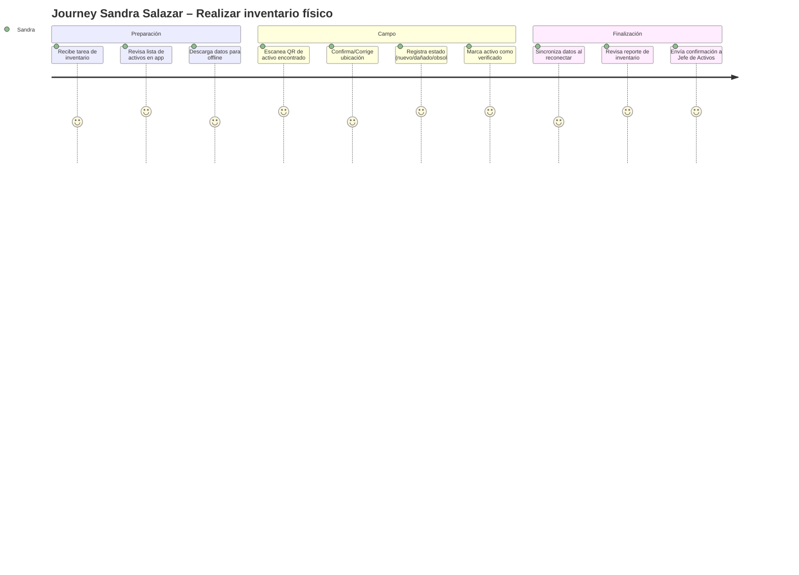
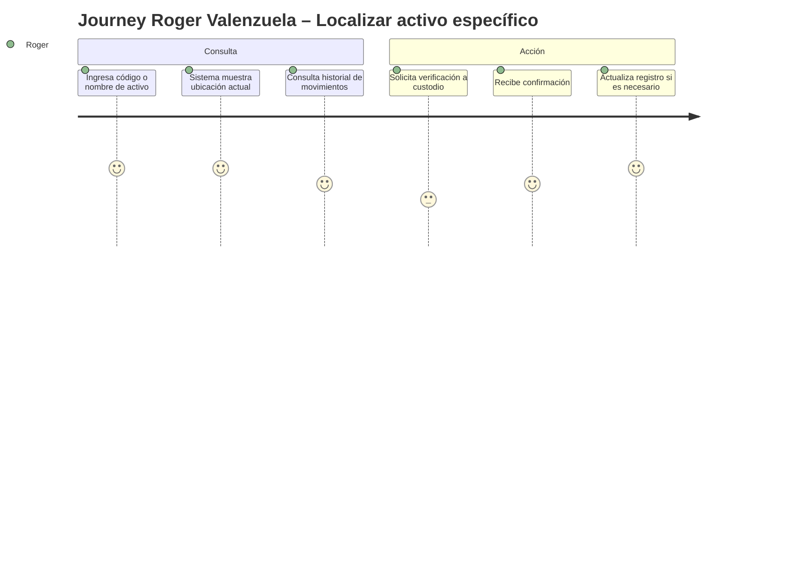

# Product Requirements Document (PRD) – Activa360

**Propósito del PRD**: describir **qué debe hacer el producto** para cumplir los requerimientos del MRD y BRD, con nivel suficiente para que diseño, ingeniería y QA puedan proceder. Responde a **"¿qué hace el producto?"** (no *cómo* lo hace).

Audiencia: Product, Diseño (UX/UI), Ingeniería, QA.

---

## 0. Metadatos

| Campo | Valor |
| :---- | :---- |
| Producto | Activa360 – Sistema Inteligente de Gestión de Activos Fijos |
| Grupo | Grupo 3 (Activos Fijos) |
| Versión | v1.0.0 |
| Fecha | 27/05/2026 |
| Product Manager / Autor | Equipo de Producto Grupo 3 |
| Revisores | Docente + Tech Lead + QA |
| Estado | Final |
| BRD de referencia | BRD_Activos_Fijos.md v1.0.0 |
| MRD de referencia | MRD_Activos_Fijos.md v1.0.0 |
| Insumos M2 (UI/UX) | M2. Consigna de Trabajo Final Activa360ult.pdf, M1 Bitácora |
| Fase Spec Kit cubierta | Specify ✅ / Plan ✅ / Tasks ✅ / Implement ✅ |
| Prompts utilizados | docs/PROMPT_MAPPING.md |

## 0.1 Constitution (opcional — Spec Kit)

**Principios no negociables del producto Activa360:**

- **Principio 1**: Todo flujo crítico debe completarse en ≤ 3 pasos desde la pantalla principal.
- **Principio 2**: Ningún dato sensible se loggea ni en producción ni en debug (cumplimiento SABS).
- **Principio 3**: Toda funcionalidad debe poder usarse sin internet por ≥ 60 segundos (modo offline para inventariadores).
- **Principio 4**: El sistema no debe ser percibido como herramienta punitiva, sino como asistente de gestión.
- **Principio 5**: El cumplimiento normativo SABS debe ser un subproducto natural del uso, no una carga adicional.

## 1. Resumen del producto

Activa360 es un sistema inteligente de gestión de activos fijos para instituciones públicas (inicialmente UMSS) que aborda la brecha crítica entre los registros contables y la realidad física de los bienes.

El producto permite el registro, seguimiento y auditoría de activos mediante códigos QR y una aplicación móvil con modo offline, eliminando los "activos fantasmas" y automatizando el cumplimiento normativo SABS.

Dirigido a: Jefe de Activos Fijos, Inventariadores, Custodios (funcionarios/docentes), y Autoridades (MAE).

Valor: Trazabilidad en tiempo real, reducción de 50% en tiempo de inventarios, 95% de coincidencia físico-contable.

## 2. Objetivos del producto

Cada objetivo enlaza a un objetivo de negocio (BRD).

| ID | Objetivo del producto | BRD vinculado | Métrica | Meta |
| :---- | :---- | :---- | :---- | :---- |
| OP-01 | Permitir registro de activo en ≤ 2 minutos escaneando QR | BO-01 | tiempo promedio registro | ≤ 2 min |
| OP-02 | Garantizar ubicación en tiempo real de cualquier activo | BO-01 | % de activos localizables | ≥ 98% |
| OP-03 | Reducir tiempo de inventario físico a la mitad | BO-02 | horas hombre/año | ≤ 60 horas |
| OP-04 | Automatizar cumplimiento normativo SABS en bajas y traslados | BO-03 | % requisitos automatizados | ≥ 90% |
| OP-05 | Permitir trabajo offline en campo con sincronización automática | BO-04 | funcionalidad offline | 100% |
| OP-06 | Proporcionar dashboard en tiempo real para decisiones directivas | - | actualización dashboard | < 5 min |

## 3. Alcance (*Scope*)

### 3.1 Dentro del alcance (release v1.0)

- Registro de activos con código QR único
- Aplicación móvil para inventario en campo (modo offline)
- Dashboard de indicadores para directivos
- Control de custodios y asignaciones
- Workflow de bajas según normativa SABS
- Historial completo de movimientos por activo
- Generación automática de reportes de auditoría
- Notificaciones de activos sin localizar

### 3.2 Fuera del alcance (backlog)

- Gestión de bienes inmuebles (terrenos, edificios)
- Integración con sistemas de recursos humanos
- Gestión de mantenimiento de activos
- Módulo de depreciación automática
- Registro de activos por fotografía con IA
- Notifications push push a custodios

### 3.3 Roadmap de versiones (Delivery track)

| Versión | Contenido | Fecha objetivo |
| :---- | :---- | :---- |
| v0.5 | Prototipo funcional - Registro y QR | 15/06/2026 |
| v1.0 | MVP - Core features (QR, inventario offline, dashboard) | 15/07/2026 |
| v1.1 | Bajas SABS, historial, reportes | 15/08/2026 |
| v2.0 | Integración contable, expansiones | 15/09/2026 |

### 3.4 Roadmap de validación (Discovery track)

| Sprint / Semana | Hipótesis a validar | Método | Criterio de éxito | Estado |
| :---- | :---- | :---- | :---- | :---- |
| S1 | Inventariadores prefieren escaneo QR sobre entrada manual | Encuesta + 5 entrevistas | ≥ 70% preferencia | Validada (M1) |
| S2 | Dashboard en tiempo real es más útil que reportes PDF | Entrevistas con MAE | ≥ 60% preferencia | Pendiente |
| S3 | Modo offline es crítico para trabajo de campo | Entrevistas inventariadores | ≥ 80% consideran esencial | Pendiente |
| S4 | Notificaciones de activos sin localizar reducen "fantasmas" | A/B test | Reducción 30% | Pendiente |

**Regla de oro**: ninguna *user story* `Must` entra al Delivery track sin una hipótesis validada en el Discovery track.

## 4. Personas y *user journeys*

### 4.1 Personas (resumen, extendidas en MRD)

- **Persona 1 - Roger Valenzuela (Jefe de Activos Fijos)**: 50 años, 20 años de experiencia. Pasa 2-3 días localizando activos. Sufre porque otras áreas no colaboran. Necesita visibilidad total y reportes instantáneos para auditorías.

- **Persona 2 - Sandra Salazar (Inventariadora)**: 45 años, 15 años de experiencia. Trabajo manual excesivo, pierde tiempo buscando activos. Necesita trabajar "de pie y en movimiento" sin depender de escritorio.

- **Persona 3 - Funcionario/Docente (Custodio)**: Usuario final que tiene activos asignados. Necesita consultar qué tiene asignado y reportar problemas fácilmente.

- **Persona 4 - MAE (Máxima Autoridad Ejecutivas)**: Necesita dashboard predictivo para optimización de presupuesto de reposición.

### 4.2 *User journeys* principales

#### Journey 1: Inventariador – Realizar inventario físico

#### Journey 2: Jefe de Activos – Localizar activo específico

## 5. *User stories* y criterios de aceptación

Mínimo **15 historias** priorizadas. Formato: "Como `<rol>`, quiero `<acción>` para `<beneficio>`". Cada historia cumple INVEST.

### 5.1 Épica E1 – Registro y Identificación de Activos

| ID | Historia | Prioridad | Valor | Esfuerzo | Criterios Gherkin |
| :---- | :---- | :---- | :---- | :---- | :---- |
| PRD-US-001 | Como inventariador, quiero escanear un código QR para registrar automáticamente los datos del activo | Must | 10 | 5 | ver §5.1.1 |
| PRD-US-002 | Como Jefe de Activos, quiero generar códigos QR únicos para cada activo | Must | 9 | 3 | ver §5.1.2 |
| PRD-US-003 | Como inventariador, quiero registrar un activo manualmente cuando no tiene QR | Should | 7 | 5 | ver §5.1.3 |
| PRD-US-004 | Como Jefe de Activos, quiero importar activos desde Excel para migración inicial | Should | 6 | 8 | ver §5.1.4 |

#### 5.1.1 Criterios PRD-US-001

Escenario 1: Escaneo exitoso de QR existente

  Dado un activo registrado en el sistema con código QR asignado
  Cuando el inventariador escanea el código QR con la app
  Entonces el sistema muestra los datos del activo (código, nombre, ubicación, custodio)
   Y permite actualizar ubicación y estado

Escenario 2: Escaneo de QR no registrado

  Dado un código QR que no existe en el sistema
  Cuando el inventariador escanea el código
 Entonces el sistema muestra opción "Registrar nuevo activo"
   Y permite crear registro con datos del QR

#### 5.1.2 Criterios PRD-US-002

Escenario: Generación de código QR

  Dado un activo registrado con todos los datos obligatorios
  Cuando el Jefe de Activos solicita generar código QR
  Entonces el sistema genera un código QR único
   Y permite imprimirlo en formato etiqueta

### 5.2 Épica E2 – Inventario en Campo

| ID | Historia | Prioridad | Valor | Esfuerzo | Criterios Gherkin |
| :---- | :---- | :---- | :---- | :---- | :---- |
| PRD-US-005 | Como inventariador, quiero trabajar sin internet para registrar activos en zonas sin cobertura | Must | 10 | 8 | ver §5.2.1 |
| PRD-US-006 | Como inventariador, quiero sincronizar datos automáticamente cuando tenga conectividad | Must | 9 | 5 | ver §5.2.2 |
| PRD-US-007 | Como inventariador, quiero ver la lista de activos a verificar antes de salir a campo | Must | 8 | 3 | ver §5.2.3 |
| PRD-US-008 | Como inventariador, quiero registrar el estado del activo (nuevo/bueno/dañado/obsoleto) | Must | 8 | 2 | ver §5.2.4 |

#### 5.2.1 Criterios PRD-US-005

Escenario: Registro offline

  Dado que el dispositivo no tiene conectividad
  Cuando el inventariador escanea un QR o ingresa datos
 Entonces el sistema guarda el registro localmente
   Y muestra indicador "sin conexión"
   Y permite continuar operando normalmente

### 5.3 Épica E3 – Trazabilidad y Localización

| ID | Historia | Prioridad | Valor | Esfuerzo | Criterios Gherkin |
| :---- | :---- | :---- | :---- | :---- | :---- |
| PRD-US-009 | Como Jefe de Activos, quiero buscar un activo por código/nombre/ubicación para localizarlo rápidamente | Must | 9 | 3 | ver §5.3.1 |
| PRD-US-010 | Como Jefe de Activos, quiero ver el historial completo de movimientos de un activo | Must | 8 | 4 | ver §5.3.2 |
| PRD-US-011 | Como custodio, quiero ver los activos que tengo asignados | Should | 7 | 3 | ver §5.3.3 |
| PRD-US-012 | Como Jefe de Activos, quiero recibir alertas de activos sin localizar por más de X meses | Should | 7 | 4 | ver §5.3.4 |

### 5.4 Épica E4 – Gestión de Custodios

| ID | Historia | Prioridad | Valor | Esfuerzo | Criterios Gherkin |
| :---- | :---- | :---- | :---- | :---- | :---- |
| PRD-US-013 | Como Jefe de Activos, quiero asignar un activo a un custodio con su firma digital | Must | 9 | 5 | ver §5.4.1 |
| PRD-US-014 | Como custodio, quiero aceptar/rechazar una asignación de activo | Should | 6 | 3 | ver §5.4.2 |
| PRD-US-015 | Como Jefe de Activos, quiero registrar traspaso de activo entre custodios | Must | 8 | 4 | ver §5.4.3 |

### 5.5 Épica E5 – Bajas y Cumplimiento Normativo

| ID | Historia | Prioridad | Valor | Esfuerzo | Criterios Gherkin |
| :---- | :---- | :---- | :---- | :---- | :---- |
| PRD-US-016 | Como Jefe de Activos, quiero iniciar proceso de baja según normativa SABS | Must | 9 | 8 | ver §5.5.1 |
| PRD-US-017 | Como Jefe de Activos, quiero generar reporte de auditoría automáticamente | Must | 8 | 5 | ver §5.5.2 |
| PRD-US-018 | Como MAE, quiero dashboard con indicadores clave en tiempo real | Should | 8 | 6 | ver §5.5.3 |

### 5.6 Épica E6 – Reportes y Consulta

| ID | Historia | Prioridad | Valor | Esfuerzo | Criterios Gherkin |
| :---- | :---- | :---- | :---- | :---- | :---- |
| PRD-US-019 | Como Jefe de Activos, quiero exportar inventario a Excel/PDF | Should | 6 | 3 | - |
| PRD-US-020 | Como Jefe de Activos, quiero ver estadísticas de inventario (coincidencia, activos por estado) | Should | 6 | 4 | - |

## 6. Priorización

| Método | Ranking |
| :---- | :---- |
| MoSCoW | Must > Should > Could > Won't |
| RICE | `Reach × Impact × Confidence ÷ Effort` |

Tabla RICE (para las 10 historias *top*):

| ID | Reach | Impact (0.25–3) | Confidence (%) | Effort | RICE |
| :---- | :---- | :---- | :---- | :---- | :---- |
| PRD-US-001 | 5000 | 3 | 90 | 5 | 2700 |
| PRD-US-005 | 3000 | 3 | 80 | 8 | 900 |
| PRD-US-002 | 2000 | 2.5 | 90 | 3 | 1500 |
| PRD-US-009 | 4000 | 2 | 85 | 3 | 2267 |
| PRD-US-013 | 3500 | 2.5 | 80 | 5 | 1400 |
| PRD-US-016 | 1500 | 3 | 85 | 8 | 478 |
| PRD-US-006 | 3000 | 2 | 85 | 5 | 1020 |
| PRD-US-010 | 2500 | 2 | 90 | 4 | 1125 |
| PRD-US-017 | 2000 | 2.5 | 80 | 5 | 800 |
| PRD-US-018 | 500 | 3 | 70 | 6 | 175 |

## 7. Requerimientos funcionales (alto nivel)

| ID | Requisito | Historia(s) | Prioridad |
| :---- | :---- | :---- | :---- |
| PRD-REQ-001 | El sistema debe permitir registro de activos con código QR único | PRD-US-001, PRD-US-002 | Must |
| PRD-REQ-002 | El sistema debe funcionar en modo offline con sincronización automática | PRD-US-005, PRD-US-006 | Must |
| PRD-REQ-003 | El sistema debe permitir búsqueda y localización de activos en tiempo real | PRD-US-009 | Must |
| PRD-REQ-004 | El sistema debe mantener historial completo de movimientos por activo | PRD-US-010 | Must |
| PRD-REQ-005 | El sistema debe gestionar asignaciones y traspasos de custodios | PRD-US-013, PRD-US-015 | Must |
| PRD-REQ-006 | El sistema debe implementar workflow de bajas según SABS | PRD-US-016 | Must |
| PRD-REQ-007 | El sistema debe generar reportes de auditoría automáticamente | PRD-US-017 | Must |
| PRD-REQ-008 | El sistema debe proporcionar dashboard con KPIs en tiempo real | PRD-US-018 | Should |
| PRD-REQ-009 | El sistema debe permitir importación masiva desde Excel | PRD-US-004 | Should |

## 8. Requerimientos no funcionales (alto nivel)

| ID | Categoría | Requerimiento | Métrica | Umbral |
| :---- | :---- | :---- | :---- | :---- |
| PRD-NFR-001 | Rendimiento | tiempo de respuesta API búsqueda | p95 | < 500 ms |
| PRD-NFR-002 | Rendimiento | tiempo de sincronización offline | - | < 30 seg (100 registros) |
| PRD-NFR-003 | Seguridad | protección de datos sensibles | cifrado | AES-256 |
| PRD-NFR-004 | Seguridad | autenticación de usuarios | protocolo | OAuth 2.0 / SAML |
| PRD-NFR-005 | Disponibilidad | soporte modo offline | tiempo | ≥ 60 segundos sin conexión |
| PRD-NFR-006 | Usabilidad | pasos para registro de activo | cantidad | ≤ 3 clics |
| PRD-NFR-007 | Compatibilidad | soporte de dispositivos móviles | OS | Android 8+, iOS 13+ |
| PRD-NFR-008 | Accesibilidad | cumplimiento WCAG | nivel | AA |

Estos NFRs se detallan con mecanismo de verificación en el FSD §10.

## 9. Dependencias e integraciones

| Sistema | Tipo | Propósito | Riesgo |
| :---- | :---- | :---- | :---- |
| VSIAF/SIAF | consumo | Sincronización contable | Alto |
| SAF WEB | consumo | Datos de bienes | Medio |
| Servidor UMSS | provisión | Infraestructura hosting | Medio |
| Active Directory / SSO | consumo | Autenticación institucional | Medio |

## 10. Supuestos y restricciones

- **Supuestos**: 
  - Los inventariadores tienen dispositivos móviles disponibles
  - Existe conectividad básica en oficinas para sincronización
  - Los usuarios aceptan el uso de códigos QR físicos
  - La institución puede imprimir etiquetas QR
  
- **Restricciones**: 
  - Cumplimiento de normativa SABS (Decreto Supremo N° 0181)
  - Plazo del proyecto definido por calendario académico
  - Presupuesto limitado para hardware
  - stack tecnológico definido por restricciones de la institución

## 11. Experiencia de usuario

- Referencia a M2. Consigna de Trabajo Final Activa360ult.pdf (Wireframes, User Flows)
- Lineamientos de diseño: simplicidad, modo offline claro, sin fatiga cognitiva
- El sistema no debe percibirse como herramienta punitiva sino como asistente

### 11.1 Trazabilidad con M2 (UI/UX)

Hallazgos clave de investigación M2 organizados por categoría:

| Categoría M2 | Hallazgo | Implicación PRD |
| :---- | :---- | :---- |
| UI/UX - Carga Cognitiva | Menús saturados que confunden | Navegación simple, ≤ 3 clics |
| UI/UX - Navegación | Procesos "ciegos" sin progreso | Barras de progreso visibles |
| Operación - Captura | Dependencia del papel | App móvil con offline |
| Operación - Campo | Necesidad de transcribir datos | Escaneo QR directo |
| Cumplimiento - Trazabilidad | Incapacidad de ubicación en tiempo real | GPS/QR en tiempo real |
| Cumplimiento - Offline | Dificultad sin internet | Modo offline obligatorio |
| Custodios - Actas | Actas físicas se pierden | Firmas digitales |
| Reportes - MAE | Solo PDFs estáticos | Dashboard predictivo |

#### Use Cases del M2 ↔ User Stories del PRD

| Use Case M2 | User Story PRD | Estado de la traza |
| :---- | :---- | :---- |
| UC-M2-01: Registro de activo | `PRD-US-001` | ✅ cubierto |
| UC-M2-02: Inventario físico | `PRD-US-005`, `PRD-US-007` | ✅ cubierto |
| UC-M2-03: Localización de activo | `PRD-US-009` | ✅ cubierto |
| UC-M2-04: Asignación a custodio | `PRD-US-013` | ✅ cubierto |
| UC-M2-05: Baja de activo | `PRD-US-016` | ✅ cubierto |
| UC-M2-06: Dashboard MAE | `PRD-US-018` | ✅ cubierto |

### 11.2 Exploración con Vibe Coding (opcional)

*Pendiente de documentar si se utilizó*

## 12. Métricas de éxito del producto

- **North Star**: % de coincidencia entre inventario físico y sistema ≥ 95%
- **KPIs de adopción**: % de usuarios activos diarios ≥ 80%
- **KPIs de calidad**: Tasa de errores en registro < 1%, MTTR < 4 horas

| ID | Métrica | Línea Base | Meta | Horizonte |
| :---- | :---- | :---- | :---- | :---- |
| KPP-01 | % coincidencia físico-contable | 70% | ≥ 95% | Q4 2026 |
| KPP-02 | Tiempo promedio registro activo | 10 min | ≤ 2 min | Q4 2026 |
| KPP-03 | Adopción usuarios (DAU/MAU) | 0% | ≥ 80% | Q4 2026 |
| KPP-04 | Tasa de error en sincronización | - | < 1% | Q4 2026 |

## 13. Riesgos del producto

| Riesgo | Prob. | Impacto | Mitigación |
| :---- | :---- | :---- | :---- |
| Baja adopción por inventariadores | media | alto | Capacitación, UX intuitiva, incentivos |
| Problemas de integración contable | media | medio | Pruebas tempranas, APIs documentadas |
| Dispositivos offline no funcionan | baja | alto | Testing exhaustivo, modo fallback |
| Resistencia de custodios a firmar digital | media | medio | Comunicación, beneficios claros |

## 14. Trazabilidad

| PRD ID | BRD | MRD | FSD (próximo) |
| :---- | :---- | :---- | :---- |
| PRD-US-001 | BR-001 | MRD-N-01 | FSD-UC-001 |
| PRD-US-005 | BR-002 | MRD-N-02 | FSD-UC-002 |
| PRD-US-009 | BR-007 | MRD-N-03 | FSD-UC-001 |
| PRD-US-016 | BR-006 | MRD-N-04 | FSD-UC-003 |
| PRD-US-018 | BR-008 | MRD-N-05 | FSD-UC-008 |

## 15. Anexos

- M1. Bitácora – Encuesta completa con resultados (92.9% disposición a probar)
- M2. Consigna – Hallazgos de auditoría heurística (8 categorías de problemas)
- Análisis de stakeholders (11 tipos de stakeholders identificados)

## 16. Registro de cambios

| Versión | Fecha | Autor | Cambio |
| :---- | :---- | :---- | :---- |
| v0.1 | 14/05/2026 | Grupo 3 | Versión inicial basada en template PRD + insumos M1/M2 |
| v1.0.0 | 27/05/2026 | Grupo 3 | Versión final pulida y alineada para la Defensa Final |

---

## Checklist mínimo

- [x] ≥ 15 *user stories* con INVEST y Gherkin (20 historias definidas)
- [x] Priorización MoSCoW + RICE para top‑10
- [x] ≥ 2 *user journeys* en Mermaid (2 journeys definidos)
- [x] NFRs alto nivel con umbrales (8 NFRs)
- [x] Roadmap de versiones (v0.5 → v2.0)
- [x] Trazabilidad BRD → MRD → PRD → FSD iniciada
- [ ] Revisión documentada por pares