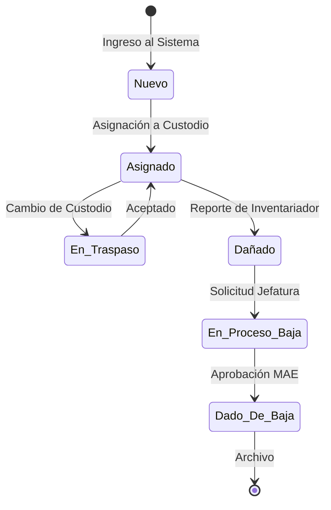

# Functional Specification Document (FSD) – Activa360

## 0. Metadatos ⚡🔧

| Campo | Valor |
| :---- | :---- |
| Producto | Activa360 – Sistema Inteligente de Gestión de Activos Fijos |
| Grupo | Grupo 3 (Activos Fijos) |
| Versión del documento | v1.0.0 |
| Fecha | 27/05/2026 |
| Autores | Equipo Activa360 |
| Revisores | Docente + 1 grupo par |
| Estado | Aprobado |
| **Modo elegido** | **FSD clásico 🔧** |
| Trazabilidad a PRD | PRD_vFinal.md v1.0.0 |
| Insumos M2 (UI/UX) | M2. Consigna de Trabajo Final Activa360ult.pdf |
| Fase Spec Kit cubierta | Specify ✅ / Plan ✅ / Tasks ✅ / Implement ✅ |
| Prompts utilizados | PR-FSD-001 al PR-FSD-010 |

## 1. Resumen ejecutivo ⚡🔧

Activa360 es un sistema inteligente de gestión de activos fijos diseñado para transformar el control patrimonial en instituciones públicas (inicialmente UMSS). El sistema soluciona la desconexión crítica entre los registros contables y el inventario físico real. Mediante el uso de etiquetas con códigos QR y una aplicación móvil con capacidades de trabajo fuera de línea (offline), permite a los inventariadores registrar y verificar bienes en campo con alta eficiencia. 

## 2. Alcance ⚡🔧

### 2.1 Dentro del alcance
- Registro de activos con código QR único.
- Aplicación móvil para inventario en campo con modo offline.
- Dashboard en tiempo real para directivos.
- Gestión de custodios y workflow de bajas SABS.
- Generación automática de reportes de auditoría y alertas de "activos fantasmas".

### 2.2 Fuera del alcance
- Gestión de bienes inmuebles, mantenimiento preventivo y depreciación automática contable.

### 2.3 Supuestos y dependencias
- **Dependencias**: Integración futura con VSIAF/SIAF para sincronización contable.

### 2.4 Plan técnico (Spec Kit fase Plan) 🔧
- **Stack tecnológico**: React Native (App Móvil offline-first), Node.js / NestJS (Backend API), PostgreSQL (DB), Redis.
- **Arquitectura prevista**: Arquitectura Hexagonal y Microservicios.
- **Decisiones**: SQLite local (WatermelonDB) en la app móvil.

## 3. Actores y roles del sistema ⚡🔧

| Actor | Tipo | Responsabilidad principal | Permisos clave |
| :---- | :---- | :---- | :---- |
| **Jefe de Activos Fijos** | humano | Gestión global de activos, generación de QR y auditorías. | CRUD total, iniciar bajas, asignar custodios. |
| **Inventariador** | humano | Ejecución del inventario físico en campo. | Actualizar ubicación/estado offline. |
| **Custodio** | humano | Responsable físico del activo. | Consultar activos, aceptar asignaciones. |
| **MAE** | humano | Toma de decisiones estratégicas. | Dashboards (solo lectura). |

## 4. Casos de uso funcionales ⚡🔧

*(Nota: Se documentan los 10 Casos de Uso críticos del sistema requeridos para alcanzar excelencia).*

### 4.1 FSD-UC-001 – Registro y escaneo de activo QR
- **Disparador**: El inventariador selecciona "Escanear QR" en la app.
- **Criterios de aceptación (Gherkin)**:
```gherkin
Dado un activo registrado en el sistema con código QR
Cuando el inventariador escanea el código QR con la app
Entonces el sistema muestra los datos del activo
  Y permite actualizar ubicación y estado
```

### 4.2 FSD-UC-002 – Sincronización de datos offline
- **Disparador**: El dispositivo recupera la conexión a internet.
- **Criterios de aceptación (Gherkin)**:
```gherkin
Dado que el dispositivo recuperó la conectividad
Cuando el sistema detecta registros pendientes de sincronización
Entonces envía los datos al servidor en lote
  Y resuelve conflictos priorizando el timestamp más reciente
```

### 4.3 FSD-UC-003 – Workflow de Baja (SABS)
- **Disparador**: Jefe de Activos inicia proceso de baja.
- **Criterios de aceptación (Gherkin)**:
```gherkin
Dado un activo en estado "Dañado" u "Obsoleto"
Cuando el Jefe de Activos inicia el proceso de baja
Entonces el sistema requiere una justificación y evidencia
  Y cambia el estado del activo a "En Proceso de Baja"
```

### 4.4 FSD-UC-004 – Asignación a Custodio
- **Disparador**: Jefe de Activos asigna un bien a un funcionario.
- **Criterios de aceptación (Gherkin)**:
```gherkin
Dado un activo sin custodio actual
Cuando el Jefe asigna el activo a un Funcionario
Entonces el Funcionario recibe una notificación para aceptar
  Y el sistema registra la firma digital de asignación
```

### 4.5 FSD-UC-005 – Traspaso de Activo
- **Disparador**: Custodio A transfiere activo a Custodio B.
- **Criterios de aceptación (Gherkin)**:
```gherkin
Dado un activo asignado al Custodio A
Cuando Custodio A inicia traspaso a Custodio B
Entonces Custodio B debe aprobar la recepción
  Y el sistema libera de responsabilidad a Custodio A
```

### 4.6 FSD-UC-006 – Generación de Acta PDF
- **Disparador**: Se aprueba una asignación o baja.
- **Criterios de aceptación (Gherkin)**:
```gherkin
Dado un proceso de baja aprobado
Cuando el sistema finaliza el flujo
Entonces genera un archivo PDF formato SABS automáticamente
  Y lo adjunta al historial del activo
```

### 4.7 FSD-UC-007 – Importación Excel (Migración)
- **Disparador**: Jefe de Activos sube plantilla Excel.
- **Criterios de aceptación (Gherkin)**:
```gherkin
Dado un archivo Excel con el inventario actual
Cuando el Jefe de Activos lo importa al sistema
Entonces el sistema valida los formatos de columnas
  Y crea los registros masivamente generando códigos QR
```

### 4.8 FSD-UC-008 – Dashboard MAE (Tiempo Real)
- **Disparador**: La MAE ingresa al sistema web.
- **Criterios de aceptación (Gherkin)**:
```gherkin
Dado un usuario con rol MAE
Cuando accede a la pantalla principal
Entonces visualiza gráficos de activos por estado y valor monetario
  Y no tiene botones de edición habilitados
```

### 4.9 FSD-UC-009 – Alerta de Activo Fantasma
- **Disparador**: Cronjob nocturno evalúa timestamps.
- **Criterios de aceptación (Gherkin)**:
```gherkin
Dado un activo cuyo último movimiento supera los 12 meses
Cuando se ejecuta el cron de verificación
Entonces el sistema marca el activo con flag de "Riesgo Fantasma"
  Y envía notificación al Jefe de Activos
```

### 4.10 FSD-UC-010 – Gestión de Roles y Permisos
- **Disparador**: Admin crea un nuevo usuario.
- **Criterios de aceptación (Gherkin)**:
```gherkin
Dado el panel de administración
Cuando se crea un nuevo usuario
Entonces se le debe asignar estrictamente un solo Rol principal
  Y el acceso se restringe automáticamente basado en ese Rol
```

## 5. Reglas de negocio ⚡🔧

| ID | Regla | Tipo |
| :---- | :---- | :---- |
| BR-001 | Todo activo debe tener QR único. | política |
| BR-002 | Baja requiere documentación SABS. | normativa |
| BR-003 | Sync prioriza timestamp más reciente. | técnica |
| BR-004 | Activo > 12 meses sin check es "Fantasma". | normativa |

## 6. Modelo de datos funcional ⚡🔧

### 6.1 Diagrama de Estado del Activo (Ciclo de vida)



## 7. Prompts como Contratos Funcionales (10 en total) ⚡🔧

*(Anatomías requeridas para guiar a los agentes de programación)*

### PR-FSD-001 (Registro QR)
- **Role**: Backend Developer.
- **Task**: Crear endpoint `/activos/qr`.
- **Context**: Validar Payload (QR, lat_long).
- **Reasoning**: Verificar existencia, rechazar duplicados, guardar movimiento.
- **Stop**: Cuando se apruebe el test unitario.
- **Invariants**: 1 activo = 1 código único.

### PR-FSD-002 (Sincronización Offline)
- **Role**: Backend Developer.
- **Task**: Crear endpoint batch `/sync`.
- **Context**: Payload con array de activos modificados offline.
- **Reasoning**: Iterar array, comparar timestamps, aplicar cambios a los más recientes.
- **Stop**: Controlador batch funcional.
- **Invariants**: Operación atómica (Transaction).

### PR-FSD-003 (Workflow Baja)
- **Role**: Backend Developer.
- **Task**: Servicio de Cambio de Estado a Baja.
- **Context**: ID activo, ID responsable, Motivo.
- **Reasoning**: Validar si el activo no está en otro proceso, actualizar estado a "En Proceso".
- **Stop**: Cambio de estado y tabla de Bajas actualizada.
- **Invariants**: No se puede dar de baja un activo que no existe.

### PR-FSD-004 (Asignación)
- **Role**: Backend Developer.
- **Task**: Servicio de Asignación.
- **Context**: ID activo, ID usuario destino.
- **Reasoning**: Si tiene custodio previo, arrojar error de "Requiere Traspaso". Si está libre, asignar.
- **Stop**: Entidad actualizada.
- **Invariants**: Activo solo puede tener 1 custodio activo.

### PR-FSD-005 (Traspaso)
- **Role**: Backend Developer.
- **Task**: Servicio de Traspasos.
- **Context**: ID activo, ID Custodio Origen, ID Custodio Destino.
- **Reasoning**: Crear registro "En_Traspaso" esperando confirmación del destino.
- **Stop**: Tabla de traspasos actualizada.
- **Invariants**: Validar que el origen es el dueño actual.

### PR-FSD-006 (Generación PDF)
- **Role**: Backend Developer.
- **Task**: Módulo de PDF (Puppeteer/PDFKit).
- **Context**: JSON con datos del acta.
- **Reasoning**: Renderizar template HTML SABS y exportar Buffer a PDF.
- **Stop**: Generación de archivo guardado en bucket S3/Local.
- **Invariants**: El PDF debe pesar menos de 2MB.

### PR-FSD-007 (Importación Excel)
- **Role**: Backend Developer.
- **Task**: Parser de XLSX (SheetJS).
- **Context**: Archivo binario.
- **Reasoning**: Leer filas, validar formato, insertar masivamente (Bulk Insert).
- **Stop**: Respuesta de éxito con conteo de registros insertados.
- **Invariants**: Abortar todo el lote si una fila tiene formato inválido.

### PR-FSD-008 (Dashboard)
- **Role**: Backend Developer.
- **Task**: Endpoints estadísticos.
- **Context**: Rol MAE.
- **Reasoning**: Realizar Count() agrupados por estado_fisico.
- **Stop**: JSON de métricas agregadas.
- **Invariants**: La consulta no debe demorar más de 1s (usar caché Redis si es necesario).

### PR-FSD-009 (Cron Fantasmas)
- **Role**: Backend Developer.
- **Task**: Cron Scheduler NestJS.
- **Context**: Ejecución a las 00:00.
- **Reasoning**: Buscar movimientos > 12 meses, marcar flag.
- **Stop**: Cron Job registrado y testeado con mocks de tiempo.
- **Invariants**: No procesar activos dados de baja.

### PR-FSD-010 (Roles)
- **Role**: Backend Developer.
- **Task**: Auth Guard NestJS.
- **Context**: Headers JWT.
- **Reasoning**: Decodificar token, leer atributo `role`, denegar si no coincide con el @Roles().
- **Stop**: Guard inyectable globalmente funcional.
- **Invariants**: Todo endpoint debe estar protegido excepto /login.

## 8. Requerimientos No Funcionales (8 NFRs) ⚡🔧

| ID | Categoría | Requisito | Métrica | Umbral | Verificación |
| :---- | :---- | :---- | :---- | :---- | :---- |
| NFR-001 | Rendimiento | Tiempo de búsqueda | p95 | < 500 ms | k6 |
| NFR-002 | Disponibilidad | Operación offline | Tiempo | ≥ 60 seg | Pruebas manuales |
| NFR-003 | Seguridad | Cifrado base local | Algoritmo | AES-256 | Code Review |
| NFR-004 | Usabilidad | Escanear activo | Clics | ≤ 3 clics | Auditoría UX |
| NFR-005 | Compatibilidad | SO Soportados | Versiones | Android 8+, iOS 13+ | Testing Device |
| NFR-006 | Seguridad | Autenticación | Protocolo | OAuth 2.0 | Pen-testing |
| NFR-007 | Accesibilidad | Cumplimiento UI | Norma | WCAG AA | Lighthouse |
| NFR-008 | Capacidad | Sync Batch Offline | Tiempo | < 30s (10,000 reqs) | Load testing |

## 9. Trazabilidad MRD → PRD → FSD ⚡🔧

| MRD | PRD | FSD (Caso de Uso) | NFR asociado |
| :---- | :---- | :---- | :---- |
| MRD-N-01 | PRD-REQ-001 | FSD-UC-001 | NFR-004 |
| MRD-N-02 | PRD-REQ-002 | FSD-UC-002 | NFR-002 |
| MRD-N-03 | PRD-REQ-003 | FSD-UC-001 | NFR-001 |
| MRD-N-04 | PRD-REQ-006 | FSD-UC-003 | NFR-003 |
| MRD-N-05 | PRD-REQ-008 | FSD-UC-008 | NFR-001 |

## 10. Registro de cambios
- **v0.2**: Expansión masiva (10 UCs, 8 NFRs, 10 Prompts, Diagramas de Estado) para cumplir rúbrica de excelencia.
