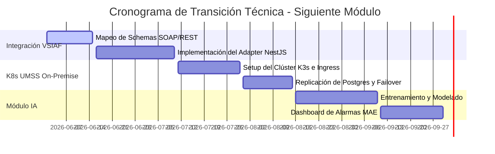

# Hoja de Ruta de Ingeniería – Siguiente Módulo (Activa360)

Este documento traza la planificación de ingeniería y arquitectura para la transición al siguiente módulo de la maestría, estableciendo los hitos de escalabilidad, integración gubernamental y adopción en producción real de **Activa360**.

---

## 1. Hito 1: Integración Estatal con VSIAF (SIGEP Bolivia)
*   **Objetivo**: Automatizar la conciliación contable de activos fijos con el Sistema Integrado de Gestión Pública nacional (SIGEP / VSIAF), eliminando la doble transcripción de información.
*   **Arquitectura de Integración**:
    *   Implementación de un **Adaptador de Salida (Secondary Adapter)** de conformidad en NestJS que se conecte mediante SOAP/WSDL y REST con firma digital del Estado a la pasarela interoperable pública boliviana.
    *   Diseño de un Worker en segundo plano (Worker Pool) que sincronice semanalmente los estados contables de depreciación acumulada de activos.
*   **Métrica de Éxito**: Tasa de discrepancia en registros contables reducida a **0.0%** en la conciliación mensual del primer trimestre de pruebas.

---

## 2. Hito 2: Despliegue en Alta Disponibilidad (UMSS On-Premise)
*   **Objetivo**: Desplegar la infraestructura definitiva en el centro de datos institucional de la Universidad Mayor de San Simón (UMSS), garantizando una disponibilidad del 99.9% para todas las facultades.
*   **Estrategia de Despliegue**:
    *   Migración de contenedores Docker simples a un clúster local de **Kubernetes (K3s u OKD)** administrado institucionalmente.
    *   Configuración de políticas de autoescalado horizontal de Pods (HPA) con un piso mínimo de 3 réplicas del backend y balanceador de carga NGINX Ingress Controller.
    *   Implementación de replicación síncrona en PostgreSQL (Streaming Replication) entre dos servidores rack físicos SUN Microsystems del campus central para failover automático de base de datos.
*   **Métrica de Éxito**: Disponibilidad medida del sistema ≥ **99.9%** (MTBF > 3 meses).

---

## 3. Hito 3: Módulo de IA Analítico y Mantenimiento Predictivo
*   **Objetivo**: Implementar algoritmos de IA ligeros directamente en el Core para predecir cuándo un activo fijo requiere mantenimiento preventivo o debe ser dado de baja preventivamente por SABS antes de fallar catastróficamente.
*   **Estrategia de Implementación**:
    *   Creación de un microservicio Python (FastAPI) aislado que consuma el feed de eventos históricos de inventario de Postgres.
    *   Uso de modelos de regresión y clasificación (Scikit-Learn) entrenados en base a: estado de desgaste, frecuencia de escaneo GPS, e historial de incidentes reportados por inventariadores.
    *   Exposición de alarmas proactivas en el Dashboard directivo de la Máxima Autoridad Ejecutiva (MAE) notificando estimaciones de vida útil remanente.
*   **Métrica de Éxito**: Reducción del **35%** en costes de sustitución de emergencia de activos tecnológicos y de laboratorio en la UMSS.

---

## 4. Cronograma de Transición

