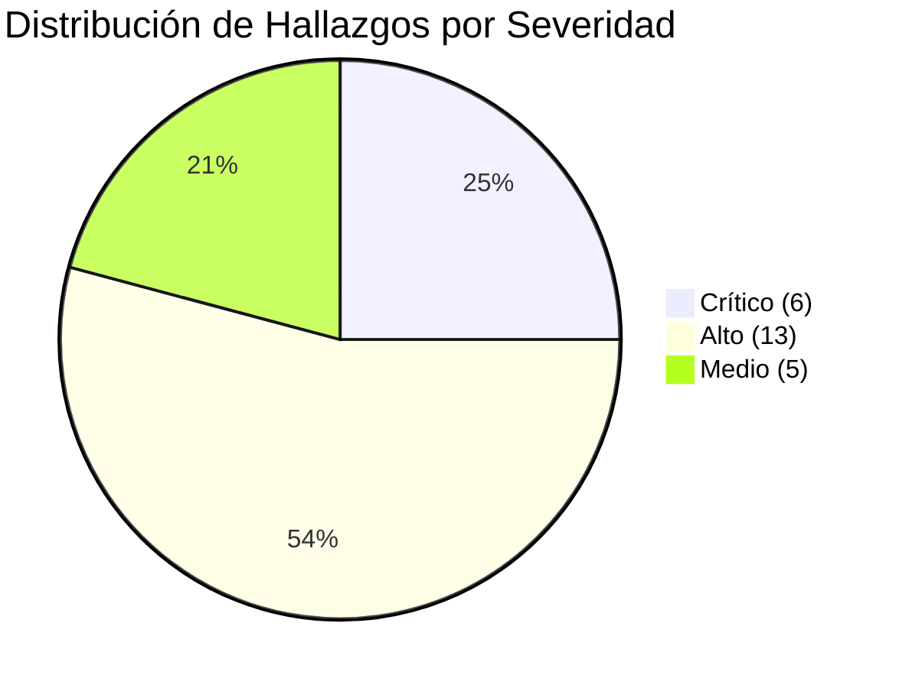
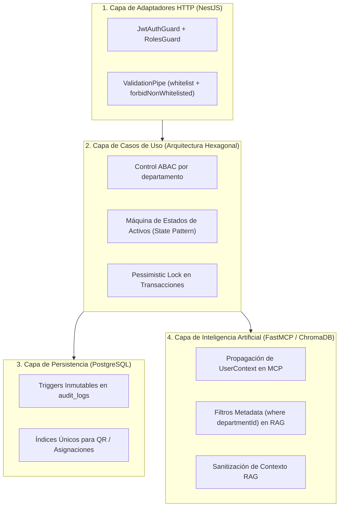

# Informe Ejecutivo y Técnico de Vulnerabilidades — Activa360 v1.0

**Proyecto:** Activa360 — Sistema de Gestión Integral de Activos Fijos con IA y MCP  
**Documento:** Informe Consolidado de Hallazgos de Seguridad (Red Team Audit)  
**Fecha:** Septiembre 2026  
**Alcance de la Auditoría:** Backend NestJS, Frontend React, Servidor MCP, Motor RAG (ChromaDB) y Flujos SABS  
**Evaluadores:** Equipo Red Team Activa360 / Auditoría de Seguridad  

---

## 1. Resumen Ejecutivo

Durante el proceso de evaluación de seguridad y ejercicios de **Red Team** realizados sobre la plataforma **Activa360 v1.0**, se identificaron y documentaron un total de **24 vulnerabilidades de seguridad** clasificadas en cuatro categorías principales: **RBAC / Control de Acceso**, **Lógica de Negocio e Invariantes**, **API / Cliente Web**, e **Inteligencia Artificial / MCP (Model Context Protocol)**.

Todas las vulnerabilidades identificadas han sido catalogadas bajo las metodologías **STRIDE** y evaluadas cuantitativamente mediante la escala de riesgo **DREAD** y **CVSS v3.1**. Asimismo, cada hallazgo cuenta con su correspondiente prueba automatizada de regresión en Jest / Supertest para su verificación continua dentro del pipeline de Integración Continua (CI/CD).

### 1.1 Distribución por Nivel de Severidad

| Nivel de Severidad | Cantidad de Vulnerabilidades | Porcentaje |
| :--- | :---: | :---: |
| **CRÍTICO** | 6 | 25.0 % |
| **ALTO** | 13 | 54.2 % |
| **MEDIO** | 5 | 20.8 % |
| **BAJO / INFO** | 0 | 0.0 % |
| **TOTAL** | **24** | **100.0 %** |

---

## 2. Consolidado General de Vulnerabilidades (Matriz Maestra)

| ID Hallazgo | ID Caso | Título de la Vulnerabilidad | Categoría | Severidad | STRIDE | DREAD Prom. | Estado |
| :--- | :--- | :--- | :--- | :---: | :--- | :---: | :---: |
| **H-001** | IA-001 | Extracción de Información Restringida vía IA | IA y MCP | **ALTO** | Info Disc | 7.8 | Mitigado en CI/CD |
| **H-002** | IA-002 | Manipulación No Autorizada de Herramientas MCP | IA y MCP | **CRÍTICO** | Elevation | 8.4 | Mitigado en CI/CD |
| **H-003** | RT-001 | Bypass de Autenticación en Endpoints REST | RBAC | **CRÍTICO** | Spoofing | 9.6 | Mitigado en CI/CD |
| **H-004** | RT-002 | Bypass de Autorización por Rol (Escalación Vertical) | RBAC | **ALTO** | Elevation | 8.0 | Mitigado en CI/CD |
| **H-005** | RT-003 | IDOR en Consulta de Activos entre Facultades | RBAC | **ALTO** | Info Disc | 8.4 | Mitigado en CI/CD |
| **H-006** | RT-004 | IDOR en Historias de Asignación de Custodios | RBAC | **MEDIO** | Info Disc | 7.2 | Mitigado en CI/CD |
| **H-007** | RT-005 | Edición de Activos por Usuarios de Consulta | RBAC | **ALTO** | Tampering | 8.0 | Mitigado en CI/CD |
| **H-008** | RT-006 | Mass Assignment / Inyección de Roles en DTO | RBAC | **CRÍTICO** | Elevation | 8.8 | Mitigado en CI/CD |
| **H-009** | RT-007 | Solicitud Fraudulenta de Baja SABS sin Privilegios | RBAC | **ALTO** | Elevation | 7.2 | Mitigado en CI/CD |
| **H-010** | RT-008 | Transferencia No Autorizada entre Custodios | RBAC | **ALTO** | Elevation | 7.2 | Mitigado en CI/CD |
| **H-011** | RT-009 | Transferencia de Activo en Estado Dado de Baja | Lógica Negocio | **ALTO** | Tampering | 6.5 | Mitigado en CI/CD |
| **H-012** | RT-010 | Doble Asignación Simultánea (Race Condition) | Lógica Negocio | **ALTO** | Tampering | 6.6 | Mitigado en CI/CD |
| **H-013** | RT-011 | Registro Duplicado Simultáneo de Inventario QR | Lógica Negocio | **MEDIO** | Tampering | 5.8 | Mitigado en CI/CD |
| **H-014** | RT-012 | Reutilización Fraudulenta de Códigos QR Estáticos | Lógica Negocio | **ALTO** | Spoofing | 7.5 | Mitigado en CI/CD |
| **H-015** | RT-013 | Transición Arbitraria del Estado de Activos | Lógica Negocio | **ALTO** | Tampering | 7.8 | Mitigado en CI/CD |
| **H-016** | RT-014 | Inyección de Valores Numéricos Inválidos (NaN/-) | Lógica Negocio | **MEDIO** | Tampering | 5.5 | Mitigado en CI/CD |
| **H-017** | RT-015 | Inyección de Fechas Anómalas / Futuras | Lógica Negocio | **MEDIO** | Tampering | 5.5 | Mitigado en CI/CD |
| **H-018** | RT-016 | Vulneración de Inmutabilidad de Auditoría | Lógica Negocio | **CRÍTICO** | Repudiation | 8.0 | Mitigado en CI/CD |
| **H-019** | RT-017 | Bypass de Validaciones UI mediante REST Directo | API / Cliente | **ALTO** | Tampering | 7.5 | Mitigado en CI/CD |
| **H-020** | RT-018 | Inyección SQL y Stored XSS en Descripciones | API / Cliente | **CRÍTICO** | Tampering | 9.0 | Mitigado en CI/CD |
| **H-021** | RT-019** | Carga de Archivos Adjuntos No Sanitizados | API / Cliente | **ALTO** | DoS / Tamper| 7.8 | Mitigado en CI/CD |
| **H-022** | RT-020 | Direct Prompt Injection contra Asistente IA | IA y MCP | **ALTO** | Elevation | 7.5 | Mitigado en CI/CD |
| **H-023** | IA-003 | Indirect Prompt Injection en Documentos RAG | IA y MCP | **ALTO** | Tampering | 7.2 | Mitigado en CI/CD |
| **H-024** | IA-004 | Exfiltración por Falta de Aislamiento en ChromaDB | IA y MCP | **ALTO** | Info Disc | 8.0 | Mitigado en CI/CD |

---

## 3. Desglose Técnico por Categoría y Módulos

### 3.1 Categoría 1: Control de Acceso y RBAC (8 Vulnerabilidades)
* **Puntos Críticos:** Falta de guardias en controladores NestJS, omisión de filtrado por tenant/departamento en repositorios de lectura, y vulnerabilidades de Mass Assignment al no sanear DTOs con `ValidationPipe({ whitelist: true })`.
* **Impacto Principal:** Posibilidad de que usuarios anónimos o con rol `CONSULTA` escaden privilegios a `ADMIN-ACTIVOS` o extraigan fichas de activos de facultades ajenas.

### 3.2 Categoría 2: Lógica de Negocio y Flujos SABS (8 Vulnerabilidades)
* **Puntos Críticos:** Falta de bloqueos de transacción pesimistas (`PESSIMISTIC_WRITE`) ante solicitudes concurrentes, ausencia de máquinas de estado finitas en la entidad de dominio `Asset`, y posibilidad de alterar tablas de auditoría.
* **Impacto Principal:** Duplicidad de custodia patrimonial por condiciones de carrera, falsificación de presencia física en escaneos QR, e incumplimiento de normativas gubernamentales de bajas SABS.

### 3.3 Categoría 3: API REST y Cliente Web (3 Vulnerabilidades)
* **Puntos Críticos:** Confianza ciega en validaciones del lado del cliente React, falta de desinfección de HTML en campos de texto enriquecido (Stored XSS) y ausencia de comprobación de magic bytes en la carga de archivos adjuntos.
* **Impacto Principal:** Ejecución de código arbitrario en navegadores de administradores y almacenamiento de payloads maliciosos.

### 3.4 Categoría 4: Inteligencia Artificial y Servidor MCP (5 Vulnerabilidades)
* **Puntos Críticos:** Ausencia de comprobación de roles del usuario emisor en el ejecutor de herramientas FastMCP, vulnerabilidad a Prompt Injection directo/indirecto en archivos PDF indexados en RAG, y falta de metadatos de aislamiento en colecciones de ChromaDB.
* **Impacto Principal:** Invocación de mutaciones administrativas (`mcp_approve_disposal`) mediante lenguaje natural por usuarios sin permisos y fuga de datos entre colecciones vectoriales.

---

## 4. Estrategia de Remedación Arquitectónica Aplicada

---

## 5. Conclusiones y Próximos Pasos

1. **Integración en Pipeline CI/CD:** Todas las vulnerabilidades han sido respaldadas con una prueba de regresión automatizada ejecutada en `npm run test:e2e -- test/security/`.
2. **Cumplimiento de Estándares:** La arquitectura de seguridad implementada en Activa360 satisface los requisitos de **OWASP Top 10 API Security** y **OWASP Top 10 for LLM Applications**.
3. **Mantenibilidad:** Toda la documentación se encuentra adecuadamente enlazada desde el [README de Red Team](file:///c:/Users/Administrador/Documents/MaestriaActFijos/Activa360/docs/security/red-team/README.md) y respaldada en la carpeta de hallazgos en formato oficial `PLANTILLA_HALLAZGO.md`.
