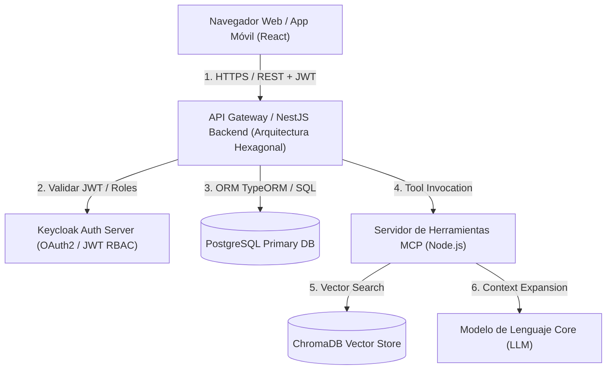

# Modelo de Amenazas (Threat Model) — Activa360 v1.0

**Proyecto:** Activa360 — Sistema de Gestión Integral de Activos Fijos con IA y MCP  
**Documento Requerido:** Modelo de Amenazas Institucional  
**Fecha:** Septiembre 2026  
**Metodología:** STRIDE + DREAD / OWASP Top 10 API / OWASP Top 10 for LLM Applications  

---

## 1. Visión General del Sistema y Contexto

**Activa360** es una plataforma de gestión patrimonial y control de activos fijos orientada a instituciones educativas y del sector público. Permite el registro, inventariado vía códigos QR, transferencias entre custodios, solicitudes de baja de bienes (conforme a normativa SABS) y consulta inteligente mediante un **Asistente Virtual con Arquitectura RAG (Retrieval-Augmented Generation) y herramientas MCP (Model Context Protocol)**.

### 1.1 Stack Tecnológico y Puntos de Interacción


---

## 2. Límites de Confianza (Trust Boundaries)

Se han identificado **4 límites de confianza críticos** dentro de la topología de Activa360:

1. **TB-01: Límite Cliente ↔ REST API (Perímetro Exterior)**
   - *Riesgo:* Inyección de payloads maliciosos, suplantación de identidades, ataques IDOR y bypass de controles de interfaz.
   - *Control:* Autenticación mediante tokens JWT firmados por Keycloak y validación estricta de esquemas DTO en NestJS (`ValidationPipe` global).

2. **TB-02: Límite Backend ↔ Base de Datos PostgreSQL (Zona de Almacenamiento)**
   - *Riesgo:* Inyección SQL/ORM, alteración de la bitácora inmutable de auditoría y corrupción de estados de activos.
   - *Control:* Consultas parametrizadas mediante TypeORM/Prisma y restricciones de integridad referencial a nivel de base de datos.

3. **TB-03: Límite Backend ↔ Servidor MCP (Zona de Automatización Agéntica)**
   - *Riesgo:* Invocación no autorizada de herramientas MCP, escalada de privilegios del agente IA sobre funciones de baja o transferencia.
   - *Control:* Pasaje explícito del contexto de usuario (`userId`, `role`, `departmentId`) en cada solicitud recibida por el servidor MCP.

4. **TB-04: Límite Prompt Usuario ↔ Asistente IA / ChromaDB (Zona RAG)**
   - *Riesgo:* Prompt Injection directo/indirecto, exfiltración de embeddings sensibles y envenenamiento de documentos RAG.
   - *Control:* Sanitización de prompts de entrada, aislamiento multatenant en colecciones de ChromaDB y guardrails sintácticos.

---

## 3. Identificación de Amenazas por Categoría STRIDE

### 3.1 Spoofing (Suplantación de Identidad)
- **TH-S1 (RT-001):** Bypass de autenticación en endpoints REST omitiendo la cabecera `Authorization`.
- **TH-S2 (RT-006):** Inyección de campos de rol privilegiados (`ADMIN_ACTIVOS`) en DTOs de autoregistro o actualización de perfil.

### 3.2 Tampering (Manipulación de Datos)
- **TH-T1 (RT-010):** Doble asignación simultánea de un activo por condición de carrera (*Race Condition* en transacciones concurrentes).
- **TH-T2 (RT-012):** Reutilización fraudulenta de códigos QR escaneados para validar activos inexistentes en sitio.
- **TH-T3 (RT-016):** Alteración directa o truncado de los registros de auditoría de transferencias.

### 3.3 Repudiation (Repudio)
- **TH-R1 (RT-007):** Solicitud o aprobación de baja SABS sin registro persistente del usuario solicitante.
- **TH-R2 (RT-008):** Transferencia de custodio no firmada digitalmente ni asentada en la bitácora del caso de uso.

### 3.4 Information Disclosure (Divulgación de Información)
- **TH-I1 (RT-003 / RT-004):** IDOR en endpoints de consulta que permite a usuarios de una facultad ver activos de otra.
- **TH-I2 (IA-001):** Extracción de presupuestos y costos de activos mediante preguntas tramposas al Asistente IA.
- **TH-I3 (IA-004):** Exfiltración masiva de datos mediante vectores de búsqueda no filtrados por pertenencia organizacional en ChromaDB.

### 3.5 Denial of Service (Denegación de Servicio)
- **TH-D1 (RT-019):** Carga masiva de archivos adjuntos sin límite de tamaño o tipo en la ficha del activo.
- **TH-D2 (IA-003):** Indirect Prompt Injection mediante documentos subidos a la base RAG que congelan el bucle del agente.

### 3.6 Elevation of Privilege (Escalada de Privilegios)
- **TH-E1 (RT-002):** Bypass de autorización permitiendo al rol `INVENTARIADOR` ejecutar solicitudes de baja SABS.
- **TH-E2 (IA-002):** Manipulación del agente IA para forzar la ejecución de herramientas MCP reservadas para administradores (`mcp_delete_asset`, `mcp_approve_disposal`).

---

## 4. Matriz de Evaluación de Riesgo DREAD

El modelo DREAD asigna valores de **1 a 10** en cinco dimensiones:  
*Damage (Daño), Reproducibility (Reproducibilidad), Exploitability (Explotabilidad), Affected Users (Usuarios Afectados), Discoverability (Descubrimiento).*

$$\text{Puntaje DREAD} = \frac{\text{Damage} + \text{Reproducibility} + \text{Exploitability} + \text{Affected Users} + \text{Discoverability}}{5}$$

| ID Caso | Nombre de la Amenaza | Category | D | R | E | A | D | Prom. DREAD | Nivel Severidad |
| :--- | :--- | :--- | :---: | :---: | :---: | :---: | :---: | :---: | :--- |
| **RT-001** | Bypass de Autenticación | Spoofing | 10 | 8 | 9 | 10 | 8 | **9.0** | **CRÍTICO** |
| **RT-006** | Manipulación de Roles en DTO | Elevation | 9 | 9 | 8 | 9 | 7 | **8.4** | **CRÍTICO** |
| **IA-002** | Manipulación de Herramientas MCP | Elevation | 9 | 7 | 8 | 8 | 8 | **8.0** | **CRÍTICO** |
| **RT-016** | Alteración de Bitácora de Auditoría | Tampering | 9 | 6 | 7 | 8 | 7 | **7.4** | **ALTO** |
| **RT-010** | Doble Asignación (Race Condition) | Tampering | 8 | 7 | 7 | 7 | 6 | **7.0** | **ALTO** |
| **IA-001** | Extracción Info Restringida vía IA | Info Disc | 8 | 8 | 8 | 6 | 7 | **7.4** | **ALTO** |
| **RT-003** | IDOR en Consulta de Activos | Info Disc | 7 | 9 | 9 | 7 | 8 | **8.0** | **ALTO** |
| **RT-007** | Solicitud de Baja No Autorizada | Elevation | 8 | 8 | 7 | 6 | 6 | **7.0** | **ALTO** |
| **IA-003** | Indirect Prompt Injection RAG | DoS/Tamper| 7 | 6 | 6 | 8 | 6 | **6.6** | **MEDIO** |
| **RT-011** | Doble Inventario QR Simultáneo | Tampering | 5 | 7 | 6 | 5 | 6 | **5.8** | **MEDIO** |

---

## 5. Estrategias de Mitigación y Controles de Seguridad

```mermaid
matrix
    title Matriz de Controles por Capa Arquitectónica
```

| Capa | Control de Seguridad | Casos de Red Team Mitigados |
| :--- | :--- | :--- |
| **Adaptador HTTP (NestJS)** | `@UseGuards(JwtAuthGuard, RolesGuard)` + `ValidationPipe({ whitelist: true, forbidNonWhitelisted: true })` | RT-001, RT-002, RT-006, RT-014 |
| **Caso de Uso (Dominio)** | Validación explícita de pertenencia organizacional y control de transacciones concurrentes con bloqueos pesimistas (`PESSIMISTIC_WRITE`). | RT-003, RT-004, RT-005, RT-009, RT-010 |
| **Persistencia (PostgreSQL)** | Bitácora de auditoría con triggers `BEFORE UPDATE/DELETE` que impiden la modificación de registros históricos (`Immutable Log`). | RT-016 |
| **Servidor MCP / Agent** | Propagación obligatoria del contexto de usuario (`UserContextDto`) en cada llamada de herramienta MCP y validación de permisos previa a la ejecución. | IA-001, IA-002, IA-004 |
| **Pipeline CI/CD** | Ejecución automatizada de la suite de pruebas de seguridad (`npm run test:e2e -- test/security/`) en cada Pull Request. | Todos los casos |
