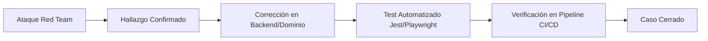

# Suite de Red Team — Activa360 v1.0

Este directorio contiene la documentación ejecutable y la matriz de pruebas de la **Suite de Red Team de Activa360**. Cada caso de prueba está desglosado en una ficha individual que incluye vectores de ataque manuales (cURL/HTTP) y su correspondiente **prueba automatizada de regresión** en Jest o Playwright.

---

## 🏛️ Filosofía de Seguridad y Regla de Oro

> **"Una vulnerabilidad encontrada debe transformarse obligatoriamente en una prueba automatizada en el pipeline CI/CD."**



---

## 📋 Matriz Maestra de Casos de Red Team

| ID | Nombre del Caso | Categoría | Actor Atacante | Severidad | Ficha |
| :--- | :--- | :--- | :--- | :--- | :--- |
| **RT-001** | Bypass de Autenticación | RBAC | `ATK-EXT` | **CRÍTICO** | [Ficha](file:///c:/Users/Administrador/Documents/MaestriaActFijos/Activa360/docs/security/red-team/rbac/RT-001-bypass-autenticacion.md) |
| **RT-002** | Bypass de Autorización por Rol | RBAC | `INVENTARIADOR` | **ALTO** | [Ficha](file:///c:/Users/Administrador/Documents/MaestriaActFijos/Activa360/docs/security/red-team/rbac/RT-002-bypass-autorizacion.md) |
| **RT-003** | IDOR en Consulta de Activos | RBAC | `ATK-USER` | **ALTO** | [Ficha](file:///c:/Users/Administrador/Documents/MaestriaActFijos/Activa360/docs/security/red-team/rbac/RT-003-idor-activos.md) |
| **RT-004** | IDOR en Asignaciones | RBAC | `ATK-USER` | **MEDIO** | [Ficha](file:///c:/Users/Administrador/Documents/MaestriaActFijos/Activa360/docs/security/red-team/rbac/RT-004-idor-asignaciones.md) |
| **RT-005** | Modificación No Autorizada de Activo | RBAC | `CONSULTA` | **ALTO** | [Ficha](file:///c:/Users/Administrador/Documents/MaestriaActFijos/Activa360/docs/security/red-team/rbac/RT-005-modificacion-no-autorizada.md) |
| **RT-006** | Manipulación de Roles en DTO | RBAC | `ATK-USER` | **CRÍTICO** | [Ficha](file:///c:/Users/Administrador/Documents/MaestriaActFijos/Activa360/docs/security/red-team/rbac/RT-006-manipulacion-roles.md) |
| **RT-007** | Solicitud de Baja No Autorizada | RBAC | `INVENTARIADOR` | **ALTO** | [Ficha](file:///c:/Users/Administrador/Documents/MaestriaActFijos/Activa360/docs/security/red-team/rbac/RT-007-baja-no-autorizada.md) |
| **RT-008** | Transferencia No Autorizada | RBAC | `CONSULTA` | **ALTO** | [Ficha](file:///c:/Users/Administrador/Documents/MaestriaActFijos/Activa360/docs/security/red-team/rbac/RT-008-transferencia-no-autorizada.md) |
| **RT-009** | Transferencia de Activo Dado de Baja | Lógica de Negocio | `ADMIN-ACTIVOS` | **ALTO** | [Ficha](file:///c:/Users/Administrador/Documents/MaestriaActFijos/Activa360/docs/security/red-team/domain-logic/RT-009-transferencia-activo-baja.md) |
| **RT-010** | Doble Asignación Simultánea (Race Condition) | Lógica de Negocio | `ADMIN-ACTIVOS` | **ALTO** | [Ficha](file:///c:/Users/Administrador/Documents/MaestriaActFijos/Activa360/docs/security/red-team/domain-logic/RT-010-doble-asignacion.md) |
| **RT-011** | Doble Inventario QR Simultáneo | Lógica de Negocio | `INVENTARIADOR` | **MEDIO** | [Ficha](file:///c:/Users/Administrador/Documents/MaestriaActFijos/Activa360/docs/security/red-team/domain-logic/RT-011-doble-inventario-qr.md) |
| **RT-012** | Reutilización Fraudulenta de QR | Lógica de Negocio | `INVENTARIADOR` | **ALTO** | [Ficha](file:///c:/Users/Administrador/Documents/MaestriaActFijos/Activa360/docs/security/red-team/domain-logic/RT-012-reutilizacion-fraudulenta-qr.md) |
| **RT-013** | Manipulación Arbitraria de Estado de Activo | Lógica de Negocio | `ATK-USER` | **ALTO** | [Ficha](file:///c:/Users/Administrador/Documents/MaestriaActFijos/Activa360/docs/security/red-team/domain-logic/RT-013-manipulacion-estado-activo.md) |
| **RT-014** | Inyección de Valores Límite Inválidos | Lógica de Negocio | `ATK-USER` | **MEDIO** | [Ficha](file:///c:/Users/Administrador/Documents/MaestriaActFijos/Activa360/docs/security/red-team/domain-logic/RT-014-valores-invalidos.md) |
| **RT-015** | Manipulación Anómala de Fechas | Lógica de Negocio | `ATK-USER` | **MEDIO** | [Ficha](file:///c:/Users/Administrador/Documents/MaestriaActFijos/Activa360/docs/security/red-team/domain-logic/RT-015-manipulacion-fechas.md) |
| **RT-016** | Alteración Directa de Registros de Auditoría | Lógica de Negocio | `ADMIN-ACTIVOS` | **CRÍTICO** | [Ficha](file:///c:/Users/Administrador/Documents/MaestriaActFijos/Activa360/docs/security/red-team/domain-logic/RT-016-alteracion-auditoria.md) |
| **RT-017** | Acceso Directo a API (Bypass UI Frontend) | API y Cliente | `ATK-USER` | **ALTO** | [Ficha](file:///c:/Users/Administrador/Documents/MaestriaActFijos/Activa360/docs/security/red-team/client-and-api/RT-017-acceso-directo-api.md) |
| **RT-018** | Inyección SQL / ORM / Stored XSS | API y Cliente | `ATK-EXT` | **CRÍTICO** | [Ficha](file:///c:/Users/Administrador/Documents/MaestriaActFijos/Activa360/docs/security/red-team/client-and-api/RT-018-inyeccion-sql-xss.md) |
| **RT-019** | Carga de Archivos Maliciosos / Inseguros | API y Cliente | `ATK-USER` | **ALTO** | [Ficha](file:///c:/Users/Administrador/Documents/MaestriaActFijos/Activa360/docs/security/red-team/client-and-api/RT-019-carga-archivos.md) |
| **RT-020** | Prompt Injection Directo contra Asistente IA | IA y MCP | `ATK-IA` | **ALTO** | [Ficha](file:///c:/Users/Administrador/Documents/MaestriaActFijos/Activa360/docs/security/red-team/ai-and-mcp/RT-020-prompt-injection-directo.md) |
| **IA-001** | Extracción de Información Restringida vía IA | IA y MCP | `ATK-IA` | **ALTO** | [Ficha](file:///c:/Users/Administrador/Documents/MaestriaActFijos/Activa360/docs/security/red-team/ai-and-mcp/IA-001-extraccion-informacion-restringida.md) |
| **IA-002** | Manipulación No Autorizada de Herramientas MCP | IA y MCP | `ATK-MCP` | **CRÍTICO** | [Ficha](file:///c:/Users/Administrador/Documents/MaestriaActFijos/Activa360/docs/security/red-team/ai-and-mcp/IA-002-manipulacion-herramientas-mcp.md) |
| **IA-003** | Indirect Prompt Injection en Documentos RAG | IA y MCP | `ATK-IA` | **ALTO** | [Ficha](file:///c:/Users/Administrador/Documents/MaestriaActFijos/Activa360/docs/security/red-team/ai-and-mcp/IA-003-prompt-injection-indirecto-rag.md) |
| **IA-004** | Exfiltración de Datos mediante RAG Vectorial | IA y MCP | `ATK-IA` | **ALTO** | [Ficha](file:///c:/Users/Administrador/Documents/MaestriaActFijos/Activa360/docs/security/red-team/ai-and-mcp/IA-004-exfiltracion-mediante-rag.md) |

---

## 🛠️ Ejecución Automatizada

Para ejecutar todas las pruebas de seguridad en el backend:
```bash
npm run test:e2e -- test/security/
```

Para ejecutar las pruebas E2E de interfaz y cliente con Playwright:
```bash
npx playwright test test/playwright/security/
```
