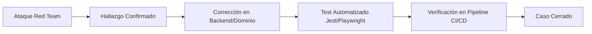

# Suite de Red Team — Activa360 v1.0

Este directorio contiene la documentación ejecutable, las plantillas oficiales del curso y la matriz de pruebas de la **Suite de Red Team de Activa360**. Cada caso de prueba está desglosado en una ficha individual y documentado bajo los formatos oficiales solicitados.

---

## 📄 Plantillas y Documentos de Seguridad

- 📊 **[Informe Ejecutivo y Técnico de Vulnerabilidades (INFORME_EJECUTIVO_VULNERABILIDADES.md)](file:///c:/Users/Administrador/Documents/MaestriaActFijos/Activa360/docs/security/INFORME_EJECUTIVO_VULNERABILIDADES.md)**: Reporte consolidado de las 24 vulnerabilidades identificadas, desglose estadístico, severidad DREAD/CVSS y estrategia arquitectónica.
- 🛡️ **[Modelo de Amenazas Institucional (MODELO_DE_AMENAZAS.md)](file:///c:/Users/Administrador/Documents/MaestriaActFijos/Activa360/docs/security/MODELO_DE_AMENAZAS.md)**: Documentación de arquitectura, límites de confianza, matriz STRIDE y puntuación DREAD.
- 📐 **[Plantilla de Modelo de Amenazas (Plantilla)](file:///c:/Users/Administrador/Documents/MaestriaActFijos/Activa360/docs/security/red-team/templates/MODELO_DE_AMENAZAS.md)**: Formato base para la elaboración de modelos de amenazas.
- 📋 **[Plantilla de Reporte de Hallazgo (PLANTILLA_HALLAZGO.md)](file:///c:/Users/Administrador/Documents/MaestriaActFijos/Activa360/docs/security/red-team/templates/PLANTILLA_HALLAZGO.md)**: Estructura estándar para el reporte formal de hallazgos de seguridad (Metadata, DREAD, PoC, Diff, Tests).
- 📁 **[Carpeta de Hallazgos Formales (`hallazgos/`)](file:///c:/Users/Administrador/Documents/MaestriaActFijos/Activa360/docs/security/red-team/hallazgos/)**: Los 24 casos convertidos al formato oficial de hallazgos del docente (`H-001` a `H-024`).

---

## 🏛️ Filosofía de Seguridad y Regla de Oro

> **"Una vulnerabilidad encontrada debe transformarse obligatoriamente en una prueba automatizada en el pipeline CI/CD."**



---

## 📋 Matriz Maestra de Casos de Red Team

| ID | Nombre del Caso | Categoría | Actor Atacante | Severidad | Ficha Red Team | Hallazgo Formateado (Plantilla) |
| :--- | :--- | :--- | :--- | :--- | :--- | :--- |
| **RT-001** | Bypass de Autenticación | RBAC | `ATK-EXT` | **CRÍTICO** | [Ficha](file:///c:/Users/Administrador/Documents/MaestriaActFijos/Activa360/docs/security/red-team/rbac/RT-001-bypass-autenticacion.md) | [Hallazgo H-003](file:///c:/Users/Administrador/Documents/MaestriaActFijos/Activa360/docs/security/red-team/hallazgos/H-003-RT-001-bypass-autenticacion.md) |
| **RT-002** | Bypass de Autorización por Rol | RBAC | `INVENTARIADOR` | **ALTO** | [Ficha](file:///c:/Users/Administrador/Documents/MaestriaActFijos/Activa360/docs/security/red-team/rbac/RT-002-bypass-autorizacion.md) | [Hallazgo H-004](file:///c:/Users/Administrador/Documents/MaestriaActFijos/Activa360/docs/security/red-team/hallazgos/H-004-RT-002-bypass-autorizacion.md) |
| **RT-003** | IDOR en Consulta de Activos | RBAC | `ATK-USER` | **ALTO** | [Ficha](file:///c:/Users/Administrador/Documents/MaestriaActFijos/Activa360/docs/security/red-team/rbac/RT-003-idor-activos.md) | [Hallazgo H-005](file:///c:/Users/Administrador/Documents/MaestriaActFijos/Activa360/docs/security/red-team/hallazgos/H-005-RT-003-idor-activos.md) |
| **RT-004** | IDOR en Asignaciones | RBAC | `ATK-USER` | **MEDIO** | [Ficha](file:///c:/Users/Administrador/Documents/MaestriaActFijos/Activa360/docs/security/red-team/rbac/RT-004-idor-asignaciones.md) | [Hallazgo H-006](file:///c:/Users/Administrador/Documents/MaestriaActFijos/Activa360/docs/security/red-team/hallazgos/H-006-RT-004-idor-asignaciones.md) |
| **RT-005** | Modificación No Autorizada de Activo | RBAC | `CONSULTA` | **ALTO** | [Ficha](file:///c:/Users/Administrador/Documents/MaestriaActFijos/Activa360/docs/security/red-team/rbac/RT-005-modificacion-no-autorizada.md) | [Hallazgo H-007](file:///c:/Users/Administrador/Documents/MaestriaActFijos/Activa360/docs/security/red-team/hallazgos/H-007-RT-005-modificacion-no-autorizada.md) |
| **RT-006** | Manipulación de Roles en DTO | RBAC | `ATK-USER` | **CRÍTICO** | [Ficha](file:///c:/Users/Administrador/Documents/MaestriaActFijos/Activa360/docs/security/red-team/rbac/RT-006-manipulacion-roles.md) | [Hallazgo H-008](file:///c:/Users/Administrador/Documents/MaestriaActFijos/Activa360/docs/security/red-team/hallazgos/H-008-RT-006-manipulacion-roles.md) |
| **RT-007** | Solicitud de Baja No Autorizada | RBAC | `INVENTARIADOR` | **ALTO** | [Ficha](file:///c:/Users/Administrador/Documents/MaestriaActFijos/Activa360/docs/security/red-team/rbac/RT-007-baja-no-autorizada.md) | [Hallazgo H-009](file:///c:/Users/Administrador/Documents/MaestriaActFijos/Activa360/docs/security/red-team/hallazgos/H-009-RT-007-baja-no-autorizada.md) |
| **RT-008** | Transferencia No Autorizada | RBAC | `CONSULTA` | **ALTO** | [Ficha](file:///c:/Users/Administrador/Documents/MaestriaActFijos/Activa360/docs/security/red-team/rbac/RT-008-transferencia-no-autorizada.md) | [Hallazgo H-010](file:///c:/Users/Administrador/Documents/MaestriaActFijos/Activa360/docs/security/red-team/hallazgos/H-010-RT-008-transferencia-no-autorizada.md) |
| **RT-009** | Transferencia de Activo Dado de Baja | Lógica de Negocio | `ADMIN-ACTIVOS` | **ALTO** | [Ficha](file:///c:/Users/Administrador/Documents/MaestriaActFijos/Activa360/docs/security/red-team/domain-logic/RT-009-transferencia-activo-baja.md) | [Hallazgo H-011](file:///c:/Users/Administrador/Documents/MaestriaActFijos/Activa360/docs/security/red-team/hallazgos/H-011-RT-009-transferencia-activo-baja.md) |
| **RT-010** | Doble Asignación Simultánea (Race Condition) | Lógica de Negocio | `ADMIN-ACTIVOS` | **ALTO** | [Ficha](file:///c:/Users/Administrador/Documents/MaestriaActFijos/Activa360/docs/security/red-team/domain-logic/RT-010-doble-asignacion.md) | [Hallazgo H-012](file:///c:/Users/Administrador/Documents/MaestriaActFijos/Activa360/docs/security/red-team/hallazgos/H-012-RT-010-doble-asignacion.md) |
| **RT-011** | Doble Inventario QR Simultáneo | Lógica de Negocio | `INVENTARIADOR` | **MEDIO** | [Ficha](file:///c:/Users/Administrador/Documents/MaestriaActFijos/Activa360/docs/security/red-team/domain-logic/RT-011-doble-inventario-qr.md) | [Hallazgo H-013](file:///c:/Users/Administrador/Documents/MaestriaActFijos/Activa360/docs/security/red-team/hallazgos/H-013-RT-011-doble-inventario-qr.md) |
| **RT-012** | Reutilización Fraudulenta de QR | Lógica de Negocio | `INVENTARIADOR` | **ALTO** | [Ficha](file:///c:/Users/Administrador/Documents/MaestriaActFijos/Activa360/docs/security/red-team/domain-logic/RT-012-reutilizacion-fraudulenta-qr.md) | [Hallazgo H-014](file:///c:/Users/Administrador/Documents/MaestriaActFijos/Activa360/docs/security/red-team/hallazgos/H-014-RT-012-reutilizacion-fraudulenta-qr.md) |
| **RT-013** | Manipulación Arbitraria de Estado de Activo | Lógica de Negocio | `ATK-USER` | **ALTO** | [Ficha](file:///c:/Users/Administrador/Documents/MaestriaActFijos/Activa360/docs/security/red-team/domain-logic/RT-013-manipulacion-estado-activo.md) | [Hallazgo H-015](file:///c:/Users/Administrador/Documents/MaestriaActFijos/Activa360/docs/security/red-team/hallazgos/H-015-RT-013-manipulacion-estado-activo.md) |
| **RT-014** | Inyección de Valores Límite Inválidos | Lógica de Negocio | `ATK-USER` | **MEDIO** | [Ficha](file:///c:/Users/Administrador/Documents/MaestriaActFijos/Activa360/docs/security/red-team/domain-logic/RT-014-valores-invalidos.md) | [Hallazgo H-016](file:///c:/Users/Administrador/Documents/MaestriaActFijos/Activa360/docs/security/red-team/hallazgos/H-016-RT-014-valores-invalidos.md) |
| **RT-015** | Manipulación Anómala de Fechas | Lógica de Negocio | `ATK-USER` | **MEDIO** | [Ficha](file:///c:/Users/Administrador/Documents/MaestriaActFijos/Activa360/docs/security/red-team/domain-logic/RT-015-manipulacion-fechas.md) | [Hallazgo H-017](file:///c:/Users/Administrador/Documents/MaestriaActFijos/Activa360/docs/security/red-team/hallazgos/H-017-RT-015-manipulacion-fechas.md) |
| **RT-016** | Alteración Directa de Registros de Auditoría | Lógica de Negocio | `ADMIN-ACTIVOS` | **CRÍTICO** | [Ficha](file:///c:/Users/Administrador/Documents/MaestriaActFijos/Activa360/docs/security/red-team/domain-logic/RT-016-alteracion-auditoria.md) | [Hallazgo H-018](file:///c:/Users/Administrador/Documents/MaestriaActFijos/Activa360/docs/security/red-team/hallazgos/H-018-RT-016-alteracion-auditoria.md) |
| **RT-017** | Acceso Directo a API (Bypass UI Frontend) | API y Cliente | `ATK-USER` | **ALTO** | [Ficha](file:///c:/Users/Administrador/Documents/MaestriaActFijos/Activa360/docs/security/red-team/client-and-api/RT-017-acceso-directo-api.md) | [Hallazgo H-019](file:///c:/Users/Administrador/Documents/MaestriaActFijos/Activa360/docs/security/red-team/hallazgos/H-019-RT-017-acceso-directo-api.md) |
| **RT-018** | Inyección SQL / ORM / Stored XSS | API y Cliente | `ATK-EXT` | **CRÍTICO** | [Ficha](file:///c:/Users/Administrador/Documents/MaestriaActFijos/Activa360/docs/security/red-team/client-and-api/RT-018-inyeccion-sql-xss.md) | [Hallazgo H-020](file:///c:/Users/Administrador/Documents/MaestriaActFijos/Activa360/docs/security/red-team/hallazgos/H-020-RT-018-inyeccion-sql-xss.md) |
| **RT-019** | Carga de Archivos Maliciosos / Inseguros | API y Cliente | `ATK-USER` | **ALTO** | [Ficha](file:///c:/Users/Administrador/Documents/MaestriaActFijos/Activa360/docs/security/red-team/client-and-api/RT-019-carga-archivos.md) | [Hallazgo H-021](file:///c:/Users/Administrador/Documents/MaestriaActFijos/Activa360/docs/security/red-team/hallazgos/H-021-RT-019-carga-archivos.md) |
| **RT-020** | Prompt Injection Directo contra Asistente IA | IA y MCP | `ATK-IA` | **ALTO** | [Ficha](file:///c:/Users/Administrador/Documents/MaestriaActFijos/Activa360/docs/security/red-team/ai-and-mcp/RT-020-prompt-injection-directo.md) | [Hallazgo H-022](file:///c:/Users/Administrador/Documents/MaestriaActFijos/Activa360/docs/security/red-team/hallazgos/H-022-RT-020-prompt-injection-directo.md) |
| **IA-001** | Extracción de Información Restringida vía IA | IA y MCP | `ATK-IA` | **ALTO** | [Ficha](file:///c:/Users/Administrador/Documents/MaestriaActFijos/Activa360/docs/security/red-team/ai-and-mcp/IA-001-extraccion-informacion-restringida.md) | [Hallazgo H-001](file:///c:/Users/Administrador/Documents/MaestriaActFijos/Activa360/docs/security/red-team/hallazgos/H-001-IA-001-extraccion-informacion-restringida.md) |
| **IA-002** | Manipulación No Autorizada de Herramientas MCP | IA y MCP | `ATK-MCP` | **CRÍTICO** | [Ficha](file:///c:/Users/Administrador/Documents/MaestriaActFijos/Activa360/docs/security/red-team/ai-and-mcp/IA-002-manipulacion-herramientas-mcp.md) | [Hallazgo H-002](file:///c:/Users/Administrador/Documents/MaestriaActFijos/Activa360/docs/security/red-team/hallazgos/H-002-IA-002-manipulacion-herramientas-mcp.md) |
| **IA-003** | Indirect Prompt Injection en Documentos RAG | IA y MCP | `ATK-IA` | **ALTO** | [Ficha](file:///c:/Users/Administrador/Documents/MaestriaActFijos/Activa360/docs/security/red-team/ai-and-mcp/IA-003-prompt-injection-indirecto-rag.md) | [Hallazgo H-023](file:///c:/Users/Administrador/Documents/MaestriaActFijos/Activa360/docs/security/red-team/hallazgos/H-023-IA-003-prompt-injection-indirecto-rag.md) |
| **IA-004** | Exfiltración de Datos mediante RAG Vectorial | IA y MCP | `ATK-IA` | **ALTO** | [Ficha](file:///c:/Users/Administrador/Documents/MaestriaActFijos/Activa360/docs/security/red-team/ai-and-mcp/IA-004-exfiltracion-mediante-rag.md) | [Hallazgo H-024](file:///c:/Users/Administrador/Documents/MaestriaActFijos/Activa360/docs/security/red-team/hallazgos/H-024-IA-004-exfiltracion-mediante-rag.md) |

---

## 🛠️ Ejecución Automatizada

Para ejecutar todas las pruebas de seguridad en el backend:
```bash
npm run test:e2e -- test/security/
```

Para ejecutar las pruebas E2E de interfaz y cliente con Playwright:
```bash
npx playwright test test/playwright/security/
```

