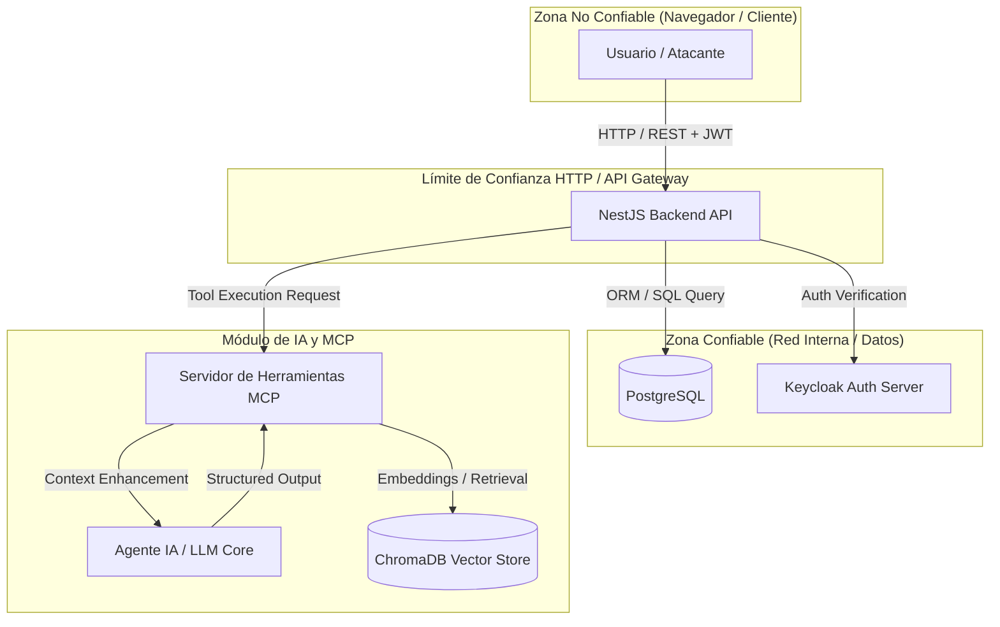

# Plantilla: Modelo de Amenazas (Threat Model) — Activa360

**Proyecto:** Activa360 — Sistema de Gestión de Activos Fijos con IA y MCP  
**Versión del Documento:** 1.0.0  
**Fecha de Última Revisión:** YYYY-MM-DD  
**Metodología Utilizada:** STRIDE + DREAD / OWASP Top 10 + OWASP Top 10 LLM  

---

## 1. Contexto y Arquitectura del Sistema

### 1.1 Visión General del Sistema
Breve descripción del sistema objetivo, sus módulos principales y su propósito operativo (ej. gestión de bienes patrimoniales, inventario QR, flujo de bajas SABS, asistente IA con integraciones MCP).

### 1.2 Componentes de la Arquitectura
| Componente | Tecnología / Stack | Función Principal | Nivel de Confianza |
| :--- | :--- | :--- | :--- |
| **Frontend Web** | React / Vite | Interfaz gráfica para usuarios e inventariadores | Inseguro (Cliente) |
| **Backend API** | NestJS (Arquitectura Hexagonal) | Lógica de negocio, controladores y casos de uso | Seguro (Servidor) |
| **Base de Datos Relacional** | PostgreSQL | Almacenamiento persistente de activos y auditoría | Crítico (Servidor interno) |
| **Proveedor de Identidad** | Keycloak / JWT | Autenticación y emisión de tokens RBAC | Crítico |
| **Servidor MCP / RAG** | Node.js / ChromaDB / FastMCP | Herramientas del Asistente IA para consulta y acción | Medio / Alto |

---

## 2. Diagrama de Flujo de Datos (DFD) y Limites de Confianza

### 2.1 Límites de Confianza (Trust Boundaries)
1. **Límite 1 (Cliente -> API Gateway):** Transición de datos no confiables desde la web hacia endpoints NestJS.
2. **Límite 2 (API -> Servidor MCP / IA):** Canal de comunicación entre el backend y las herramientas de lenguaje natural.
3. **Límite 3 (API -> PostgreSQL):** Acceso a datos sensibles y registros de auditoría inmutables.

---

## 3. Matriz de Identificación de Amenazas (Metodología STRIDE)

| Categoría STRIDE | Amenaza Identificada | Componente Objetivo | Vector de Ataque Principal | Impacto de Riesgo |
| :--- | :--- | :--- | :--- | :--- |
| **Spoofing** (Suplantación) | Bypass de tokens JWT o robo de identidad | Backend NestJS / Keycloak | Reutilización de token expuesto / Firma débil | CRÍTICO |
| **Tampering** (Manipulación) | Alteración de estados de activos o auditoría | Base de Datos / API NestJS | Race condition / Inyección en DTO de actualización | ALTO |
| **Repudiation** (Repudio) | Negación de autoría en transferencias de bienes | Bitácora de Auditoría | Inexistencia o alteración de registros auditables | ALTO |
| **Information Disclosure** | Extracción no autorizada de activos o datos de costo | Servidor MCP / RAG | Direct/Indirect Prompt Injection vía IA | ALTO |
| **Denial of Service** | Agotamiento de recursos en búsquedas vectoriales | ChromaDB / Vector Store | Consultas masivas no paginadas o prompts gigantes | MEDIO |
| **Elevation of Privilege** | Asignación arbitraria del rol `ADMIN-ACTIVOS` | RBAC / Endpoints API | Manipulación de campos DTO no saneados | CRÍTICO |

---

## 4. Evaluación y Priorización de Riesgos (DREAD)

| ID Amenaza | S (Spoofing) | T (Tampering) | R (Repudiation) | I (Info Disc) | D (DoS) | E (Elevation) | Promedio DREAD | Nivel de Riesgo |
| :--- | :---: | :---: | :---: | :---: | :---: | :---: | :---: | :--- |
| **AM-001: Manipulación de Roles en DTO** | 8 | 9 | 7 | 8 | 5 | 10 | **7.8** | **CRÍTICO** |
| **AM-002: Prompt Injection en Asistente IA** | 5 | 7 | 6 | 9 | 7 | 8 | **7.0** | **ALTO** |
| **AM-003: Race Condition en Asignaciones** | 4 | 9 | 8 | 4 | 6 | 7 | **6.3** | **ALTO** |
| **AM-004: IDOR en Visualización de Fichas** | 6 | 4 | 4 | 9 | 3 | 6 | **5.3** | **MEDIO** |

---

## 5. Estrategias de Mitigación y Controles

1. **Defensa en Profundidad (RBAC + ABAC):** Validación de permisos tanto en el Gateway API como a nivel de caso de uso en dominio hexagonal.
2. **Sanitización y Validación de Schemas (Zod / Class-Validator):** Rechazar campos no explícitamente declarados (`whitelist: true`, `forbidNonWhitelisted: true`).
3. **Control de Contexto en MCP (Token-Passing):** Pasar el token y claims del usuario invocador a cada llamada de herramienta MCP para aplicar seguridad a nivel de registro.
4. **Pruebas Continuas de Red Team:** Integrar casos de prueba ejecutable automatizados en Jest y Playwright para evitar regresiones de seguridad en el pipeline CI/CD.
