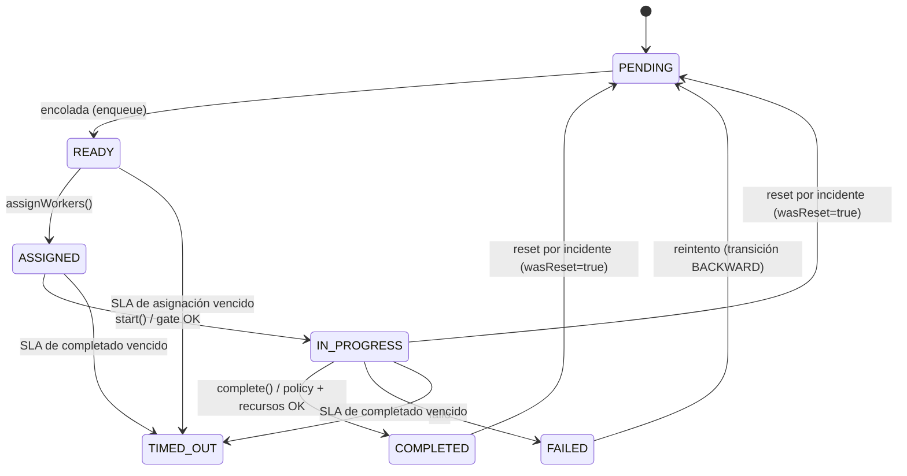
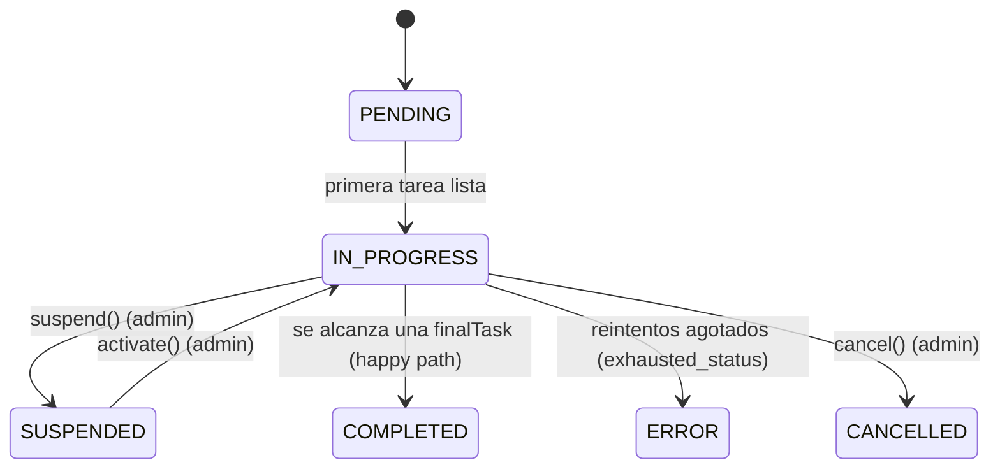
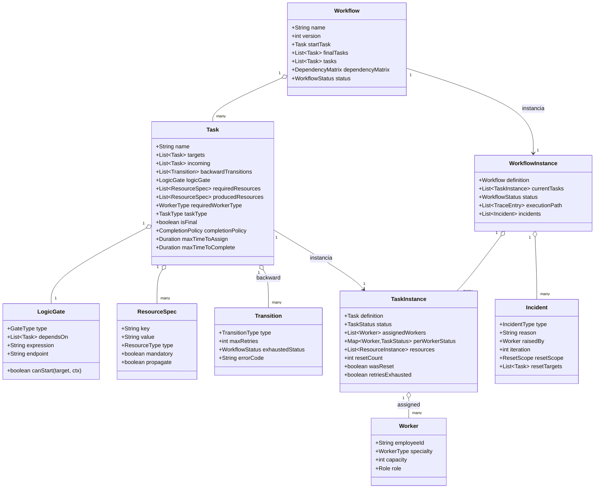
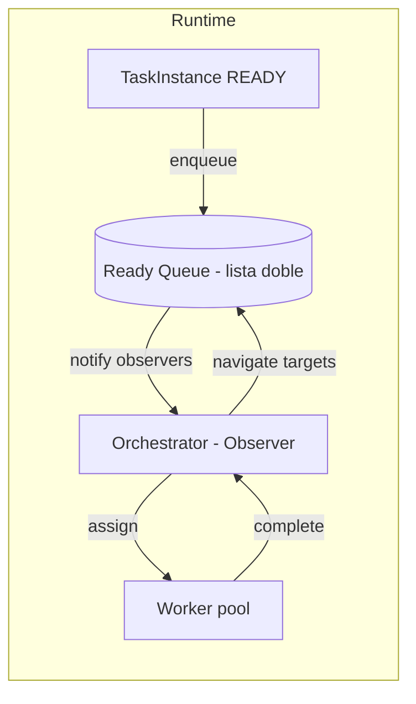

# Documento de Diseño — Motor de Workflow tipo BPMN 2.0

> **Curso:** Fundamentos de Programación y Frameworks Modernos para IA
> **Entregable:** Diseño e implementación (por grupos) de un motor de workflow inspirado en BPMN 2.0, con comparación frente a Camunda y Activiti.
> **Naturaleza del entregable:** trabajo grupal. Debe detallarse la contribución individual de cada integrante.
> **Idioma del modelo de objetos:** el modelo de dominio (clases, atributos, estados) se nombra en **inglés**; la documentación y justificación en español.
>
> **Decisiones confirmadas del curso:**
> - **Stack de implementación:** **Python** (usar `dataclasses`, `Enum`, `type hints`; el modelo de dominio conserva nombres en inglés).
> - **Compuertas:** **embebidas** en la tarea destino como lógica de *join* (enfoque teoría de grafos).
> - **Persistencia:** **a elección de cada grupo**, debidamente justificada (en memoria, SQLite, PostgreSQL/Mongo, etc.).
> - **Integraciones REST/Lambda:** **simuladas (mock)**; basta demostrar el concepto.
> - **Formato del documento:** Markdown en español, modelo en inglés.

---

## 1. Objetivo y alcance

Diseñar y construir un **motor de workflow** que modele procesos de negocio como **grafos dirigidos** (posiblemente cíclicos), equivalentes conceptualmente a un diagrama **BPMN 2.0**. El motor debe:

1. Representar un proceso como un **grafo**: los **nodos** son tareas (`Task`) y las **aristas** son los caminos/dependencias entre tareas.
2. Separar claramente la **plantilla / definición** (`Workflow`, `Task`) de la **instancia de ejecución** (`WorkflowInstance`, `TaskInstance`), tal como lo hacen los motores BPMN reales (definición vs. runtime).
3. Soportar **flujos lineales, paralelos, convergentes (joins), condicionales y cíclicos**.
4. Modelar **compuertas lógicas** (`LogicGate`) que decidan si una tarea destino puede iniciarse (AND, OR, y lógica compleja incluyendo llamadas a métodos internos, REST o AWS Lambda).
5. Gestionar **recursos** (`Resource`) de entrada/salida con propagación entre tareas.
6. Gestionar **trabajadores** (`Worker`) con especialidad y asignación balanceada.
7. Orquestar la ejecución mediante una **cola** y un **orquestador basado en el patrón Observer** (emulando AWS SQS), **sin usar cron** (el cron se considera antipatrón para este caso).
8. Ofrecer **trazabilidad** completa del camino recorrido, incluso con ciclos.

---

## 2. Fundamento teórico: BPMN como teoría de grafos

Un workflow es un **grafo dirigido** `G = (V, E)`:

- `V` (vértices/nodos) = conjunto de **tareas** (`Task`).
- `E` (aristas dirigidas) = **dependencias/caminos** `A → B` ("desde la tarea A se puede navegar a la tarea B").

Propiedades que debemos soportar:

| Concepto de grafos | Equivalente en el motor | Notas |
| --- | --- | --- |
| Nodo | `Task` | Unidad de trabajo |
| Arista dirigida `A→B` | `target` en `A` + `source`/incoming en `B` | Doble sentido de navegación |
| Grado de entrada > 1 | Tarea con **join** (compuerta) | Requiere `LogicGate` |
| Grado de salida > 1 | Tarea con **split** (paralelo/condicional) | Varios `targets` |
| Arista tipada | `Transition` con `type` `FORWARD`/`BACKWARD` | El sentido del flujo se tipa explícitamente |
| Back-edge (ciclo) | Transición `BACKWARD` = **incidente/rework** | Regresa a un nodo previo por un problema (ver §3.9) |
| Ciclo | Camino que regresa a un nodo previo | Debe soportarse (rework/loops) |
| Nodo fuente | `startTask` (única) | Una sola tarea inicial |
| Nodo(s) sumidero | `finalTasks` (una o más) | Varios finales posibles |
| Matriz de adyacencia | **Matriz de dependencias** | Refleja todos los caminos |
| Recorrido / traversal | **Traza de ejecución** (`executionPath`) | Ordenada, con ciclos |

> **Decisión de diseño clave (split/join):** En BPMN estándar las compuertas (gateways) son **nodos independientes**. En este diseño, para mantenerlo cercano a la teoría de grafos que ya trabajaron los estudiantes, la **lógica de convergencia (join) vive dentro de la tarea destino** mediante su `LogicGate`. Se documenta esta diferencia explícitamente (ver §8, comparación con Camunda/Activiti) y se recomienda una variante opcional con gateways como nodos de primera clase para quien quiera acercarse 100% al estándar.

> **Aristas tipadas (avance vs. retorno):** las transiciones se tipan como `FORWARD` (avance) o `BACKWARD` (retorno). Una transición `BACKWARD` **siempre modela un incidente** (el trabajo no se hizo bien y hay que volver atrás); es distinta de un avance normal y dispara la lógica de reset y reintentos (ver §3.9 `Transition`, §3.10 `Incident` y §4.6). Así, un ciclo por rework queda explícitamente distinguible de los caminos hacia adelante.

---

## 3. Modelo de dominio — Plantilla / Definición

Estas clases describen **cómo se ve el proceso** (la plantilla). No cambian durante la ejecución.

### 3.1 `Workflow` (definición del proceso)

Representa la plantilla completa del proceso.

| Atributo | Tipo | Descripción |
| --- | --- | --- |
| `id` | `String`/`UUID` | Identificador de la definición |
| `name` | `String` | Nombre legible del workflow |
| `version` | `int` | Versión de la definición (soporte de versionado, como Camunda) |
| `startTask` | `Task` (ref) | **Tarea inicial única** (obligatoria) |
| `finalTasks` | `List<Task>` | Una o más tareas de estado final |
| `tasks` | `List<Task>` | Todas las tareas del grafo |
| `dependencyMatrix` | `DependencyMatrix` | Matriz de adyacencia de caminos |
| `status` | `WorkflowStatus` | Estado de la **definición** (activa/suspendida) |

### 3.2 `Task` (definición de tarea = nodo del grafo)

| Atributo | Tipo | Descripción |
| --- | --- | --- |
| `id` | `String`/`UUID` | Identificador |
| `name` | `String` | Nombre de la tarea |
| `targets` | `List<Task>` (refs) | **Nodos destino** hacia los que se puede navegar (split) |
| `incoming` | `List<Task>` (refs) | **Dependencias hacia atrás**: de qué tareas recibe navegación |
| `logicGate` | `LogicGate` | Compuerta de **entrada** (join) que decide si la tarea puede iniciar |
| `requiredResources` | `List<ResourceSpec>` | Recursos requeridos (obligatorios/opcionales) |
| `producedResources` | `List<ResourceSpec>` | Recursos que la tarea genera/propaga |
| `requiredWorkerType` | `WorkerType` | Tipo/especialidad de worker que necesita |
| `taskType` | `TaskType` | Clasificación (ver §3.7) |
| `isFinal` | `boolean` | Si es una tarea de estado final |
| `backwardTransitions` | `List<Transition>` | Retornos por incidente que salen de esta tarea (ver §3.9) |
| `completionPolicy` | `CompletionPolicy` | Cuándo se da por COMPLETED si hay varios asignados: `ALL`/`ANY`/`QUORUM` (por defecto `ALL`) |
| `quorum` | `int` (opcional) | N mínimo si `completionPolicy = QUORUM` |
| `maxTimeToAssign` | `Duration` (opcional) | SLA máximo desde `READY` hasta `ASSIGNED` |
| `maxTimeToComplete` | `Duration` (opcional) | SLA máximo desde `ASSIGNED`/`IN_PROGRESS` hasta `COMPLETED` |

> Una `Task` con `incoming.size() > 1` es un **punto de convergencia** y **debe** tener un `LogicGate` que exprese la condición de inicio.
>
> Los **caminos hacia adelante** viven en `targets` (`FORWARD`); los **retornos por incidente** viven en `backwardTransitions` (`BACKWARD`) y cada uno declara su límite de reintentos y el estado terminal de error (ver §3.9).

### 3.3 `LogicGate` (compuerta lógica)

Decide si la tarea destino **puede iniciarse** en función del estado de sus tareas predecesoras y/o de lógica externa. Es análoga a las **compuertas de un circuito digital**.

| Atributo | Tipo | Descripción |
| --- | --- | --- |
| `type` | `GateType` | `AND`, `OR`, `XOR`, `COMPLEX`, `SCRIPT`, `REST`, `LAMBDA` |
| `dependsOn` | `List<Task>` (refs) | Tareas predecesoras evaluadas |
| `expression` | `String` (opcional) | Expresión booleana para `COMPLEX`/`SCRIPT` |
| `endpoint` | `String` (opcional) | URL REST o ARN de Lambda para `REST`/`LAMBDA` |

**Semántica:**

- `AND`: la tarea destino inicia solo cuando **todas** sus predecesoras (`dependsOn`) están `COMPLETED`.
- `OR`: inicia cuando **al menos una** predecesora está `COMPLETED`.
- `XOR`: inicia con **exactamente una** rama completada (exclusiva).
- `COMPLEX`: evalúa una `expression` booleana sobre estados/variables (p. ej. `2 de 3`, `(B AND C) OR D`).
- `SCRIPT` / `REST` / `LAMBDA`: delega la decisión a **lógica de negocio**: un método interno, un API REST externo o una función AWS Lambda. El resultado (booleano) determina si la tarea puede iniciarse.

> Contrato de la compuerta: `boolean canStart(TaskInstance target, WorkflowInstance ctx)`. Esto la vuelve extensible (Strategy pattern) y permite agregar tipos nuevos sin tocar el motor.

### 3.4 `Resource` / `ResourceSpec`

Recurso asociado a una tarea. Por ahora el **valor** es `String` (rutas, archivos, texto libre u otro), pero se **cataloga** por tipo.

| Atributo | Tipo | Descripción |
| --- | --- | --- |
| `key` | `String` | Nombre/clave lógica del recurso |
| `value` | `String` | Contenido (ruta, archivo, texto libre, etc.) |
| `type` | `ResourceType` | Categoría: `FILE`, `TEXT`, `URL`, `OTHER` (extensible) |
| `mandatory` | `boolean` | Si es **obligatorio** (bloquea completar) u **opcional** |
| `propagate` | `boolean` | Bandera: si es **salida** que se propaga a la siguiente tarea (input de la siguiente) |

**Reglas de recursos:**

1. Una tarea **no puede completarse** si falta algún recurso `mandatory`. Los `opcional` no bloquean.
2. Los recursos con `propagate = true` son **salida** de la tarea y **candidatos a entrada** de las tareas destino.
3. **Propagación con match:** al navegar `A → B`, solo se copian a `B` los recursos propagados de `A` cuya `key`/`type` **haga match** con los `requiredResources` de `B`. La relación entrada↔salida es **muchos a muchos**; se propaga únicamente lo que la tarea destino declara como requisito.

### 3.5 `Worker` (trabajador / employee)

| Atributo | Tipo | Descripción |
| --- | --- | --- |
| `id` / `employeeId` | `String` | Identificador del empleado |
| `name` | `String` | Nombre |
| `specialty` / `workerType` | `WorkerType` | Especialidad del worker |
| `capacity` | `int` | Cupo máximo de tareas concurrentes (para balanceo) |
| `role` | `Role` | `WORKER` o `ADMIN` (ver §7 permisos) |

### 3.6 `DependencyMatrix` (aristas)

Matriz de adyacencia `M[i][j] = true` si existe camino de la tarea `i` a la tarea `j`. Sirve para:

- Validar el grafo (alcanzabilidad de `finalTasks` desde `startTask`, nodos huérfanos).
- Consultar rápidamente si `A → B` es navegable.
- Detectar ciclos y ramas.

### 3.7 Enumeraciones (Python `Enum`)

```python
from enum import Enum

class WorkflowStatus(Enum):
    PENDING = "PENDING"
    IN_PROGRESS = "IN_PROGRESS"
    SUSPENDED = "SUSPENDED"      # pausado y reanudable (suspend/activate de Camunda)
    COMPLETED = "COMPLETED"      # fin exitoso (happy path)
    CANCELLED = "CANCELLED"      # cancelado por un ADMIN
    ERROR = "ERROR"             # fin TERMINAL por error (p. ej. reintentos agotados). Distinto de COMPLETED

class TaskStatus(Enum):
    PENDING = "PENDING"          # nunca ejecutada, o reiniciada por incidente (ver was_reset)
    READY = "READY"             # en la cola de listos, aún sin asignar (arranca el SLA de asignación)
    ASSIGNED = "ASSIGNED"        # asignada a uno o varios workers, aún no iniciada
    IN_PROGRESS = "IN_PROGRESS"
    COMPLETED = "COMPLETED"
    FAILED = "FAILED"           # falló; puede reintentarse (backward)
    TIMED_OUT = "TIMED_OUT"      # venció un SLA (asignación o completado)
    CANCELLED = "CANCELLED"      # cancelada (p. ej. por reset/cancelación de admin)
    # opcionales: BLOCKED (esperando un join), SKIPPED

class GateType(Enum):
    AND = "AND"
    OR = "OR"
    XOR = "XOR"
    COMPLEX = "COMPLEX"
    SCRIPT = "SCRIPT"
    REST = "REST"        # mock en el curso
    LAMBDA = "LAMBDA"    # mock en el curso

class ResourceType(Enum):
    FILE = "FILE"
    TEXT = "TEXT"
    URL = "URL"
    OTHER = "OTHER"

class TaskType(Enum):            # inspirado en BPMN
    HUMAN = "HUMAN"
    SERVICE = "SERVICE"
    SCRIPT = "SCRIPT"
    DECISION = "DECISION"
    START = "START"
    END = "END"

class Role(Enum):
    WORKER = "WORKER"
    ADMIN = "ADMIN"

class TransitionType(Enum):      # tipo de arista del grafo
    FORWARD = "FORWARD"          # avance normal del flujo
    BACKWARD = "BACKWARD"        # retorno por INCIDENTE (rework); back-edge del grafo

class IncidentType(Enum):        # motivo tipificado de un retorno hacia atrás
    QUALITY = "QUALITY"          # el trabajo no se hizo bien
    VALIDATION = "VALIDATION"    # no pasó una validación
    MISSING_RESOURCE = "MISSING_RESOURCE"
    BUSINESS_RULE = "BUSINESS_RULE"
    OTHER = "OTHER"

class CompletionPolicy(Enum):    # cuándo una tarea multi-asignada se da por COMPLETED
    ALL = "ALL"                 # todos los asignados terminan
    ANY = "ANY"                 # cualquiera termina
    QUORUM = "QUORUM"           # N de M (ver Task.quorum)
```

### 3.8 Esbozo del modelo de dominio en Python (`dataclasses`)

```python
from dataclasses import dataclass, field
from datetime import timedelta
from typing import Optional

@dataclass
class ResourceSpec:
    key: str
    value: str
    type: ResourceType
    mandatory: bool = False
    propagate: bool = False

@dataclass
class LogicGate:
    type: GateType
    depends_on: list["Task"] = field(default_factory=list)
    expression: Optional[str] = None      # para COMPLEX / SCRIPT
    endpoint: Optional[str] = None        # URL REST o ARN Lambda (mock)

    def can_start(self, target: "TaskInstance", ctx: "WorkflowInstance") -> bool:
        ...  # Strategy: implementación por GateType

@dataclass
class Transition:                           # arista tipada del grafo (ver §3.9)
    source: "Task"
    target: "Task"
    type: TransitionType = TransitionType.FORWARD
    # Solo para BACKWARD (retorno por incidente) — OBLIGATORIOS en ese caso:
    max_retries: Optional[int] = None                       # tope de rebotes por esta transición
    exhausted_status: WorkflowStatus = WorkflowStatus.ERROR # estado terminal al agotar reintentos
    error_code: Optional[str] = None                        # etiqueta específica del error

@dataclass
class Task:                                 # nodo del grafo (definición)
    id: str
    name: str
    targets: list["Task"] = field(default_factory=list)      # split (caminos FORWARD)
    incoming: list["Task"] = field(default_factory=list)     # dependencias atrás
    backward_transitions: list[Transition] = field(default_factory=list)  # retornos por incidente
    logic_gate: Optional[LogicGate] = None                   # join
    required_resources: list[ResourceSpec] = field(default_factory=list)
    produced_resources: list[ResourceSpec] = field(default_factory=list)
    required_worker_type: Optional[str] = None
    task_type: TaskType = TaskType.HUMAN
    is_final: bool = False
    completion_policy: CompletionPolicy = CompletionPolicy.ALL   # multi-asignación
    quorum: Optional[int] = None                                 # N si QUORUM
    max_time_to_assign: Optional[timedelta] = None              # SLA READY -> ASSIGNED
    max_time_to_complete: Optional[timedelta] = None            # SLA ASSIGNED -> COMPLETED

@dataclass
class Workflow:                             # plantilla / definición
    id: str
    name: str
    version: int
    start_task: Task
    final_tasks: list[Task] = field(default_factory=list)
    tasks: list[Task] = field(default_factory=list)
    status: WorkflowStatus = WorkflowStatus.PENDING
```

### 3.9 `Transition` (arista tipada: avance vs. retorno por incidente)

Las aristas del grafo se tipan explícitamente para distinguir el **avance normal** del **retorno por incidente**:

| Atributo | Tipo | Descripción |
| --- | --- | --- |
| `source` | `Task` | Tarea origen |
| `target` | `Task` | Tarea destino (para `BACKWARD`, una tarea previa a la que se regresa) |
| `type` | `TransitionType` | `FORWARD` (avance) o `BACKWARD` (retorno por incidente) |
| `max_retries` | `int` | **Solo BACKWARD (obligatorio)**: nº máximo de rebotes permitidos por esta transición |
| `exhausted_status` | `WorkflowStatus` | **Solo BACKWARD (obligatorio)**: estado terminal de error al agotar reintentos (p. ej. `ERROR`) |
| `error_code` | `String` (opcional) | Etiqueta específica del error para trazabilidad |

**Reglas:**

1. Todo camino de avance es una transición `FORWARD` (equivale a los `targets` de la tarea).
2. Todo retorno hacia atrás es una transición `BACKWARD` y **siempre** corresponde a un **incidente** (§3.10).
3. Cada `BACKWARD` **debe** declarar `max_retries` y `exhausted_status`: es decir, **al crear un retorno se especifica en qué estado terminal quedará el workflow** si se agotan los reintentos de esa transición.

### 3.10 `Incident` (motivo tipificado de un retorno)

Cuando una tarea se devuelve hacia atrás por una transición `BACKWARD`, se registra un **incidente** con su motivo. Es lo que distingue un retorno (rework) de un avance.

| Atributo | Tipo | Descripción |
| --- | --- | --- |
| `id` | `UUID` | Identificador del incidente |
| `from_task` | `Task` | Tarea donde se detectó el problema |
| `to_task` | `Task` | Tarea a la que se regresa |
| `type` | `IncidentType` | `QUALITY`/`VALIDATION`/`MISSING_RESOURCE`/`BUSINESS_RULE`/`OTHER` |
| `reason` | `String` | **Glosa/observación OBLIGATORIA**: por qué se devuelve |
| `raised_by` | `Worker` | Quién levanta el incidente |
| `timestamp` | `Instant` | Cuándo |
| `iteration` | `int` | Iteración del ciclo (coincide con la traza) |
| `reset_scope` | `ResetScope` | `ALL_DOWNSTREAM` o `SPECIFIC` (lo decide el empleado) |
| `reset_targets` | `List<Task>` | Si `SPECIFIC`: tareas concretas que vuelven a `PENDING` |

```python
from enum import Enum

class ResetScope(Enum):
    ALL_DOWNSTREAM = "ALL_DOWNSTREAM"   # resetea todo lo alcanzable hacia adelante
    SPECIFIC = "SPECIFIC"               # solo las tareas indicadas por el empleado

@dataclass
class Incident:
    id: str
    from_task: Task
    to_task: Task
    type: IncidentType
    reason: str                          # glosa OBLIGATORIA
    raised_by: "Worker"
    timestamp: "datetime"
    iteration: int
    reset_scope: ResetScope = ResetScope.ALL_DOWNSTREAM
    reset_targets: list[Task] = field(default_factory=list)
```

> **Reset configurable por el empleado:** al levantar el incidente, el empleado decide si se **resetea todo hacia adelante** (`ALL_DOWNSTREAM`) o **solo tareas específicas** (`SPECIFIC` + `reset_targets`). El efecto del reset sobre las instancias se detalla en §4.6.

---

## 4. Modelo de ejecución — Instancia (runtime)

Para **cada** elemento de la definición existe su equivalente en tiempo de ejecución (patrón *definition/instance* de todos los motores BPMN).

| Definición (plantilla) | Instancia (runtime) |
| --- | --- |
| `Workflow` | `WorkflowInstance` |
| `Task` | `TaskInstance` |
| `Resource` (spec) | `ResourceInstance` (con valor real) |

### 4.1 `WorkflowInstance`

| Atributo | Tipo | Descripción |
| --- | --- | --- |
| `id` | `UUID` | Identificador de la instancia |
| `definition` | `Workflow` (ref) | Plantilla de la que nace |
| `currentTasks` | `List<TaskInstance>` | **Tarea(s) actual(es)** (puede haber varias por paralelismo) |
| `status` | `WorkflowStatus` | Estado de la instancia |
| `executionPath` | `List<TraceEntry>` | **Traza ordenada** del recorrido (soporta ciclos) |
| `incidents` | `List<Incident>` | **Historial de incidentes** (retornos por `BACKWARD`) con su glosa |
| `variables` | `Map<String,String>` | Contexto/recursos vivos de la instancia |

**Responsabilidades:**
- Conocer **cuál(es) es/son la(s) tarea(s) actual(es)** para poder avanzar.
- Mover la ejecución al/los `target(s)` siguiente(s) cuando la `LogicGate` del destino lo permita.
- Al completar una `finalTask`, evaluar si el workflow entero está `COMPLETED`.
- Al recibir un incidente (retorno `BACKWARD`): registrarlo en `incidents`, aplicar el **reset** según su alcance (§4.6) y, si se agotaron los reintentos de esa transición, pasar el workflow a su `exhausted_status` (`ERROR`).

### 4.2 `TaskInstance`

| Atributo | Tipo | Descripción |
| --- | --- | --- |
| `id` | `UUID` | Identificador |
| `definition` | `Task` (ref) | Plantilla de tarea |
| `status` | `TaskStatus` | `PENDING`/`READY`/`ASSIGNED`/`IN_PROGRESS`/`COMPLETED`/`FAILED`/`TIMED_OUT`/`CANCELLED` |
| `assignedWorkers` | `List<Worker>` | **Uno o varios** empleados asignados (multi-asignación) |
| `perWorkerStatus` | `Map<Worker,TaskStatus>` | Estado por asignado; base para evaluar `completionPolicy` (`ALL`/`ANY`/`QUORUM`) |
| `resources` | `List<ResourceInstance>` | Recursos reales (entrada propagada + producidos) |
| `startedAt` / `completedAt` | `Instant` | Marcas de tiempo |
| `assignDeadline` / `completeDeadline` | `Instant` | Vencimientos de SLA (derivados de `maxTimeToAssign`/`maxTimeToComplete`) |
| `retryCount` | `Map<transitionId,int>` | Rebotes acumulados **por transición `BACKWARD`** |
| `retriesExhausted` | `boolean` | `true` si alguna transición agotó `max_retries` (el empleado debe ser notificado) |
| `wasReset` | `boolean` | `true` si volvió a `PENDING` por un incidente pese a haber avanzado/completado |
| `resetCount` | `int` | Cuántas veces fue reiniciada |
| `resetIncidentRef` | `Incident` (ref, nullable) | Incidente que causó el último reset |

**Operaciones del ciclo de vida (API mínima esperada):**

1. `enqueue()` → marca `READY` (entra a la cola de listos; arranca `assignDeadline`).
2. `assignWorkers([...])` → asigna uno o varios trabajadores (respetando `requiredWorkerType`); marca `ASSIGNED` y arranca `completeDeadline`.
3. `start()` → marca `IN_PROGRESS` si la `LogicGate` lo permite.
4. `assignResources(...)` → asigna recursos requeridos.
5. `complete(worker)` → registra el fin de ese asignado en `perWorkerStatus`; la tarea pasa a `COMPLETED` cuando se satisface la `completionPolicy` (`ALL`/`ANY`/`QUORUM`) y los recursos obligatorios están.
6. `navigateToTargets()` → propaga recursos (con match) y habilita las tareas destino (`FORWARD`).
7. `raiseIncident(to_task, type, reason, reset_scope, [reset_targets])` → dispara un retorno `BACKWARD` (ver §4.6).

### 4.3 Máquina de estados

**Task:** `PENDING → READY → ASSIGNED → IN_PROGRESS → COMPLETED`, con retorno a `PENDING` por **reset** de incidente (marca `wasReset`) y ramas de `FAILED`/`TIMED_OUT`.



**Workflow:** `PENDING → IN_PROGRESS → COMPLETED`; `SUSPENDED` reanudable; `CANCELLED` por admin desde cualquier estado no terminal; y `ERROR` como **fin terminal por error** (p. ej. al agotar los reintentos de una transición `BACKWARD`).



### 4.4 Trazabilidad y ciclos

`executionPath` es una lista ordenada de `TraceEntry { taskId, status, worker, timestamp, iteration, incidentId?, wasReset? }`. Debe permitir reconstruir el **camino completo** aunque haya bucles, incluyendo **incidentes** y **resets**.

Ejemplo con incidente `D → C` (rework por calidad) y reset de la rama de adelante:

```text
1. A        COMPLETED   it=1
2. B        COMPLETED   it=1
3. C        COMPLETED   it=1
4. D        IN_PROGRESS it=1
5. INCIDENT D→C  it=1  type=QUALITY  reason="faltó validar el archivo X"  reset_scope=ALL_DOWNSTREAM
6. C        PENDING     it=2   wasReset=true   (reset por incidente)
7. D        PENDING     it=2   wasReset=true
8. C        COMPLETED   it=2
9. D        COMPLETED   it=2
10. [workflow COMPLETED]
```

El campo `iteration` distingue el mismo nodo visitado en ciclos distintos; `incidentId` y `wasReset` dejan trazado **por qué** y **cómo** se retrocedió. Garantiza trazabilidad sin ambigüedad.

### 4.5 Diagrama de clases (visión general)



### 4.6 Incidentes, reset y reintentos (retornos `BACKWARD`)

Cuando el trabajo de una tarea no se hizo bien, el empleado **levanta un incidente** que devuelve el flujo por una transición `BACKWARD`. El algoritmo:

1. **Validaciones**: la transición debe ser `BACKWARD` y el incidente debe traer `reason` (glosa) no vacía.
2. **Reintentos por transición**: `retryCount[t] += 1`. Si `retryCount[t] > t.max_retries`:
   - marcar `TaskInstance.retriesExhausted = true` y **notificar al empleado** (listener `onRetryExhausted`),
   - pasar el `WorkflowInstance.status` a `t.exhausted_status` (terminal de error, p. ej. `ERROR`) y detener el avance.
3. **Registro**: agregar el `Incident` a `WorkflowInstance.incidents` y a `executionPath`.
4. **Reset de tareas hacia adelante** (según `reset_scope` que **elige el empleado**):
   - `ALL_DOWNSTREAM`: todas las tareas alcanzables por aristas `FORWARD` desde `to_task`.
   - `SPECIFIC`: solo las de `reset_targets`.
   - Para cada tarea del conjunto que estuviera `COMPLETED`/`IN_PROGRESS`/`ASSIGNED`: volver a `PENDING`, `wasReset = true`, `resetCount += 1`, `resetIncidentRef = incident`, **cancelar sus futuros en vuelo** (§5.5) y limpiar sus recursos derivados.
5. **Reanudar** desde `to_task`, incrementando `iteration` para la traza.

> El booleano `wasReset` permite distinguir en cualquier momento un `PENDING` "nunca ejecutado" de uno que **estaba completado y fue reiniciado** al retroceder el workflow.

---

## 5. Orquestación, cola y asignación de workers

### 5.1 Cola + Orquestador (patrón Observer, emulando SQS)

- **No usar cron** (antipatrón para este caso).
- Modelar una **cola** de tareas listas (`ready queue`), implementable en Python como **`collections.deque`** (cola doblemente enlazada) o tabla en base de datos con semántica de cola.
- Un **`Orchestrator`** implementa **Observer**: se suscribe a eventos de la cola (`task_ready`, `task_completed`) —vía callbacks/`Protocol` o una lib de eventos— y reacciona asignando workers. Emula el comportamiento *push/poll* de **AWS SQS** (una tarea encolada dispara el consumo).



> **Analogía con motores reales:** esto corresponde al **Job Executor** de Camunda/Activiti y al patrón de **External Task / fetch-and-lock**: los workers "toman y bloquean" tareas de un tópico en vez de que un scheduler las empuje por tiempo.

### 5.2 Algoritmos de asignación (balanceo)

El orquestador consulta los workflows en progreso, ve qué tiene asignado cada worker y asigna al **más disponible**, respetando `requiredWorkerType`. Opciones a evaluar/documentar por los estudiantes:

| Algoritmo | Idea | Cuándo conviene |
| --- | --- | --- |
| **Round-robin** | Rota secuencialmente | Cargas homogéneas, simple |
| **Least-loaded (greedy)** | Asigna al worker con menos tareas activas | **Recomendado como base** |
| **Weighted round-robin** | Pondera por `capacity` | Workers con distinta capacidad |
| **Skill-based + least-loaded** | Filtra por `WorkerType` y luego el menos cargado | **Recomendado final** |
| **Algoritmo Húngaro** (asignación óptima) | Matching bipartito que minimiza costo global | Asignación por lotes óptima |
| **Priority queue** | Prioriza por prioridad de tarea/urgencia | Cuando hay SLAs |

**Recomendación:** `Skill-based (match WorkerType) → Least-loaded (desempate por capacity/round-robin)`. Documentar complejidad y trade-offs; el Húngaro como extensión "avanzada".

### 5.3 Reasignación y permisos (roles)

- Solo un **worker asignado** puede mover *su* tarea entre `PENDING ↔ IN_PROGRESS ↔ COMPLETED` (con multi-asignación, cada uno reporta su parte según `completionPolicy`).
- Un **ADMIN** puede: reasignar tareas a otro empleado, cambiar recursos, cambiar el estado del workflow (incluido `CANCELLED`/`SUSPENDED`) y modificar la definición.
- Toda reasignación/cambio de estado debe quedar en la **traza** (auditoría).

### 5.4 SLAs, timers y listeners (sin cron)

- **Deadlines reactivos, no cron:** al pasar a `READY` se fija `assignDeadline = now + maxTimeToAssign`; al `ASSIGNED`, `completeDeadline = now + maxTimeToComplete`. El orquestador mantiene una **cola de vencimientos** (min-heap por deadline) y revisa el próximo vencimiento cuando reacciona a un evento (coherente con el patrón Observer/SQS, sin *scheduler* por tiempo).
- **Al vencer un SLA:** marcar la tarea `TIMED_OUT`, disparar **escalamiento** (reasignar/avisar al ADMIN) y registrar en la traza.
- **Listeners/hooks del Observer** (base para notificar y auditar): `onReady`, `onAssign`, `onStart`, `onComplete`, `onIncident`, `onReset`, `onRetryExhausted`, `onSlaBreach`. `onRetryExhausted` es el que **avisa al empleado** que alcanzó el máximo de reintentos y que el workflow terminará en error.

### 5.5 Concurrencia y ejecución en paralelo (futuros)

El motor **debe soportar concurrencia**. Se define una **interfaz abstracta `Executor`** que devuelve `Future` (contrato tipo `concurrent.futures.Future` / `asyncio.Future`); **cada grupo elige** la implementación (secuencial para empezar, luego `threading` o `asyncio`).

```python
from typing import Protocol, Callable

class Future(Protocol):
    def result(self, timeout=None): ...
    def cancel(self) -> bool: ...
    def done(self) -> bool: ...

class Executor(Protocol):
    def submit(self, fn: Callable, *args, **kwargs) -> Future: ...
```

- Las tareas `READY` se lanzan con `executor.submit(...)`; varias corren **en paralelo** (varias entradas en `currentTasks`, cada una con uno o más `assignedWorkers`).
- Un **join** (`LogicGate` de la tarea destino) **espera sobre los `Future`** de sus predecesoras: `AND` = esperar todos; `OR` = esperar el primero.
- **Cancelación en reset:** al procesar un incidente (§4.6), los `Future` en vuelo de las tareas reseteadas se **cancelan** (`future.cancel()`) antes de volverlas a `PENDING`.
- **Seguridad:** proteger las estructuras compartidas (cola, traza, estados) con *locks* o versión/optimistic-locking; documentar la estrategia elegida.

---

## 6. Escenarios que el motor debe soportar

1. **Lineal:** `A → B → C → D`.
2. **Split paralelo:** `A → {B, C}` (B y C en paralelo).
3. **Join AND:** `{B, C} → D` donde D requiere **B y C** completadas (`GateType.AND`).
4. **Join OR:** `{B, C} → D` donde D inicia si **B o C** completó (`GateType.OR`).
5. **Join complejo / lógica de negocio:** D decide vía `COMPLEX`/`SCRIPT`/`REST`/`LAMBDA`.
6. **Ciclos / rework:** `D → C` (o `D → A/B`), reejecutando ramas; el workflow termina cuando se alcanza una `finalTask` y la lógica de finalización se satisface.
7. **Múltiples finales:** un workflow puede terminar por distintas `finalTasks`.
8. **Retorno por incidente con reset:** una tarea se devuelve por una transición `BACKWARD` con `Incident` (glosa obligatoria); las tareas de adelante vuelven a `PENDING` con `wasReset=true`, ya sea **todo aguas abajo** o **solo tareas específicas** que elige el empleado.
9. **Reintentos y fin en error:** al superar `max_retries` de una transición `BACKWARD`, el empleado es notificado (`onRetryExhausted`) y el workflow termina en el `exhausted_status` declarado (p. ej. `ERROR`).
10. **SLA / timeout:** una tarea que excede `maxTimeToAssign`/`maxTimeToComplete` pasa a `TIMED_OUT` y escala (sin cron).
11. **Multi-asignación:** una tarea con varios `assignedWorkers` se completa según su `completionPolicy` (`ALL`/`ANY`/`QUORUM`).
12. **Ejecución concurrente:** varias tareas corren en paralelo vía `Executor`/`Future`; los joins esperan sobre los futuros y estos se cancelan al resetear por incidente.

---

## 7. Comparación con Camunda y Activiti (enriquecimiento)

Ambos son motores BPMN 2.0 en Java/Spring (Camunda nació como fork de Activiti), por lo que son la referencia natural. Mapeo de nuestro diseño a sus capacidades:

| Capacidad del motor real | Camunda / Activiti | En nuestro diseño | Estado |
| --- | --- | --- | --- |
| Definición vs. instancia | `ProcessDefinition` / `ProcessInstance` | `Workflow` / `WorkflowInstance` | ✅ Cubierto |
| Versionado de definiciones | Deploy con versión | `Workflow.version` | ✅ Cubierto |
| Tipos de tarea | User/Service/Script/Business Rule/Send/Receive Task | `TaskType` | ✅ Parcial |
| Gateways | Exclusive(XOR)/Parallel(AND)/Inclusive(OR)/Complex/Event-based | `LogicGate` (embebida en task) | ⚠️ Difiere (gateway como atributo, no nodo) |
| Reglas de negocio | **DMN** (tablas de decisión) | `GateType.COMPLEX/SCRIPT` | ⚠️ Sugerido extender con DMN |
| Conectores externos | HTTP Connector, External Task | `GateType.REST/LAMBDA` | ✅ Cubierto |
| Variables de proceso | Process/Task variables, I/O mapping | `Resource` + `variables` + propagación con match | ✅ Cubierto |
| Asignación humana | assignee, candidate users/groups | `Worker` + `WorkerType` + orquestador | ✅ Cubierto |
| Ejecución async | **Job Executor** (no cron) | Cola + Orchestrator (Observer/SQS) | ✅ Cubierto |
| External task (pull) | fetch-and-lock por tópico | Worker toma tarea de la cola | ✅ Análogo |
| Historia / auditoría | History service (levels: audit/full) | `executionPath` / `TraceEntry` + `incidents` | ✅ Cubierto |
| Incidentes / reintentos | Incidents, retries | `Incident` + transición `BACKWARD` (`max_retries`, `exhausted_status`) | ✅ Cubierto |
| Multi-asignación humana | assignee / candidate users | `assignedWorkers` + `completionPolicy` (ALL/ANY/QUORUM) | ✅ Cubierto |
| Ejecución concurrente | Async executor, hilos | Interfaz `Executor` + `Future` (join espera futuros) | ✅ Cubierto |
| Timers / SLA | Timer events, task due dates | `maxTimeToAssign`/`maxTimeToComplete` + deadline queue (sin cron) | ✅ Cubierto |
| Listeners | Execution/Task listeners | hooks del Observer (`onIncident`, `onReset`, `onRetryExhausted`, `onSlaBreach`, …) | ✅ Cubierto |
| Estados de tarea/instancia | Rich lifecycle | `TaskStatus` (READY/ASSIGNED/…/TIMED_OUT) + `WorkflowStatus` (SUSPENDED/ERROR) | ✅ Cubierto |
| Multi-instance | Parallel/Sequential multi-instance | *(no cubierto)* | 🔵 Extensión sugerida |
| Eventos | Timer/Message/Signal/Error/Boundary | timers/SLA cubiertos; resto | 🔵 Extensión sugerida |
| Subprocesos / Call Activity | Sub-process, call activity | *(no cubierto)* | 🔵 Extensión sugerida |
| Compensación / transacciones | Compensation, transaction sub-process | *(reset = redo; sin undo de efectos)* | 🔵 Extensión sugerida |
| Consolas web | Cockpit / Tasklist / Admin | *(no cubierto)* | 🔵 Extensión sugerida (UI) |

**Diferencia conceptual importante:** en BPMN estándar las **compuertas son nodos**; aquí las modelamos como **comportamiento de entrada (join) de la tarea destino**. Es una simplificación válida y didáctica (más cercana a la teoría de grafos), pero se debe **documentar** y, opcionalmente, ofrecer una variante con `Gateway` como nodo de primera clase para máxima fidelidad.

**Recomendaciones de enriquecimiento priorizadas** (ya cubiertas listeners, timers/SLA, incidentes/reintentos, multi-asignación y concurrencia; quedan como extensión adicional):
1. **DMN-lite:** tabla de decisión simple para `COMPLEX` en vez de solo expresión string.
2. **Multi-instance** para tareas que se repiten por colección de recursos.
3. **Boundary events** de mensaje/señal (más allá de error/timeout ya cubiertos por SLA/incidentes).
4. **Compensación** real (undo de efectos) además del reset/redo actual.
5. **Detección de deadlock/liveness** (un ciclo con join `AND` mal diseñado puede bloquearse) y **prioridad** de tareas en la cola.
6. **Persistencia durable de la ejecución** (reanudar tras caída) y **subprocesos/call activity**.

---

## 8. Persistencia y estructuras de datos sugeridas (Python)

- **Grafo:** lista de adyacencia (`targets`/`incoming` en cada `Task`) + `DependencyMatrix` para consultas O(1).
- **Cola de listos:** `collections.deque` (cola doblemente enlazada nativa de Python) o tabla en BD con `enqueue_time` y `visibility_timeout` (emula SQS).
- **Traza:** lista append-only (`execution_path`) persistida.
- **Persistencia (a elección de cada grupo, justificada):**
  - **En memoria:** `dict`/estructuras Python — más simple, ideal para demostrar el algoritmo.
  - **SQLite** (`sqlite3` estándar) — persistencia ligera sin servidor.
  - **PostgreSQL / MongoDB** (vía `SQLAlchemy` / `psycopg` / `pymongo`) — más cercano a producción.
- **Entidades a persistir:** `Workflow`, `Task`, `WorkflowInstance`, `TaskInstance`, `Worker`, `Resource`, `TraceEntry`.
- Cada grupo **debe justificar** su elección de persistencia (trade-offs de simplicidad vs. realismo) en el FSD.

---

## 9. Requisitos del entregable (grupos)

Entrega **grupal**. Cada grupo debe producir los siguientes artefactos:

### 9.1 Documentación ligera

1. **PRD (Product Requirements Document) — ligero.** Qué se construye y por qué: objetivo, alcance, usuarios (worker/admin), escenarios soportados (lineal, paralelo, AND/OR, ciclos, múltiples finales), criterios de éxito. Máximo unas pocas páginas.
2. **FSD (Functional Specification Document) — ligero.** Cómo funciona: modelo de dominio (en inglés), máquina de estados, compuertas, propagación de recursos, orquestación/asignación, **elección de persistencia justificada**, y comparación resumida con Camunda/Activiti.

### 9.2 Implementación (código)

3. **Repositorio de GitHub** con la implementación en **Python**.
   - Deben **dar acceso al usuario `eterceros`** al repositorio.
   - Debe correr los escenarios obligatorios: lineal, paralelo, join AND, join OR, ciclo/rework, finalización con múltiples tareas finales, **retorno por incidente con reset**, **reintentos con fin en error**, **SLA/timeout**, **multi-asignación** y **ejecución concurrente** (ver §6).

### 9.3 Trazabilidad del trabajo (obligatorio)

4. **`prompt_mappings`** (archivo, p. ej. `prompt_mappings.md`): captura **todos los prompts** usados con asistentes de IA durante el desarrollo, mapeados a lo que produjeron. Sirve para trazabilidad del proceso.
5. **`PR_implementation.md`** (uno por feature / PR): refleja **la implementación y las decisiones de diseño** de cada feature trabajado, para mantener trazabilidad y consistencia entre lo diseñado (PRD/FSD) y lo implementado.

### 9.4 Contribución individual

Documentar la **contribución individual** de cada integrante:

| Integrante | Componente / responsabilidad | Contribución |
| --- | --- | --- |
| _(nombre)_ | _(p. ej. modelo de dominio)_ | _(descripción / %)_ |
| _(nombre)_ | _(orquestador + cola)_ | |
| _(nombre)_ | _(compuertas lógicas / integraciones mock)_ | |
| _(nombre)_ | _(pruebas + comparación Camunda/Activiti)_ | |

### 9.5 Estructura sugerida del repositorio

```text
repo/
├── README.md
├── docs/
│   ├── PRD.md
│   ├── FSD.md
│   └── prompt_mappings.md
├── PR_implementation/           # un archivo por feature/PR
│   ├── PR_domain_model.md
│   ├── PR_orchestrator.md
│   └── PR_logic_gates.md
├── src/
│   ├── domain/                  # Workflow, Task, LogicGate, Resource, Worker
│   ├── runtime/                 # WorkflowInstance, TaskInstance, ready queue
│   ├── orchestration/           # Orchestrator (Observer), asignación
│   └── persistence/             # elección del grupo (in-memory/SQLite/...)
└── tests/                       # escenarios lineal, paralelo, AND, OR, ciclo, finales
```

---

## 10. Decisiones confirmadas y pendientes menores

**Confirmadas** (ver también el encabezado):

| Tema | Decisión |
| --- | --- |
| Stack | **Python** (`dataclasses`, `Enum`, type hints) |
| Compuertas | **Embebidas** en la tarea destino (join) |
| Persistencia | **A elección de cada grupo**, justificada en el FSD |
| Integraciones REST/Lambda | **Mock** (simuladas) |
| Formato del documento | Markdown en español, modelo en inglés |
| Estados | `WorkflowStatus` con `SUSPENDED`/`ERROR`; `TaskStatus` extendido (`READY`, `ASSIGNED`, `FAILED`, `TIMED_OUT`, `CANCELLED`) |
| Transiciones tipadas | Aristas `FORWARD`/`BACKWARD`; un `BACKWARD` es siempre un **incidente** |
| Incidentes | `Incident` con **glosa obligatoria**; el empleado elige el alcance del reset (`ALL_DOWNSTREAM`/`SPECIFIC`) |
| Reset | Tareas de adelante vuelven a `PENDING` con `wasReset=true` |
| Reintentos | **Por transición `BACKWARD`**; cada backward **declara su estado terminal de error** (`exhausted_status`) |
| Multi-asignación | `assignedWorkers` + `completionPolicy` (`ALL`/`ANY`/`QUORUM`) |
| SLAs | `maxTimeToAssign`/`maxTimeToComplete` con chequeo reactivo (sin cron) |
| Concurrencia | **Soportada** vía interfaz `Executor` + `Future` (cada grupo elige threading/asyncio; join espera futuros) |
| Entregables | PRD + FSD ligeros, repo GitHub (acceso a `eterceros`), `prompt_mappings`, `PR_implementation.md` por feature, `APORTES.md` |

**Elecciones que define cada grupo** (no son pendientes del diseño; son libertades de implementación):

1. **Backend de la interfaz `Executor`** (la interfaz es **obligatoria** y ya está decidida): secuencial, `threading` o `asyncio`.
2. **Motor de persistencia** (in-memory / SQLite / PostgreSQL / Mongo), justificado en el FSD.
